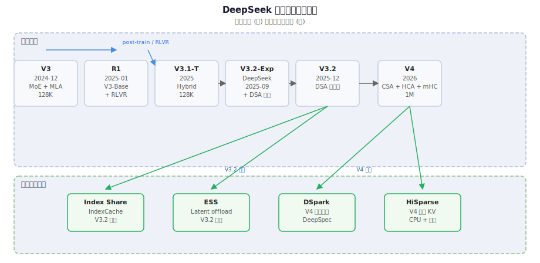
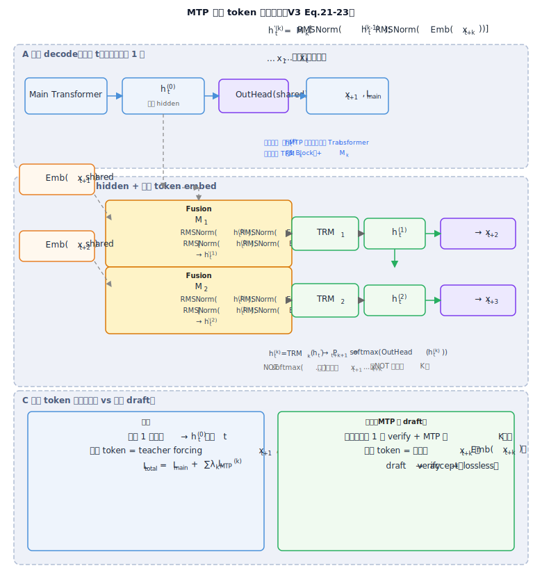

# deepseek-everything

Unofficial DeepSeek technical notes — from the earliest public tech reports through **V4**, plus V4-era inference work such as **DSpark**. Not affiliated with DeepSeek.

> **Primary language: Chinese.** Most articles, the book layout, and deep-dive notes in this repo are written in **简体中文**, aimed at the **Chinese-speaking community**.  
> **→ [中文导读（推荐阅读）](docs/README.md)**

---

## What this repo is

We follow DeepSeek's open-model line **V1 → V2 → V3 → R1 / V3.2 → V4**, and unpack **most** (not every) major technical reports into readable walkthroughs: architecture changes, training/inference tricks, formulas, and how versions relate.

Coverage includes:

- **Core DeepSeek releases** — MLA, MoE routing, MTP, DSA, CSA/HCA, mHC, Hash MoE, V4 KV layout, etc.
- **V4 inference stack** — **[DSpark](docs/versions/dspark-speculative-decoding.md)** speculative decoding, HiSparse, disk prefix cache.
- **Adjacent infra work** layered on DeepSeek checkpoints — **[Index Share / IndexCache](docs/versions/index-share.md)** (Tsinghua + Zhipu) and **[ESS](docs/versions/ess-latent-cache-offload.md)** latent-cache offload (Baidu BaiGe), with a dedicated **infrastructure** thread alongside algorithm and MoE.

Organized as wiki-style articles, SVG diagrams, and a book-style layout under [《ds-技术报告》/](《ds-技术报告》/01-总览/01-版本演进总览.md). For full navigation and article list, use the **[Chinese docs home](docs/README.md)**.

### Why reading here feels smooth

This repo is built for **bidirectional navigation**: every article, deep-dive, and Q&A page links **back** to where you came from — the Chinese home, the English homepage, the evolution hub, or the parent section. Follow a link into DSA logic, MTP fusion, or Engram notes; when you are done, one click returns you to the article or index you started from. No dead ends, no guessing how to resume the thread.

> **Work in progress.** Summaries, mirroring, links, and diagrams are still being updated. Prefer arXiv / official PDFs cited at the top of each article. Broken links or errors — **issues welcome**.

---

## Start here

| | |
|--|--|
| **Chinese home (main)** | [docs/README.md](docs/README.md) |
| **Evolution hub** | [Version lineage overview](docs/reports/deepseek-version-lineage-20260625.md) — algorithm / infrastructure / MoE threads |
| **Book layout** | [《ds-技术报告》/01-总览/01-版本演进总览.md](《ds-技术报告》/01-总览/01-版本演进总览.md) |
| **PNG figures** | [`png/`](png/) — raster exports of all SVG diagrams (images only) |

[Open SVG](./diagrams/deepseek-version-lineage.svg)

[Open SVG](./diagrams/mtp-fusion-scheme.svg) · [DSpark speculative decoding](docs/versions/dspark-speculative-decoding.md) · [MTP fusion scheme (qa)](docs/versions/qa/mtp-fusion-scheme.md)

---

## License

| Scope | License |
|-------|---------|
| Notes, diagrams, book layout | [CC BY 4.0](LICENSE) |
| `scripts/` | [MIT](LICENSE-MIT) |
| `docs/engram/` | [Apache 2.0](docs/engram/LICENSE) |
| `docs/material/` mirrors | upstream / original paper terms |

DeepSeek papers, weights, and official code remain under **their own** licenses.
