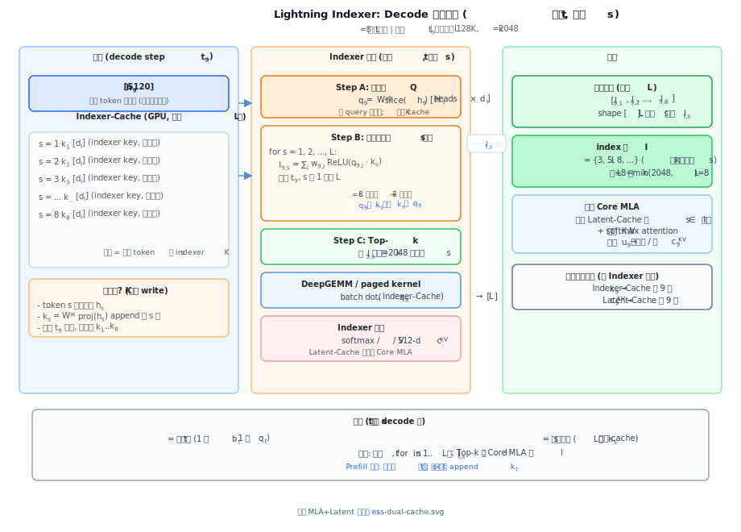
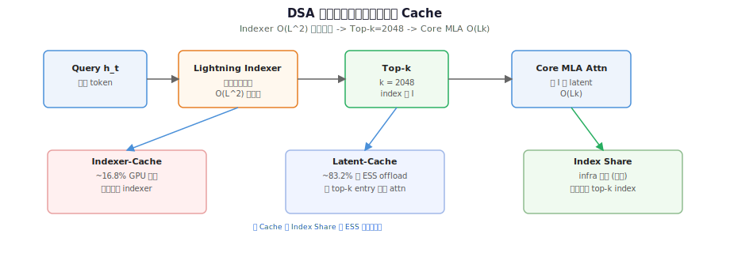
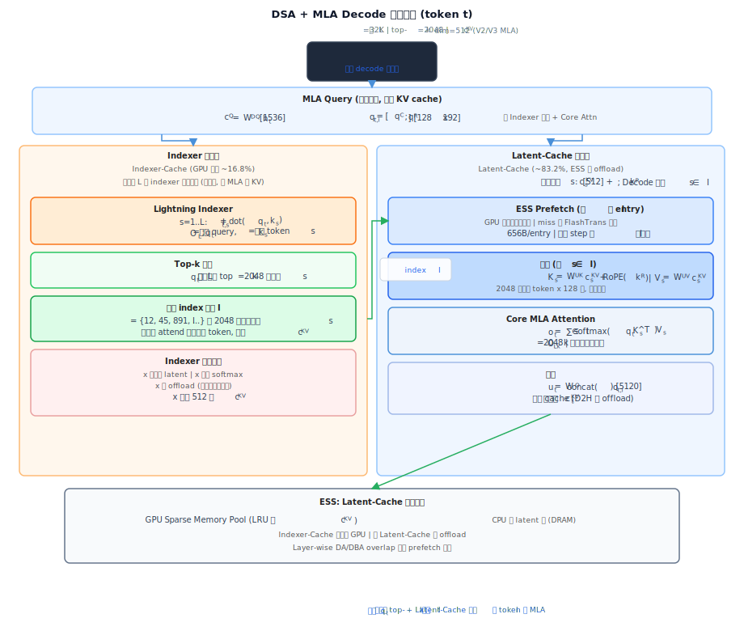
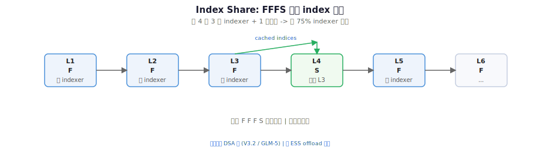

# DeepSeek DSA 与 Index Share 系列

> [← 中文导读](../README.md) · [← 仓库首页（EN）](../../README.md) · **主题**：V3.2 的 **DeepSeek Sparse Attention (DSA)** 把长上下文注意力从 $O(L^2)$ 降到 $O(Lk)$；**Index Share（IndexCache）** 在 DSA 之上用跨层 index 复用砍掉冗余 indexer，纯 infra。  
> **系列导读**：[dsa-logic.md](./dsa-logic.md) · [index-share-logic.md](./index-share-logic.md) · **[算法线导读](../reports/deepseek-algorithm-line.md)** · **[基础设施线导读](../reports/deepseek-infra-line.md)** · [← 演进总览 §3.6 V3.2](../reports/deepseek-version-lineage-20260625.md#36-deepseek-v32--v32-exp)

---

## 文档索引

| 文档 | 内容 | 对应梗概 |
|------|------|----------|
| [v3-1.md](../versions/v3-1.md) | **前置**：128K、Hybrid 推理、Prefill/Decode MLA 切换；V3.2 续训起点 | V3.1-Terminus |
| [dsa-sparse-attention.md](../versions/dsa-sparse-attention.md) | **版本表入口**：DSA 三阶段、异构 Cache、流程图 | [V3.2 梗概](../versions/v3-2.md) |
| [lightning-indexer.md](./lightning-indexer.md) | **Lightning Indexer** 公式、Indexer-Cache、Decode 一步前向 | [DSA 梗概](../versions/dsa-sparse-attention.md) |
| [dsa-logic.md](./dsa-logic.md) | DSA 两阶段稀疏注意力、异构 KV Cache、与 MLA/ESS 关系 | [V3.2 梗概](../versions/v3-2.md) |
| [ess-latent-cache-offload.md](../versions/ess-latent-cache-offload.md) | **Latent-Cache CPU offload**；FlashTrans / 热池 | V3.2 infra |
| [index-share-logic.md](./index-share-logic.md) | F/S 层划分、`FFFS` 模式、与 ESS/V4 正交性 | [Index Share 梗概](../versions/index-share.md) |
| [v4.md](../versions/v4.md) | **下游算法**：CSA/HCA、1M context（非 V3.2 补丁） | V4 梗概 |

---

## 示意图

### ⓪ Indexer Decode 一步前向（t / s / 输入输出）

[lightning-indexer.md §2 walkthrough](./lightning-indexer.md#decode-forward-walkthrough)

### ① DSA 流水线

Lightning Indexer → Top-$k$ → Core MLA；Indexer/Latent 双 Cache

### ② MLA Decode 一步分工

Indexer 选 $I$ vs Latent-Cache 升维 + Core MLA

### ③ Index Share FFFS

跨层 F/S 划分与 `FFFS` 复用示意

改图：`python3 scripts/svg/gen_dsa_svgs.py` → `python3 scripts/svg/check_svgs.py`（含 Markdown 嵌入 + 布局遮挡校验）

---

## 推荐阅读顺序

1. [V3.1-Terminus](../versions/v3-1.md) — 128K、Hybrid 推理、MLA Prefill/Decode 切换（**DSA 直接前置**）
2. [DSA 梗概](../versions/dsa-sparse-attention.md) — 三阶段总览  
3. [Lightning Indexer](./lightning-indexer.md) — indexer 公式与 Indexer-Cache  
4. [DSA 逻辑](./dsa-logic.md) — 稀疏注意力 + Indexer/Latent 双 Cache  
5. [ESS Latent-Cache offload](../versions/ess-latent-cache-offload.md) — CPU offload 与 GPU 热池  
6. [Index Share](./index-share-logic.md) — 跨层 index 复用（infra 补丁）  
7. [CSA/HCA 混合压缩注意力](../versions/csa-hca-mixed-attention.md) — 算法线继续演进

---

## 与现有栈

| 组件 | 关联 |
|------|------|
| [V3.1-Terminus 梗概](../versions/v3-1.md) | DSA 上游：128K + Hybrid，无稀疏注意力 |
| [V3.2 梗概](../versions/v3-2.md) | DSA 所在版本 |
| [中文导读](../README.md) | 文章索引、演进图示、许可说明 |
| [Engram 条件记忆](../material/papers/engram/engram-series-overview.md) | 正交稀疏轴：n-gram 查表 vs DSA top-$k$ |
| [版本演进总览](../reports/deepseek-version-lineage-20260625.md) | 算法线 + infra 线全景 |
| [算法线导读](../reports/deepseek-algorithm-line.md) | MLA → DSA → CSA/HCA + mHC 专题 hub |
| [基础设施线导读](../reports/deepseek-infra-line.md) | MLA KV → 异构 Cache → Index Share → ESS → V4 HiSparse |
| [Raschka V3→V3.2 解读](../reports/raschka-technical-deepseek-v3-v32-highlights.md) | DSA / RLVR / GRPO 第三方梳理 |

**论文**：DSA [arXiv:2512.02556](https://arxiv.org/pdf/2512.02556) · IndexCache [arXiv:2603.12201](https://arxiv.org/abs/2603.12201) · ESS [arXiv:2512.10576](https://arxiv.org/abs/2512.10576)
