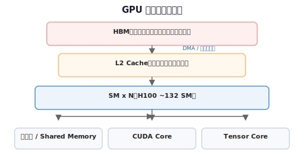

# 名词解释：SM

[← 返回投机解码专文 §1.1](../dspark-speculative-decoding.md#11-瓶颈每-token-搬一遍大模型权重) · [Compute vs Memory 答疑](./spec-decode-compute-vs-memory-bound.md) · [MMA 名词](./fp8-mma-term.md) · [答疑目录](./README.md)

---

## SM 是什么

**SM** = **S**treaming **M**ultiprocessor（流式多处理器）。

NVIDIA GPU 上 **一块芯片里重复出现很多次** 的基本计算单元：每个 SM 自带一批 **CUDA Core**、若干 **Tensor Core**、**寄存器文件**、**共享内存（Shared Memory / L1）**，并通过片上互联访问 **L2**，再经 **内存控制器** 访问片外 **HBM**（显存）。

可以粗记：**HBM 存数据，SM 算数据**；kernel 启动后，线程块（thread block）被调度到某个 SM 上执行。

---

## 在 GPU 里排哪一层

自顶向下（与本仓库 **decode / 投机解码** 语境相关）：

[图示详情](../figures/gpu-sm-hierarchy.svg)

DeepSeek 文档里「把权重 **从 HBM 搬进 SM**」= 一次矩阵乘前，权重 tile 经 **HBM → L2 → SM 寄存器/共享内存** 流入，再在 **该 SM 的 Core** 上做乘加。

---

## SM 里谁干什么

| 组件 | 在 SM 内的角色 | 本仓库常见语境 |
|------|----------------|----------------|
| **CUDA Core** | 通用标量/向量运算、控制流、部分 epilogue | FP8 反量化、partial sum **FP32 续累加**（[名词解释：MMA](./fp8-mma-term.md)） |
| **Tensor Core** | 专用 **GEMM / MMA**，高吞吐低精度矩阵乘 | 训练 FP8 GEMM；推理里大 batch **GEMM** 更吃 TC |
| **寄存器** | 线程私有，最快 | DSpark 顺序头「**寄存器级**微算」指这里，不反复读 HBM |
| **Shared Memory** | 同 block 线程共享，比 HBM 快一个数量级 | FlashAttention 等 kernel 把 tile 缓存在此 |

一个 **warp**（32 线程）是 SM 上调度的基本单位；**Tensor Core 的一条 MMA/WGMMA 通常由一组 warp 协作完成**。

---

## 为何 decode 文档总提 SM？

[投机解码专文 §1.1](../dspark-speculative-decoding.md#11-瓶颈每-token-搬一遍大模型权重) 与 [Compute vs Memory 答疑 §2](./spec-decode-compute-vs-memory-bound.md#2-为何-decode-默认是-memory-bound) 的物理图景：

1. **batch=1 自回归 decode** 每步是 **GEMV**（大权重矩阵 × **单向量**），算术强度极低。
2. 每生成 1 个 token，仍要把 **整层权重** 从 **HBM** 流式读入 **SM**，但 SM 上实际并行处理的「有效计算量」很小。
3. 结果：**SM 上的 Core 大量时间在等 HBM/L2 送下一批权重** → 任务 **Memory-Bound**（带宽瓶颈，不是 FLOPS 瓶颈）。

口语里的「**填不满 SM**」= SM 内 Tensor Core / CUDA Core **算力闲置**，内存子系统已饱和。

---

## 「搬进 SM」vs「饱和 SM」

| 说法 | 含义 |
|------|------|
| **权重搬进 SM** | 数据路径：HBM → … → SM 寄存器，准备做一次 matmul |
| **填不满 SM** | 算力视角：单位时间内 SM 内 **有效 FLOPS / 利用率低**，因为 **访存跟不上** |
| **$K$ 宽并行**（DFlash / target verify） | 同一次权重流，SM 上处理 **$K$ 列激活** → 算术强度 ↑，相对更易 **吃算力** |

投机解码 target **verify**：仍 **搬 1 遍** 权重进 SM，但在 **$K$ 个位置并行算**——FLOPS 增加，但 **[不再为 $K$ 个 token 各搬 $K$ 遍权重](./spec-decode-compute-vs-memory-bound.md#2-为何-decode-默认是-memory-bound)**。

---

## 和相邻名词不要混

| 缩写 | 领域 | 含义 |
|------|------|------|
| **SM** | **GPU 硬件** | Streaming Multiprocessor |
| **HBM** | **显存** | High Bandwidth Memory，片外大容量存储 |
| **GEMV / GEMM** | **算子** | 矩阵×向量 / 矩阵×矩阵；decode 常是 GEMV |
| **MMA** | **Tensor Core 指令** | Matrix Multiply-Accumulate（[名词解释：MMA](./fp8-mma-term.md)） |
| **MHA / MQA** | **注意力结构** | 与 SM **无关** |

---

## 与 NVIDIA 官方术语对照

- CUDA Programming Guide：**SM** 是 device 上执行 kernel 的 **multiprocessor**；每个 SM 有独立寄存器、共享内存与 Core 资源。
- Hopper 及以后架构：SM 内 Tensor Core 代际不同（如 **WGMMA** 在 warp-group 粒度调度），但「**HBM 搬入 SM 再算**」的分层不变。

---

## 一句话

**SM** = GPU 上 **真正执行 kernel 的流式多处理器**；DeepSeek 推理文档里说「权重从 HBM 搬进 SM」，是在描述 **decode 访存路径**；说「填不满 SM」是在说 **Memory-Bound 时算力单元空转**——与投机解码、Eagle/DFlash 的 mem/compute 讨论直接相关。

---

## 反向引用

| 文档 | 锚点 / 说明 |
|------|-------------|
| [投机解码专文 §1.1](../dspark-speculative-decoding.md#11-瓶颈每-token-搬一遍大模型权重) | HBM → 计算单元；GEMV Memory-Bound |
| [Compute vs Memory 答疑 §2–§4](./spec-decode-compute-vs-memory-bound.md#2-为何-decode-默认是-memory-bound) | 「搬进 SM」「填不满 SM」 |
| [酱紫君解读 §半自回归](../../reports/zhihu-jiangzijun-dspark-highlights-20260627.md#dspark-半自回归草稿并行主干-vs-顺序头) | 顺序头 **寄存器 / on-chip** vs HBM 拉 MoE |
| [名词解释：MMA](./fp8-mma-term.md) | SM 内 Tensor Core vs CUDA Core 分工 |
