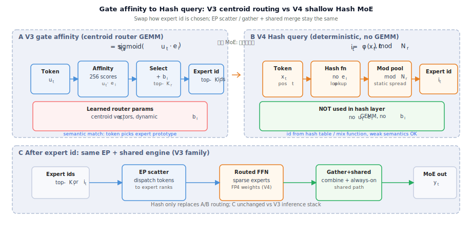

# Hash MoE 为何只改浅层、深层仍用 centroid 路由？

[← 返回 Hash MoE §1.2](../hash-moe-fp4.md#hash-moe-routing) · [EP 答疑 §4](./moe-expert-parallel-ep.md#4-hash-moe-改什么不改什么) · [centroid vs gate-weight §4.4](./moe-centroid-vs-gate-weight.md#44-v4-hash-moe部分层离开-centroid-路由) · [答疑目录](./README.md)

---

## 一句话

**Hash 路由**用确定性函数换 **零 router GEMM + 静态负载**；适合 **浅层偏通用、对语义特化要求低** 的 FFN。**深层**仍要 **按 token 语义选 expert**（$u^\top e_i$ + aux-loss-free），才能保留 V3 系 **细粒度 specialization** 与 **动态均衡**——全栈 Hash 省算力更多，但 **表达能力与 EP 负载风险** 都不划算，所以 V4 选 **浅 Hash + 深 centroid** 的混合栈。

---

## 1. 两种路由各自擅长什么

| 维度 | **Hash（浅层）** | **Centroid / aux-loss-free（深层）** |
|------|------------------|--------------------------------------|
| Expert id | token / 位置 **hash** → 近似均匀 | $u^\top e_i$ **语义亲和度** + top-$K_r$ |
| Router 算力 | **无** 对 256 expert 的打分 GEMM | 每层每 token 一次 routed 打分 |
| 负载均衡 | hash 设计 **静态近似均匀** | 动态 bias $b_i$ + [$L_{\mathrm{Bal}}$](../moe-sequence-wise-balance-loss.md) |
| 特化能力 | **弱** — id 与「内容类型」解耦 | **强** — expert 向量 $e_i$ 学「原型 / 簇」 |
| 典型层位 | **前几层** MoE / 原 dense FFN | **中深层** 主力 MoE 层 |

---

## 2. 为何浅层可以 Hash

### 2.1 浅层 FFN 更偏「通用变换」

靠近 embedding 的 FFN 多在 **升维 / 非线性 / 局部混合**，尚未形成强 **任务 / 领域** 分化。此时用 hash 把 token **伪随机但均匀** 摊到 expert 上，等价于 **加宽 FFN 容量**，对 **语义匹配** 依赖较小。

### 2.2 省下来的主要是 router 与参数

V3 每层 MoE 要对 **全体 routed expert** 算亲和度（256 维量级），再 top-8。浅层 **层数少但 token 吞吐相同**，若前几层原是 **dense FFN 或 MoE**，改成 Hash MoE 可以：

- 去掉 **$e_i$、router GEMM** 与部分 aux 路径；
- 仍走 **[EP + shared](./moe-expert-parallel-ep.md)**，**id 确定后引擎与 V3 同族**。

动机表里写的 **「省路由算力与参数；浅层更偏通用变换」** 即此。

### 2.3 静态 hash 够用的前提

Hash 层 **不随 batch 调 $b_i$**。浅层 expert 负载若天然较匀、且 **不承担精细语义分工**，静态 hash 的 **近似均匀** 通常够用；这也是只放浅层的 **前提条件**。

---

## 3. 为何深层不动

### 3.1 深层需要「按内容选 expert」

越靠后，hidden 越 **抽象、任务相关**。DeepSeekMoE 的 centroid 叙事是：token 与 **expert 原型** $e_i$ 匹配（[centroid 答疑](./moe-centroid-vs-gate-weight.md)）。数学 / 代码 / 多语言等 **分化** 主要在 **中深层 MoE** 体现；改成 hash 等于 **强行去掉内容条件路由**，特化能力损失大。

### 3.2 动态均衡在深层更关键

深层 MoE **激活参数占比高**，EP 下 **热点 expert** 代价更大（[EP 答疑 §3](./moe-expert-parallel-ep.md#3-为何与负载均衡绑在一起)）。V3 的 **$b_i$ + $L_{\mathrm{Bal}}$** 针对 **batch / 序列内** 动态调节；hash **无法** 在「某 expert 突然过热」时微调路由，全深层 hash 会让 **EP 空转风险** 上升。

### 3.3 训练与迁移：深层沿用 V3 族更稳

V4 **继承** DeepSeekMoE **256/8 + shared** 与 **sigmoid + bias** 路由（[aux-loss-free](../aux-loss-free-moe-routing.md)）。深层不动 → **大部分 MoE 层** 权重形态、训推 kernel、EP 路径与 V3 **同族**，只在前几层插入 Hash 块；若 **全栈 Hash**，router 权重与 checkpoint 语义 **全面重写**，风险与验证成本都高。

### 3.4 收益递减

Hash 省的是 **router 侧** FLOPs 与参数；深层 FFN **expert 本体** 仍是算力大头。把 Hash 推到全层，**额外省的 router 占比变小**，但 **质量与均衡风险** 单调变差 → **混合栈** 是 Pareto 折中。

---

## 4. 混合栈长什么样

Hash 仅替换浅层 **Phase A→B** 的路由函数；**Phase C**（EP scatter → Routed FFN → Gather+shared）与 V3 推理栈不变。

[图示详情](../../figures/v4/hash-moe-routing.svg)

| 段 | 路由 | 后面引擎 |
|----|------|----------|
| **浅层** | Hash MoE — 确定性 id，无 centroid GEMM | hidden 初步混合后进入深层 |
| **深层** | V3 族 MoE — $u^\top e_i$ + top-$K_r$ + shared + $b_i$ 均衡 | 仍走 EP scatter → expert FFN → gather + shared |

- **改的是「浅层选 expert 的函数」**；**id 一旦确定**，后面仍是 **EP scatter → expert FFN → gather + shared**。
- **FP4** 作用在 **routed expert 权重** 上，与 **Hash vs centroid** 正交（[Hash MoE 专文 §2](../hash-moe-fp4.md#fp4-moe-quant)），深层 routed 也可 FP4，**router 逻辑仍 centroid**。

---

## 5. 常见误解

| 误解 | 澄清 |
|------|------|
| 「V4 全部 MoE 都 Hash」 | **否** — 仅 **前几层** |
| 「深层不用 MoE」 | **否** — 主力层仍是 **256/8 DeepSeekMoE + centroid** |
| 「Hash 层不做 EP」 | **否** — 仍 **gather/scatter**，只改 **id 怎么来** |
| 「浅层 Hash = 质量一定差」 | 设计假设是浅层 **特化需求低**；深层保留 learned routing **兜底能力** |

---

## 6. 与论文口径

V4 [2606.19348](https://arxiv.org/abs/2606.19348) 将 **Hash MoE** 与 **FP4 MoE** 作为 MoE 线改动与 CSA/HCA 等 **同期打包**；公开材料对 **具体层号** 着墨有限，本地文档以 **「前几层 / 浅层 vs 深层 centroid」** 表述，细节以论文与权重 config 为准。

---

## 参考

- [Hash MoE + FP4 专文](../hash-moe-fp4.md)
- [aux-loss-free 路由](../aux-loss-free-moe-routing.md)
- [MoE centroid vs gate-weight](./moe-centroid-vs-gate-weight.md)
