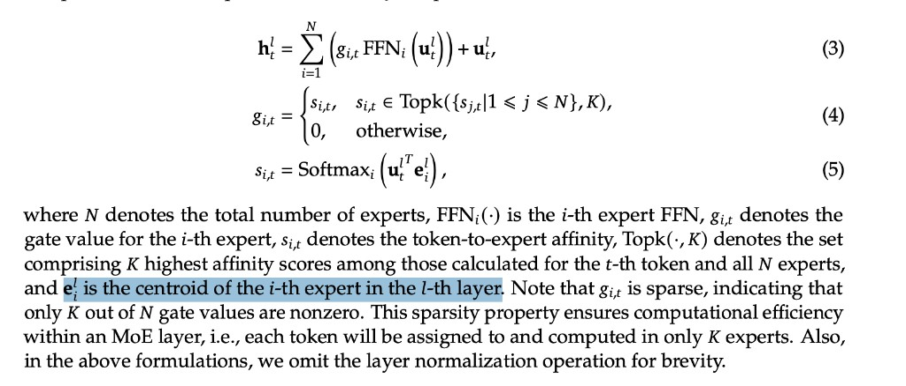

# MoE 路由：gate-weight 还是 expert centroid？

[← 返回 DeepSeekMoE §前向公式](../deepseek-moe.md#forward-formula) · [答疑目录](./README.md)

---

## 问题从哪来

多数 MoE 文献（Switch、GShard、Mixtral 等）把 Router 写成 **gate network**：一个线性层或 MLP 输出 $N$ 维 logits，再 softmax / top-$k$ 得到 **gate weights**。

DeepSeek-V2 / DeepSeekMoE 论文（Eq. 20–22）却写：

$$
s_{i,t} = \mathrm{Softmax}_i(u_t^\top e_i), \quad e_i = \text{「第 } i \text{ 个 routed expert 的 centroid」}
$$

并把 $s_{i,t}$ 叫 **token-to-expert affinity（亲和度）**，$g_{i,t}$ 才叫 **gate value**——且 $g_{i,t}$ 只在 Top-$K$ 非零。

[直接打开公式截图](../../figures/v2/moe-routing-centroid-eq.png)

---

## 1. 算子上：常常等价，语义上：两套叙事

把 $e_i \in \mathbb{R}^d$ 排成矩阵 $E \in \mathbb{R}^{N_r \times d}$，则

$$
u_t^\top e_i = (E u_t)_i
$$

这与「Router 线性层 $W_g \in \mathbb{R}^{N_r \times d}$，logits $= W_g u_t$」**是同一类双线性打分**——参数可一一对应（$W_g$ 的第 $i$ 行就是 $e_i^\top$）。

| 叙事 | 在问什么 | 典型符号 |
|------|----------|----------|
| **Gate-weight** | 「给每个 expert 一个调度权重」 | $W_g$, router logits, $g_i$ |
| **Centroid / affinity** | 「token 离哪个 expert 的**代表点**最近？」 | $e_i$, $s_{i,t}$, affinity |

DeepSeek 选第二种写法，不是因为算子不能实现成 gate layer，而是要把路由解释成 **hidden space 里的匹配 / 聚类**，与 **fine-grained expert specialization** 的设计目标对齐。

---

## 2. 概念区别：三条分工

DeepSeek 公式里其实拆了三层，很多 gate-only 写法混为一谈：

| 层 | 符号 | 作用 | 是否稀疏 |
|----|------|------|----------|
| **① 匹配** | $s_{i,t} = f(u_t, e_i)$ | token 与各 expert **原型**的亲和度 | 否（对全体 routed 算分） |
| **② 选择** | Top-$K_r$ on $\{s_{i,t}\}$（V3 起加 $b_i$） | **哪些** expert 参与 | 是 |
| **③ 门控** | $g_{i,t}$（选中后取 $s$ 或归一化 $s$） | expert 输出 **乘多少** | 仅 $K_r$ 非零 |

**Gate-weight 文献**常把 ①②③ 合成一个向量 $g=\mathrm{TopK}(\mathrm{softmax}(W u))$。

**Centroid 叙事**强调：

- $e_i$ 不是 FFN 权重，而是 expert $i$ 在 **同一 hidden 空间**里的 **routing 原型**（可学习向量）；
- expert 特化 = 「处理亲和 $e_i$ 的 token 簇」；
- $g$ 只是稀疏化后的 **执行系数**，语义上从 affinity 派生。

---

## 3. 为什么 DeepSeek 要强调 centroid？

### 3.1 与 fine-grained segmentation 同构

[DeepSeekMoE 把 $N$ 个大 expert 拆成 $2N$ 个小 expert](../deepseek-moe.md#optimization-logic)：

- expert 越多 → hidden 空间被划得越细；
- 每个 $e_i$ 像一个 **小簇中心**；
- 路由 = 「这个 token 属于哪个细簇」→ 走对应小 FFN。

若只叫 gate-weight，很难在论文里自然推出「为什么要 160 个小 expert」；centroid + clustering 直觉更顺。

### 3.2 与 shared expert 分工一致

- **Shared FFN**：不走 $e_i$ 匹配，**每个 token 必过** → 承担 **跨簇公共**模式；
- **Routed FFN**：走 $s_{i,t}=u_t^\top e_i$ → 承担 **簇内特化**。

这是 **「公共底座 + 按簇特化」**，比「$N$ 个 gate 加权 expert」更好讲清 shared isolation 动机。

### 3.3 与 device-limited routing 一致

V2 先按 **device 上 expert 组的 affinity 总和** 选 $M$ 台机器，再在子集里 Top-$K$。

把 $e_i$ 看成空间中的点，天然支持 **「先选区域（device），再选簇内 expert」**；纯 gate 矩阵也能算，但缺少几何解释。

---

## 4. 对后续建模的影响

### 4.1 V2：affinity 驱动训练侧均衡

- **Expert / device / comm** 三级 aux loss 监控的是 **被路由到的 token 流**，affinity 决定谁被选中；
- **Token dropping**：丢弃 **affinity 最低**的 token-expert 对 — 显式假设「低亲和 = 可牺牲的边缘匹配」；
- 若只有匿名 gate，很难区分「调度分数」与「语义匹配质量」。

### 4.2 V3 aux-loss-free：**拆选择 vs 门控**

V3 保留 **affinity $s_{i,t}$**（改为 sigmoid 系），但：

| 用途 | V3 用法 |
|------|---------|
| **Top-$K$ 排序** | $s_{i,t} + b_i$（$b_i$ batch 级启发式更新） |
| **乘 FFN 输出** | 仍用 **原始 $s_{i,t}$** |

详见 [aux-loss-free 路由逻辑](../aux-loss-free-moe-routing.md)。

**Centroid 叙事下的含义**：

- $e_i$ / $s_{i,t}$：学 **「token 是否属于 expert $i$ 的语义簇」**（主 loss 反传）；
- $b_i$：**运维旋钮**，只挪负载、不扭曲 gate 幅度 → 避免 aux loss 伤主任务。

若 early MoE 只有一个 gate 向量，把负载均衡和语义匹配绑在同一标量上，V3 这种 **解耦** 更难表述，也难调。

### 4.3 V3 $L_{\mathrm{Bal}}$：序列内 complement

[$L_{\mathrm{Bal}}$](../moe-sequence-wise-balance-loss.md) 在 **单序列内** 补 $f_i P_i$，与 $b_i$ 的 batch 级均衡互补 — 仍假设 expert 是可被 **按亲和度分配** 的特化单元，而不是纯随机 gate。

### 4.4 V4 Hash MoE：部分层离开 centroid 路由

V4 前几层改用 **[Hash 路由](../hash-moe-fp4.md)**— 不再用 $u^\top e_i$ 做语义匹配，而是确定性 hash。

说明 **centroid 路由是 DeepSeekMoE 稠密→稀疏 FFN 阶段的主线**；到 V4 为效率/hash 另开一路，但 **256/8 + shared + aux-loss-free** 骨架仍继承 V2/V3 的 MoE 形态。

---

## 5. 对照表

| 维度 | 常见 gate-weight MoE | DeepSeekMoE（centroid） |
|------|---------------------|-------------------------|
| Router 参数 | $W_g \in \mathbb{R}^{N \times d}$ | $e_i \in \mathbb{R}^d$（每 expert 一向量） |
| 打分 | $\mathrm{softmax}(W_g u)$ | $\mathrm{softmax}_i(u^\top e_i)$ |
| 语义 | 「学一个调度函数」 | 「token 匹配 expert 原型 / 簇」 |
| 与 FFN 关系 | gate 与 FFN 权重独立 | 同上；$e_i$ **≠** $\mathrm{FFN}_i$ 的 $W_1,W_2$ |
| 负载均衡 | aux loss 直接推 router | V2 aux；V3 **$b_i$ 只动选择、不动 $g$** |
| 设计延伸 | — | fine-grained、shared isolation、device-limited |

---

## 6. 一句话

**Gate-weight** 把 MoE 路由说成「学一个 softmax 分类器」；**centroid** 把同一条算子说成「在 hidden 空间里做 expert 聚类匹配」。DeepSeek 选后者，是为了把 **细粒度 expert、shared 分工、affinity 驱动的均衡、以及 V3 选择/门控解耦** 串成一条可设计的叙事；算子层面仍可实现为 `linear(u, E)`。

---

## 参考

- [DeepSeekMoE 架构](../deepseek-moe.md)
- [aux-loss-free 路由](../aux-loss-free-moe-routing.md)
- DeepSeek-V2 arXiv:[2405.04434](https://arxiv.org/abs/2405.04434) §2.2 Eq. 20–22
- DeepSeek-V3 arXiv:[2412.19437](https://arxiv.org/abs/2412.19437) §2.1 Eq. 16–19
