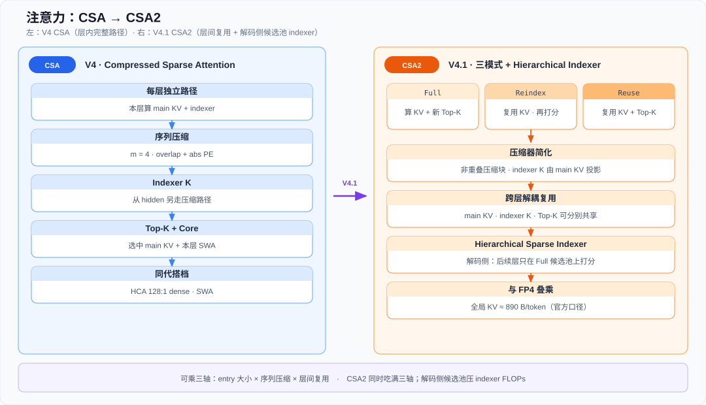
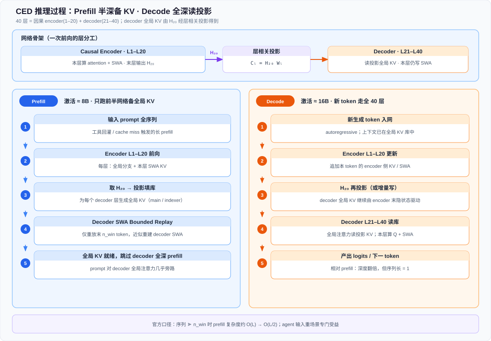
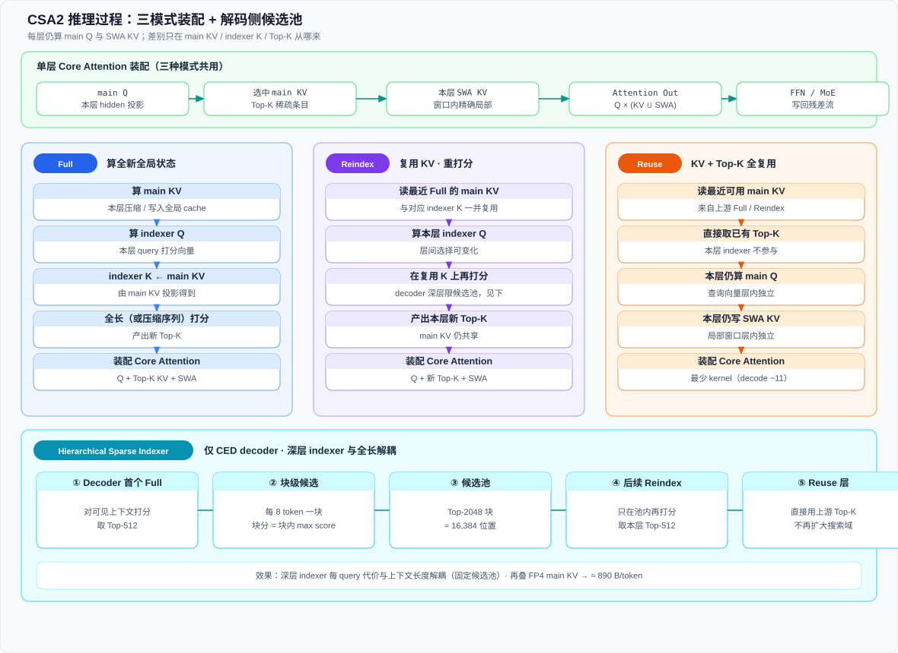

# DeepSeek-V4.1-Flash 梗概

> [← 中文导读](../README.md) · [← 仓库首页（EN）](../../README.md) · [← 版本目录](./README.md) · [← 演进总览 §3.7b](../reports/deepseek-version-lineage-20260625.md#37b-deepseek-v41-flash) · [← DeepSeek-V4](./v4.md) · [← CSA / HCA](./csa-hca-mixed-attention.md) · [← DSpark](./dspark-speculative-decoding.md) · [← Engram](../engram/README.md) · [← DeepSeek Harness](./ds-harness.md) · [← mHC](./mhc-manifold-hyper-connections.md) · [← SWA 答疑](./qa/v4-swa-sliding-window.md)

> **官方入口**：[技术报告 PDF](https://huggingface.co/deepseek-ai/DeepSeek-V4.1-Flash/blob/main/DeepSeek_V41_Tech_Report.pdf) · [HF 模型卡 / README](https://huggingface.co/deepseek-ai/DeepSeek-V4.1-Flash) · 标题 *DeepSeek-V4.1-Flash: Pushing the Limits of KV Cache Compression*（DeepSeek-AI, 2026）

## 核心结论摘要

- **定位**：多模态 MoE，面向 **超长上下文 + 长程 agent**；骨干 **552B（推理部署FP8）**，Engram **196B（首次集成）**；上下文至 **1M**。
- **Prefill / Decode 分激活量**：**Causal Encoder-Decoder（CED）** —— prefill 激活约 **8B** / token，decode 约 **16B** / token，压 agent 场景里「输入重」的 prefill 成本。
- **KV 极限压缩**：**CSA2**（跨层 KV / index 复用 + Hierarchical Sparse Indexer）+ **FP4 main KV** → 全局 KV（常驻 HBM）约 **890 B/token**，约为 [V4-Flash](./v4.md) 的 **1/4**；**SWA Bounded Replay** 使持久化 KV（SSD / host）约为 V4-Flash 的 **1/8**。
- **V4.1-Flash的优化**：属于 [V4](./v4.md) 之后的 **架构 + infer 联合升级**；本次模型升级新增特性 [CSA](./csa-hca-mixed-attention.md) 演进、[DSpark](./dspark-speculative-decoding.md)、[Engram](../engram/README.md)、[mHC，其中engram为首次官方开源实现，弥补了大模型领域开源社区的一块重要拼图](./mhc-manifold-hyper-connections.md)；agent 评测中也涉及到 [DeepSeek Harness](./ds-harness.md) Minimal 等 scaffold。

---

## 1. 定位：相对 V4-Flash 解决什么

长程 agent 让 workload **越来越 input-heavy**：稀疏注意力已压了算力，瓶颈转向 **prefill 算力**、**HBM 上的全局 KV**、以及 **SSD / host 上的持久化 KV**（存储压力与数据传输开销）。

DeepSeek-V4.1-Flash 是在这条线上把 **架构、cache 精度、部署策略** 一起精细集成的 multimodal MoE：

| 项           | V4-Flash      | V4.1-Flash                                                        |
| ----------- | ------------- | ----------------------------------------------------------------- |
| 骨干规模        | 284B / 激活 13B | **552B** / 激活 **8B（prefill）· 16B（decode）**                        |
| 注意力         | CSA / HCA 等   | **CSA2**（Full / Reindex / Reuse）+ 解码侧 Hierarchical Sparse Indexer |
| 全局 KV/token | 更高            | **≈ 890 B**（≈ V4-Flash 的 **1/4**）                                 |
| 持久化 KV      | 含 SWA 等部署方案   | **SWA Bounded Replay** → 持久化足迹 ≈ V4-Flash 的 **1/8**               |
| 模态          | 文本为主          | **原生图文**（DeepSeek-ViT + MLP，预训练起即多模态-**首次**）                      |
| 条件记忆        | 无             | 骨干内置 **Engram**（196B，稀疏查表）                                        |

*Figure: CSA（V4）层内完整压缩 + indexer；CSA2（V4.1）用 Full / Reindex / Reuse 做跨层 KV·index 解耦复用，解码侧 Hierarchical Sparse Indexer 把深层打分限制在候选池上，再与 FP4 叠乘压全局 KV。*

[图示详情](./figures/csa-vs-csa2.svg)

---

## 2. 信息来源

| 层级     | URL                                                                                                                           | 内容                                           |
| ------ | ----------------------------------------------------------------------------------------------------------------------------- | -------------------------------------------- |
| 技术报告   | [DeepSeek_V41_Tech_Report.pdf](https://huggingface.co/deepseek-ai/DeepSeek-V4.1-Flash/blob/main/DeepSeek_V41_Tech_Report.pdf) | CED / CSA2 / SWA Bounded Replay / 训推 / 后训练全文 |
| 模型卡-HF | [deepseek-ai/DeepSeek-V4.1-Flash](https://huggingface.co/deepseek-ai/DeepSeek-V4.1-Flash)                                     | 架构摘要、Base / Instruct 评测表、采样与 encoding        |
| 第三方镜像  | [alphaxiv 条目](https://www.alphaxiv.org/abs/2609.deepseek-v4-1-flash.pdf)                                                      | PDF 镜像                                       |

---

## 3. 关键机制

### 3.1 Causal Encoder-Decoder（CED）

- **40 层**因果 Transformer：**前 20 层 = causal encoder**，**后 20 层 = decoder**。
- 重回Encoder-Decoder，但是需要注意**它的 encoder 是因果单向，不能等同于老 seq2seq**。
- **全局注意力**：decoder 层的 global KV **由第 20 层（encoder 末）隐状态 H经层相关投影得到** → prefill 只需跑前半网络即可备齐 decoder 全局 KV。
- **SWA**：各层仍按层从本层 hidden 生成 local KV；为控制 decoder SWA 重建成本，部署侧用 **Decoder SWA Bounded Replay**（只重放末 n_{\mathrm{win}} token；见 §3.3）。
- **效果（官方口径）**：序列 ≫ window 时，prefill 复杂度约从 O(L) 降到 O(L/2)；激活量 **8B（prefill）/ 16B（decode）**。

对 agent：**工具调用频繁 → 大量 prefill / cache miss**；prefill flops直接减半！

*Figure: Prefill 激活 ≈ 8B——L1–L20 前向 → H层相关投影写入 decoder 全局 KV，再用 Decoder SWA Bounded Replay 近似补齐局部窗口；Decode 激活 ≈ 16B——新 token 更新 encoder 后，decoder 读投影全局 KV 并本层写 SWA。*

[图示详情](./figures/ced-inference-process.svg)

### 3.2 Compressed Sparse Attention 2（CSA2）

在 [V4 CSA](./csa-hca-mixed-attention.md) 思路上，把压缩做到 **entry 大小 × 序列压缩 × 层间复用** 三个可乘维度。

下表里的 **main Q / SWA KV / main KV** 如何同时进 **Core Attention**，以及 **indexer 只选块、作为粗召回头**，见专图；**为何 indexer 与 main 要两套 K/Q**、以及 Full / Reindex / Reuse，见 [SWA 答疑 §1.1](./qa/v4-swa-sliding-window.md#indexer-vs-main-kv)：

异构 KV：main Q 分两路 attend main KV 与 SWA KV；indexer K 与 Top-K 只服务全局稀疏分支

*Figure: **SWA 单独存在**是因为近邻要 **未压缩精确 K/V**；远距靠 **main KV + Top-K** 压显存。二者被同一 **main Q** 读入后合并。Indexer 是粗筛，main 是精确注意力——详解见上链。*

[图示详情](./figures/kv-types-core-attention.svg)

| Mode        | 单层算什么                                                       | 复用什么                                |
| ----------- | ----------------------------------------------------------- | ----------------------------------- |
| **Full**    | main KV、indexer Q；indexer K 由 main KV 投影；跑 indexer 得新 Top-K | —                                   |
| **Reindex** | 本层 indexer 再打分                                              | main KV / indexer K 来自最近 Full；索引可更新 |
| **Reuse**   | main Q + SWA KV；Core Attention                              | main KV + Top-K 均复用                 |

相对 CSA 的简化：压缩块改为非重叠、压缩路径不再带绝对位置编码；**indexer K 从 main KV 投影**（由 main KV 一条路径得到）。

**Hierarchical Sparse Indexer（decoder）**：首个 Full 层构造 **候选池**（块大小 8 → Top-2048 块 ≈ 16,384 位置）；后续 Reindex 只在池内打分取 Top-512，使深层 indexer 成本与全长上下文解耦。

**FP4 main KV**：E2M1，每 16 channel 一个 E4M3 scale → 与 CSA2 叠加后全局 KV ≈ **890 B/token**。

Reuse 模式层在生产侧可压到极少 fused kernel（报告：prefill ~15 / decode ~11），配合 FlashMLA / DeepGEMM / TileKernels / DeepSelect 等。

*Figure: 三种静态模式都算 main Q 与 SWA；Full 写 main KV 并全量打分，Reindex 复用 KV/indexer K 后重打分，Reuse 连 Top-K 一并复用。Decoder 侧首个 Full 建 16,384 候选池，后续 Reindex 只在池内选 Top-512。*

[图示详情](./figures/csa2-inference-process.svg)

### 3.3 SWA Bounded Replay 与持久化 KV

V4 部署里 SWA KV 约占持久化 cache 近半，且复用窗口短（分钟级），与「全局 KV 长驻 SSD」策略不匹配。

V4.1 调整：

1. **持久化 cache 不再存 SWA KV**；SWA 进短 TTL 的 host DRAM 池（约机器 DRAM 的 10%）。
2. 命中全局 KV、未命中 SWA 时，用 **Encoder / Decoder SWA Bounded Replay**：只重放最近 **window** 段 token 重建近似 SWA 状态（完整精确重建要 \ell \times n_{\mathrm{win}}，代价过高）。
3. 后训练阶段 **模拟同一 replay**，做 train-aware 适应。

合成效果：持久化 KV 足迹 ≈ V4-Flash 的 **1/8**（去掉 SWA ≈ ×1/2 × 全局再压 ≈ ×1/4）。

### 3.4 其它架构组件

| 组件                  | 要点                                                                             | 仓库专文                                                                                      |
| ------------------- | ------------------------------------------------------------------------------ | ----------------------------------------------------------------------------------------- |
| **Single-Pass mHC** | 修订残差流混合，便于 Mega-mHC kernel 融合                                                  | [mHC](./mhc-manifold-hyper-connections.md)                                                |
| **Engram**          | 196B 条件记忆，按 token 稀疏 lookup                                                    | [Engram](../engram/README.md)                                                             |
| **DSpark**          | 骨干预训练 **省略 MTP**；投机解码用 DSpark，**骨干训完后单独训**                                     | [DSpark](./dspark-speculative-decoding.md)                                                |
| **MoE**             | 1 shared + **384** routed / 层，每 token 激活 **6** routed；图文分模态 aux-loss-free bias | [DeepSeekMoE](./deepseek-moe.md) · [aux-loss-free](./aux-loss-free-moe-routing.md)        |
| **Vision**          | DeepSeek-ViT（2D-RoPE、3×3 pixel-unshuffle → 视觉 token ÷9）+ 两层 MLP                | [Visual Primitives](../papers/thinking-with-visual-primitives-highlights.md)（同族 ViT/CSA ） |

### 3.5 训练与后训练

| 阶段               | 要点                                                                                             |
| ---------------- | ---------------------------------------------------------------------------------------------- |
| Pretrain         | 多模态语料 **45T** tokens；稀疏注意力 64K；约 34T 处扩到 **1M**                                                |
| Post-train       | **SFT → RL → on-policy distillation（OPD）**；算法框架沿用，变化主要在 **大规模 agent 任务 / 环境自动合成** 与 rollout 扩容 |
| Reasoning effort | Instruct 支持 **1–100** 连续可控推理力度（评测表常用 `reasoning_effort=100`）                                   |
| 部署形态             | **EPD** 解耦：Encoder / Prefill / Decode 可独立扩缩与重叠                                                 |

---

## 4. 核心创新点

1. **CED：把 prefill 算力与 decode 激活量拆开** —— agent 输入重场景下，prefill 半深 + 8B 激活是结构性答案。
2. **CSA2：层间 KV 与 Top-K 解耦复用** —— Full / Reindex / Reuse + 候选池 indexer，同时砍存储与 indexer FLOPs。
3. **部署与架构同设计：SWA Bounded Replay** —— 敢于把 SWA 踢出长驻 SSD，用近似重放换持久化容量。
4. **精度：FP4 main KV** —— 与 CSA2 叠乘到 890 B/token。
5. **产品闭环**：多模态原生预训练 + agent 合成数据后训练 + 评测挂 **Harness** scaffold（见 §5）。

---

## 5. 与其他工作的联系

| 仓库节点                                                                                                         | 关系                                                                                               |
| ------------------------------------------------------------------------------------------------------------ | ------------------------------------------------------------------------------------------------ |
| [DeepSeek-V4](./v4.md) / [CSA·HCA](./csa-hca-mixed-attention.md)                                             | V4.1 的 **直接前代**；CSA2 / CED / SWA Replay 是 V4 压缩注意力与异构 KV 路线的下一跳                                  |
| [Index Share](./index-share.md)                                                                              | 论文将跨层 Top-K 复用列为先验；CSA2 把 index 复用与 main KV 共享做成 **一等架构模式**                                      |
| [ESS](./ess-latent-cache-offload.md) / [HiSparse](./v4-hisparse.md) / [磁盘 Prefix](./v4-disk-prefix-cache.md) | 同属「长上下文内存层级」；V4.1 用 **SWA Bounded Replay + 全局 KV 再压** 改写持久化策略                                    |
| [DSpark](./dspark-speculative-decoding.md)                                                                   | 官方组件；骨干无 MTP 预训练，DSpark **后训接入**                                                                 |
| [Engram](../engram/README.md)                                                                                | 从支线模块进入 **V4.1 骨干标配**（196B）                                                                      |
| [mHC](./mhc-manifold-hyper-connections.md)                                                                   | Single-Pass mHC / Mega-mHC 内核融合                                                                  |
| [DeepSeek Harness](./ds-harness.md)                                                                          | HF README：代码 agent 榜（Terminal-Bench / DeepSWE 等）用 **DSH Minimal**（及 Standard / PTC）等 scaffold 评测 |
| [Visual Primitives](../papers/thinking-with-visual-primitives-highlights.md)                                 | 同族「V4-Flash + ViT」多模态叙事；V4.1 是 **从预训练起** 的原生多模态旗舰 Flash                                          |

叙事轴： **算法线（CED / CSA2 / mHC）+ 基础设施线（KV 精度与持久化 / EPD）** 的交叉点。

---

## 6. 评测读法（摘自官方表，非二次测量）

- **Base**：相对 V4-Flash-Base / V4-Pro-Base，多任务上接近或超过 Flash，部分接近 Pro（详见 HF 表）。
- **Instruct（max effort）**：Terminal-Bench 2.1、DeepSWE v1.1、AutomationBench、Agent's Last Exam 等 **agentic** 项相对 V4-Flash / V4-Pro 有明显抬升；与闭源前沿对照见官方表。
- **Scaffold 敏感性**：同一模型在 Claude Code / Codex / DSH Minimal 等上分数不同 —— 读榜时要带上 **harness 名**（与 [ds-harness](./ds-harness.md) 文档互证）。

---

## 7. 出处与免责

- 梗概依据官方技术报告与 HF README 整理，**非官方**。
- 公式、消融、完整榜单与边界条件以 [PDF](https://huggingface.co/deepseek-ai/DeepSeek-V4.1-Flash/blob/main/DeepSeek_V41_Tech_Report.pdf) 为准；报告亦提示 CSA2 选择误差与 SWA 近似重放在极端边界上的稳健性仍在扩展评测中。

