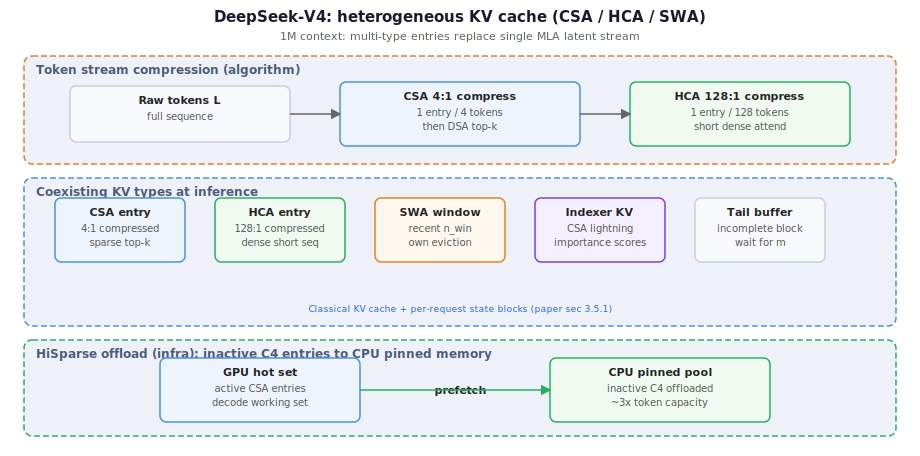

# DeepSeek-V4 梗概

> [← 中文导读](../README.md) · [← 仓库首页（EN）](../../README.md) · [← 演进总览 §3.7](../reports/deepseek-version-lineage-20260625.md#37-deepseek-v4) · [← 算法线导读](../reports/deepseek-algorithm-line.md) · [← 基础设施线导读](../reports/deepseek-infra-line.md) · [← MoE 线导读](../reports/deepseek-moe-line.md) · [Hash MoE + FP4 详解](./hash-moe-fp4.md) · [← 版本目录](./README.md) · [CSA/HCA 详解](./csa-hca-mixed-attention.md) · [DSpark 投机解码](./dspark-speculative-decoding.md) · [上游 DSA](./dsa-sparse-attention.md) · [上游 MLA](./mla-latent-attention.md) · [mHC 详解](./mhc-manifold-hyper-connections.md) · [Raschka §8 mHC](../reports/raschka-technical-deepseek-v3-v32-highlights.md#结论表-7--8)

---

## 定位

2026 年 preview release，面向 **百万 token 上下文**与 **Agentic Coding**（100K–1M token 代码库、多轮 tool trace）。相对 V3.2 是**架构级大步进**：注意力、残差、优化器、MoE 路由、量化同时翻新，不利于做单一变量 ablation。

两个规格：

| 模型 | 总参数 | 激活参数 | 定位 |
|------|--------|----------|------|
| **V4-Pro** | 1.6T | 49B | 能力上限，含 Pro-Max 推理模式 |
| **V4-Flash** | 284B | 13B | 效率优先 |

## 核心架构变化（相对 V3.2）

| 组件 | 说明 |
|------|------|
| **CSA / HCA** | [混合压缩注意力专文](./csa-hca-mixed-attention.md)：CSA 4:1 + top-$k$；HCA 128:1 + dense |
| **mHC** | [Manifold-Constrained Hyper-Connections](./mhc-manifold-hyper-connections.md)（[§3 双随机流形](./mhc-manifold-hyper-connections.md#3-mhc-核心双随机流形约束)）：Sinkhorn–Knopp 投影，恢复 HC 恒等映射稳定性 |
| **Muon** | 优化器替换，更快收敛 |
| **Hash MoE / FP4** | [Hash MoE + FP4 专文](./hash-moe-fp4.md)：前几层 Hash 路由 + routed expert FP4 + QAT |

继承自 V3：DeepSeekMoE 框架、MTP 配置。

[直接打开 SVG](../figures/v4/v4-hetero-kv.svg) · [演进总览 §3.7](../reports/deepseek-version-lineage-20260625.md#37-deepseek-v4)

## MoE 线位置

| 方向 | 文档 |
|------|------|
| **MoE 线 ⑤ Hash MoE + FP4** | [hash-moe-fp4.md](./hash-moe-fp4.md) |
| **MoE 线 hub** | [MoE 线导读](../reports/deepseek-moe-line.md) |
| **上游 ③④** | [aux-loss-free-moe-routing.md](./aux-loss-free-moe-routing.md) · [v3.md](./v3.md) |

## 1M context 效率（相对 V3.2）

| 模型 | 单 token FLOPs | 累计 KV cache |
|------|---------------|--------------|
| V4-Pro @ 1M | 27% | 10% |
| V4-Flash @ 1M | 10% | 7% |

## 推理 infra 关注点

V4 的 cache **异构**，不再是单一 MLA latent：

| KV 类型 | 特点 |
|---------|------|
| CSA 压缩 entry | 4:1，稀疏 top-$k$ |
| HCA 压缩 entry | 128:1，dense |
| SWA | 滑动窗口，独立 eviction |
| Indexer KV | CSA lightning indexer |
| Tail buffer | 未凑满压缩块的尾 token |

**KV layout**（论文 §3.5.1）→ **[专文：V4 KV Layout](./v4-kv-layout.md)**（Classical + State 双池；演进总览 [§5.3](../reports/deepseek-version-lineage-20260625.md#v4-kv-layout)）

**HiSparse** → **[专文：V4 HiSparse](./v4-hisparse.md)**（inactive C4 offload；[§5.3](../reports/deepseek-version-lineage-20260625.md#v4-hisparse)）

**磁盘 Prefix Cache**（§3.5.2）→ **[专文：V4 磁盘 Prefix Cache](./v4-disk-prefix-cache.md)**（SWA 三档策略；[§5.3](../reports/deepseek-version-lineage-20260625.md#v4-disk-prefix-cache)）

**Decode 吞吐**：V4 预览引擎 → **[投机解码与 DSpark 专文](./dspark-speculative-decoding.md)**（含 MTP、MTP-1 基线、DSpark；与 HiSparse **正交**）。

> V4 的 KV-offload **与 V3.2 ESS 完全不同**，需围绕异构压缩 cache 重新设计内存层级（见 [基础设施线导读 §3](../reports/deepseek-infra-line.md#3-节点间关系一句话)）。

---

## 基础设施线位置

| 方向 | 文档 |
|------|------|
| **本节点（⑤ V4 异构 KV + HiSparse）** | [基础设施线导读 §1](../reports/deepseek-infra-line.md#1-演进链kv--offload) · [KV layout](./v4-kv-layout.md) · [HiSparse](./v4-hisparse.md) · [磁盘 prefix](./v4-disk-prefix-cache.md) |
| **上游 ②–④** | [dsa-sparse-attention.md](./dsa-sparse-attention.md) · [index-share.md](./index-share.md) · [ess-latent-cache-offload.md](./ess-latent-cache-offload.md) |
| **算法线 ③ CSA/HCA** | [csa-hca-mixed-attention.md](./csa-hca-mixed-attention.md) · [算法线导读](../reports/deepseek-algorithm-line.md) |
| **MoE 线 ⑤ Hash MoE** | [hash-moe-fp4.md](./hash-moe-fp4.md) · [MoE 线导读](../reports/deepseek-moe-line.md) |

---

## 训练要点

- 32T+ tokens，渐进式上下文：4K dense → 16K → 64K 引入稀疏 → 1M
- 后训练：分域专家独立培养 + on-policy distillation 合并

## 算法线位置

| 方向 | 文档 |
|------|------|
| **算法线 ③ CSA/HCA** | [csa-hca-mixed-attention.md](./csa-hca-mixed-attention.md) · [算法线导读 §1](../reports/deepseek-algorithm-line.md#1-演进链attention--残差) |
| **上游 ② DSA** | [dsa-sparse-attention.md](./dsa-sparse-attention.md) |
| **并列 ④ mHC** | [mhc-manifold-hyper-connections.md](./mhc-manifold-hyper-connections.md)（残差路径，与 Attention 正交） |

---

## 上下游

| 方向 | 关系 |
|------|------|
| 上游 | V3.2（DSA 思想延续为 CSA 内嵌 indexer；见 [算法线导读](../reports/deepseek-algorithm-line.md)） |
| 并行 | Index Share 解决 V3.2 长上下文 indexer 瓶颈，与 V4 路线互补 |

## 参考

- 论文：[arXiv:2606.19348](https://arxiv.org/abs/2606.19348)
- 部署解读：[Together.ai — Serving DeepSeek-V4](https://www.together.ai/blog/serving-deepseek-v4-why-million-token-context-is-an-inference-systems-problem)
- HuggingFace：[deepseek-v4 collection](https://huggingface.co/collections/deepseek-ai/deepseek-v4)
