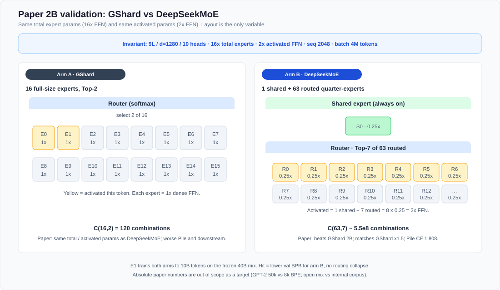
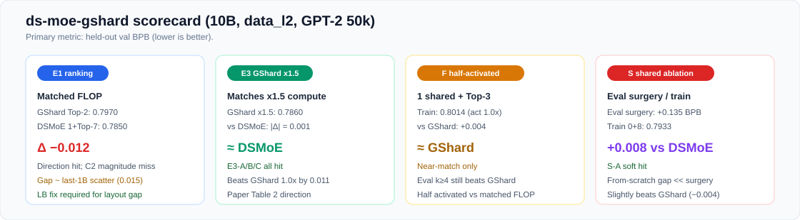

# ds-moe-gshard

From-scratch check of [*DeepSeekMoE*](https://arxiv.org/abs/2401.06066) (Dai et al., arXiv:2401.06066) against **GShard**, at the paper’s **2B validation** scale (Dense MoE skeleton in §4–§5).

Product DeepSeek-V2/V3 training is out of scope.

**Status:** 10B program closed.  
**Metric:** held-out val BPB (GPT-2 50k), lower is better.  
**Compute:** multi-GPU data parallel (no expert parallel). Local CPU / single-GPU checks: [`docs/REPRODUCE.md`](docs/REPRODUCE.md).

---

## Aim

The paper’s early MoE claim (small scale, ~2B total / ~0.3B activated) is that two **layout** changes beat matched-FLOP GShard:

1. **Fine-grained experts** — many small experts instead of few large ones  
2. **One shared expert** — always-on, plus Top-*k* routed experts  

Same **total** expert params (16× dense FFN) and same **activated** FLOPs (2× dense FFN); only the routing layout changes. If you unlock params or FLOPs, the ablation is meaningless.

This work seeks to reproduce those paper claims on a convenient open mix ([`data_l2`](docs/EXPERIMENT_DESIGN.md#5-data)), at small model scale, with **10B** tokens, GPT-2 50k, and val BPB.


---

## Design 

| Role | Layout | Total | Activated |
| --- | --- | ---: | ---: |
| GShard | 16 full experts, Top-2 | 16× | 2.0× |
| DeepSeekMoE | 1 shared + Top-7 of 63 quarters | 16× | 2.0× |



*Figure: matched total & activated expert compute; only expert granularity + shared isolation differ.*

**Reproduction matrix** (what we ran for each paper claim):

| Paper claim | Protocol here |
| --- | --- |
| DeepSeekMoE beats GShard @ same FLOP | Train both to **10B** |
| ≈ GShard with 1.5× expert compute | Train **GShard×1.5**; compare to DeepSeekMoE |
| Fewer routed experts still ≈ GShard | On a trained DeepSeekMoE ckpt, **change k at eval only** |
| Half activated from scratch still beats GShard | Train **1 shared + Top-3** from scratch |
| Shared is necessary | **Two protocols:** (1) eval surgery — drop shared, k=8; (2) train **0 shared + Top-8** from scratch |

Shared is tested both ways on purpose: surgery asks whether a *trained* shared can be replaced at eval; from-scratch asks whether the model can learn without ever having one.

Deliberate gaps vs paper: we train **10B** tokens on open [`data_l2`](docs/EXPERIMENT_DESIGN.md#5-data) with GPT-2 50k and **val BPB**. The paper used 100B tokens, an internal mix, 8k BPE, and Pile CE. Readout is ranking / direction. Absolute CE is out of scope as a target.

---

## Headline results @ 10B

**F** = fewer activated experts · **S** = shared-expert ablation ([§4.5 arms](docs/ABLATION_ARMS_DESIGN.md)).

| Arm | val BPB | vs GShard | Notes |
| --- | ---: | ---: | --- |
| GShard Top-2 | 0.7970 | 0 | baseline |
| DeepSeekMoE 1+Top-7 | **0.7850** | **−0.012** | direction hit; gap &lt; 0.02 bar |
| GShard×1.5 | 0.7860 | −0.011 | ≈ DeepSeekMoE |
| **F** fewer-activated train (1+Top-3) | 0.8014 | +0.004 | near-match only |
| **S** no-shared train (0+Top-8) | 0.7933 | −0.004 | +0.008 vs DeepSeekMoE (soft) |
| **S** drop-shared eval (surgery) | **0.9558** | — | eval-only on E1 ckpt; **+0.135** vs same-draw DSMoE **0.8204** |



*Figure: four closed arms at a glance (E1 / E3 / F / S). Metrics only — notes below.*

### Reading the scorecard

| Tag | Meaning |
| --- | --- |
| **F** | Fewer activated experts ([§4.5](docs/ABLATION_ARMS_DESIGN.md)) |
| **S** | Shared-expert ablation ([§4.5](docs/ABLATION_ARMS_DESIGN.md)) |

**Attribution**

| Comparison | Δ BPB | Read as | Main cause |
| --- | ---: | --- | --- |
| F-train vs GShard | +0.004 | near-match | 10B tokens (paper ~100B) + half activated (total experts still 16×) |
| S-train vs DeepSeekMoE | +0.008 | soft from-scratch hit | shared isolation helps, weakly at 10B |
| S-eval vs same-draw DSMoE | +0.135 | large cliff | post-hoc drop-shared on a trained ckpt (different protocol from S-train) |

**Supporting checks:** F-eval k≥4 on the Top-7 ckpt already ≤ GShard · S-train `max_frac≈0.26` (no collapse) · matched-FLOP lock holds for `dsmoe_s0`.

**Contrast**

| Ordering (val BPB, lower better) | Takeaway |
| --- | --- |
| DeepSeekMoE ≺ GShard | clear if weak ranking |
| F-train ≈ GShard | half-activated train does not pull ahead |
| DeepSeekMoE ≺ S-train ≺ GShard | no-shared from-scratch sits in between |
| S-eval ≫ others | surgery cliff; do not merge with S-train |

**Locked setup:** 9L / d=1280 / 10 heads · seq 2048 · batch ~4M · α₁=0.01 · data parallel (`WORLD=20` recipe) · frozen [`data_l2`](docs/EXPERIMENT_DESIGN.md#5-data).

Full tables, curves, and analysis: **[`docs/EXPERIMENT_REPORT.md`](docs/EXPERIMENT_REPORT.md)**.

---

## Where to read

| If you want… | Open |
| --- | --- |
| **Results + analysis** | [`docs/EXPERIMENT_REPORT.md`](docs/EXPERIMENT_REPORT.md) |
| Locks, gates, **status + doc map** (per-phase design / config / artifacts) | [`docs/EXPERIMENT_DESIGN.md`](docs/EXPERIMENT_DESIGN.md#status-and-document-map) |
| Open mix `data_l2` | [`docs/EXPERIMENT_DESIGN.md` §5](docs/EXPERIMENT_DESIGN.md#5-data) |
| §4.5 **F** / **S** arms | [`docs/ABLATION_ARMS_DESIGN.md`](docs/ABLATION_ARMS_DESIGN.md) · [`F_TRAIN_DESIGN.md`](docs/F_TRAIN_DESIGN.md) · [`S_TRAIN_DESIGN.md`](docs/S_TRAIN_DESIGN.md) |
| GShard×1.5 (E3) | [`docs/E3_DESIGN.md`](docs/E3_DESIGN.md) |
| CPU / single-GPU reproduce scope | [`docs/REPRODUCE.md`](docs/REPRODUCE.md) |

Suggested path: **README → Report → Design (doc map)**.

---

## Quick checks (CPU / no cluster)

```bash
python3 scripts/check_arch.py          # param / activation locks
python3 scripts/plot_lab_family.py      # curves from artifacts/
```

Archived metrics live under `artifacts/*_archive/`. Single-GPU / CPU reproduce scope: [`docs/REPRODUCE.md`](docs/REPRODUCE.md). Training orchestration is unpublished in this tree.
