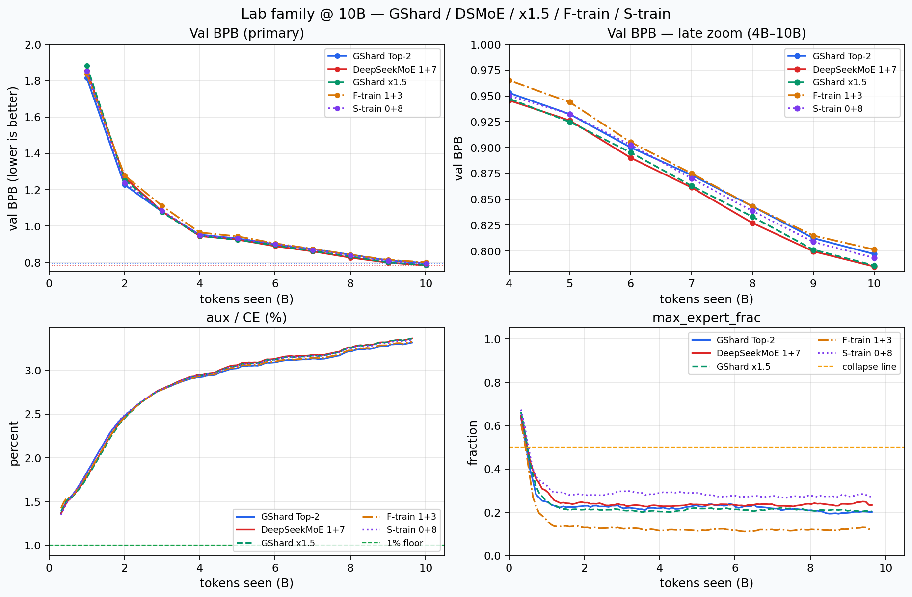
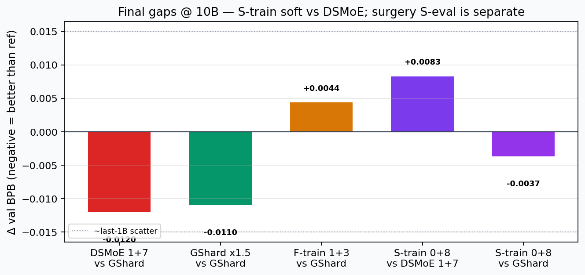
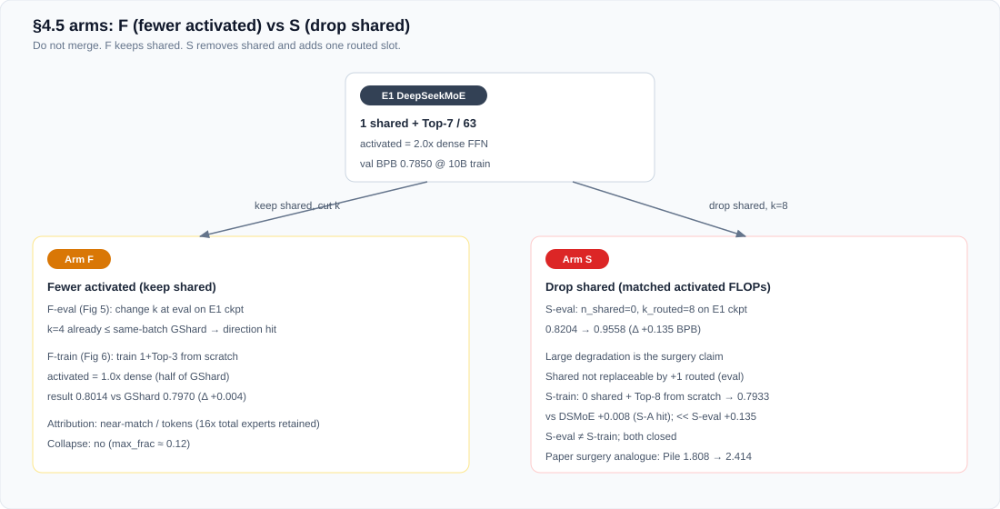

# DeepSeekMoE vs GShard — Experiment Report

**Status:** Closed (10B on frozen `data_l2`). Optional 40B continuation incomplete.  
**Paper:** [Dai et al., *DeepSeekMoE*](https://arxiv.org/abs/2401.06066) (arXiv:2401.06066).  
**Metric:** held-out BPB (GPT-2 50k), lower is better.  
**Compute:** multi-GPU data parallel (no expert parallel). CPU / single-GPU reproduce scope: [`REPRODUCE.md`](REPRODUCE.md).

Detail: [`EXPERIMENT_DESIGN.md`](EXPERIMENT_DESIGN.md#status-and-document-map) (status + per-phase links) · [`ABLATION_ARMS_DESIGN.md`](ABLATION_ARMS_DESIGN.md) · [`REPRODUCE.md`](REPRODUCE.md)

---

## 1. Why this work exists

We ran this work **to reproduce the paper’s 2B validation / ablation story**.

The paper (DeepSeekMoE) claims that, at a small MoE scale (~2B total / ~0.3B activated), two layout changes — **fine-grained experts** and **one shared expert** — beat matched-FLOP GShard, match a 1.5×-wider GShard, still work with fewer activated experts, and that the shared expert cannot be swapped for one extra routed expert.

**What “reproduce” means here:** same architecture lock and the same *directions* of those claims.  
**Out of scope:** absolute Pile CE (paper 1.808), and product DeepSeek-V2/V3 training.

| Paper claim we want to reproduce | What we ran |
| --- | --- |
| Same FLOP: DeepSeekMoE beats GShard | Train both layouts to **10B** under matched total & activated params |
| DeepSeekMoE ≈ GShard with 1.5× expert compute | Train **GShard×1.5**; compare to DeepSeekMoE |
| Fewer routed experts at eval still ≈ GShard | On trained DeepSeekMoE, **only change k at eval** |
| Half activated from scratch still beats GShard | Train **1 shared + Top-3** from scratch |
| Shared expert is necessary | **Two complementary protocols:** (1) eval surgery — drop shared on a trained ckpt, k=8; (2) train from scratch with **0 shared + Top-8** |

Shared is tested both ways on purpose: surgery asks whether a trained shared can be replaced at eval; from-scratch asks whether the model can learn without ever having one. Same claim, two protocols; both are part of the shared-ablation design.

**Deliberate gaps vs paper:** they use 100B tokens + internal mix + 8k BPE + Pile CE; we use **10B** + `data_l2` + GPT-2 50k + **val BPB**. So the readout is ranking / direction. Absolute CE is out of scope as a target.

Out of scope: Dense×16, Hash/Switch, 16B/145B, V2/V3.

---

## 2. How we set up the reproduction

### 2.1 Fair comparison lock

Keep expert **params** and **FLOPs** fixed; only change layout — otherwise the ablation is meaningless.

| Role | Layout | Total | Activated |
| --- | --- | ---: | ---: |
| GShard | 16 full experts, Top-2 | 16× dense | 2.0× |
| DeepSeekMoE | 1 shared + Top-7 / 63 quarters | 16× dense | 2.0× |

Skeleton / optim match the paper’s 2B recipe (9L / d=1280 / 10 heads / seq 2048 / batch ~4M / LR / α₁=0.01 / no drop / no EP). Aux load-balance must be correct; a first buggy aux run collapsed routing and was thrown away.

### 2.2 Reproduction matrix

| To reproduce … | Our protocol | Outcome |
| --- | --- | --- |
| DeepSeekMoE beats GShard @ same FLOP | Train both @ 10B | DeepSeekMoE **−0.012** BPB (direction hit; ≥0.02 miss) |
| DeepSeekMoE ≈ GShard×1.5 | Train GShard×1.5 @ 10B | **0.7860** ≈ DeepSeekMoE **0.7850** |
| Fewer k at eval still ≈ GShard | Eval k=3…7 on DeepSeekMoE ckpt | k≥4 ≤ same-batch GShard |
| Half activated from scratch still beats GShard | Train 1+Top-3 @ 10B | **0.8014** vs GShard **0.7970** (near-match) |
| Shared necessary — eval surgery | Eval n_shared=0, k=8 | **+0.135** BPB |
| Shared necessary — from scratch | Train 0+Top-8 @ 10B | **+0.008** vs DeepSeekMoE (soft) |

Commands: [`REPRODUCE.md`](REPRODUCE.md).

### 2.3 Executed setup

| Item | Value |
| --- | --- |
| Tokens / job | 10.003B |
| Val | 50M holdout, BPB |
| Seed | 1 |
| Parallelism | Data parallel (`WORLD=20` batch recipe) |

---

## 3. Did we reproduce it?

- **vs GShard:** yes in direction (0.7850 vs 0.7970, Δ **−0.012**); gap smaller than the paper’s strong wording.
- **≈ GShard×1.5:** yes (\|Δ\| **0.001**).
- **Fewer k at eval:** yes (k≥4).
- **Half activated from scratch:** partial — near GShard (**+0.004**); near-match only.
- **Shared necessary:** eval surgery **yes** (**+0.135**); from-scratch no-shared only **+0.008** vs DeepSeekMoE — both protocols in the design; surgery is much harsher than never having shared.

*Figure: E1 / E3 / F / S scorecards (metrics only).*

### Reading the scorecard

| Tag | Meaning |
| --- | --- |
| **F** | Fewer activated experts |
| **S** | Shared-expert ablation |

**Attribution**

| Comparison | Δ BPB | Read as | Main cause |
| --- | ---: | --- | --- |
| F-train vs GShard | +0.004 | near-match | 10B tokens (paper ~100B) + half activated (total experts still 16×) |
| S-train vs DeepSeekMoE | +0.008 | soft from-scratch hit | shared isolation helps, weakly at 10B |
| S-eval vs same-draw DSMoE | +0.135 | large cliff | post-hoc drop-shared on a trained ckpt (different protocol from S-train) |

**Contrast**

| Ordering (val BPB, lower better) | Takeaway |
| --- | --- |
| DeepSeekMoE ≺ GShard | clear if weak ranking |
| F-train ≈ GShard | half-activated train does not pull ahead |
| DeepSeekMoE ≺ S-train ≺ GShard | no-shared from-scratch sits in between |
| S-eval ≫ others | surgery cliff; do not merge with S-train |

**Locked setup:** 9L / d=1280 / 10 heads · seq 2048 · batch ~4M · α₁=0.01 · data parallel (`WORLD=20` recipe) · frozen `data_l2`.

---

## 4. Results

*Figure: family curves. Late in training, no-shared from-scratch sits between DeepSeekMoE and GShard.*

*Figure: final gaps. Soft from-scratch shared gap vs large surgery cliff (surgery omitted from this bar chart).*

### Metrics on the family curves

Primary readout is **val BPB**. The other two panels are **routing health** (sanity), separate from quality:

| Metric | Meaning | How to read it |
| --- | --- | --- |
| **aux / CE** | Expert load-balance loss divided by the language-model cross-entropy. Aux is the paper-style balance term (α₁=0.01) that pushes tokens across routed experts. | Healthy training usually sits around a few percent. Near **0** means balance is too weak (routers can collapse). We use it as a sanity check. It is not the ranking metric. |
| **max_expert_frac** | Fraction of tokens hitting the **busiest** single routed expert (worst layer / step). | Low and stable ≈ load is spread. Approaching **0.5+** ≈ one expert monopolizes traffic (**routing collapse**). Gates require end-of-run max_frac &lt; 0.5. |

In this work: main arms end with max_frac roughly **0.12–0.26** and aux/CE around **~3%** — no collapse. The discarded first run had broken aux (too weak), max_frac blew up, and the DeepSeekMoE vs GShard gap nearly disappeared.

### 4.1 Final 10B table

| Arm | Activated / dense | val BPB | vs GShard | vs DeepSeekMoE |
| --- | ---: | ---: | ---: | ---: |
| GShard Top-2 | 2.0× | **0.7970** | 0 | +0.012 |
| DeepSeekMoE 1+Top-7 | 2.0× | **0.7850** | **−0.012** | 0 |
| GShard×1.5 | ~3.0× | **0.7860** | **−0.011** | +0.001 |
| Half-activated (1+Top-3) | **1.0×** | **0.8014** | **+0.004** | +0.016 |
| No-shared from scratch (0+Top-8) | 2.0× | **0.7933** | **−0.004** | **+0.008** |

Wall ≈ 23–33 h / arm under the closed data-parallel recipe.

### 4.2 Val BPB vs tokens

| tokens | GShard | DeepSeekMoE | ×1.5 | Half-act | No-shared |
| ---: | ---: | ---: | ---: | ---: | ---: |
| 1B | 1.813 | 1.854 | 1.881 | 1.835 | 1.853 |
| 2B | 1.228 | 1.269 | 1.257 | 1.279 | 1.238 |
| 3B | 1.079 | 1.081 | 1.076 | 1.111 | 1.086 |
| 4B | 0.953 | 0.946 | 0.947 | 0.965 | 0.950 |
| 5B | 0.932 | 0.926 | 0.925 | 0.944 | 0.932 |
| 6B | 0.900 | 0.890 | 0.895 | 0.905 | 0.903 |
| 7B | 0.874 | 0.861 | 0.863 | 0.875 | 0.870 |
| 8B | 0.843 | 0.827 | 0.833 | 0.843 | 0.839 |
| 9B | 0.812 | 0.800 | 0.801 | 0.815 | 0.809 |
| **10B** | **0.797** | **0.785** | **0.786** | **0.801** | **0.793** |

### 4.3 Claim checklist

| Claim | Result |
| --- | --- |
| Layout / batch lock | **Hit** |
| DeepSeekMoE &lt; GShard (ranking) | **Hit** (Δ=−0.012) |
| Gap ≥ 0.02 BPB | **Miss (magnitude)** |
| No routing collapse on main arms | **Hit** |
| Match GShard×1.5 | **Hit** (\|Δ\|=0.001) |
| Eval fewer k ≤ GShard | **Hit** (k≥4) |
| Half-activated train &lt; GShard (strict) | **Miss** — near-match +0.004 |
| Shared surgery hurts | **Hit** (+0.135) |
| No-shared from scratch worse than DeepSeekMoE by ≥0.008 | **Hit** (+0.0083) |

---

## 5. Analysis

### 5.1 Matched-FLOP ranking

After fixing load-balance (paper-style expert aux), DeepSeekMoE leads from ~4B onward. The **−0.012** gap is real in direction but the same order as the last-1B drop (~0.015). A first run with a buggy aux (`.mean()` instead of `.sum()`) collapsed routers and nearly erased the layout gap — balanced training is required for the fine-grained advantage to show. Aux helps DeepSeekMoE BPB (~−0.008) and barely moves GShard.

### 5.2 Match GShard×1.5

GShard×1.5 (0.7860) sits on DeepSeekMoE (0.7850). “Matches 1.5× expert compute” holds **in direction** on this mix at 10B.

### 5.3 Fewer activated experts

*Figure: fewer-activated vs drop-shared. Do not merge the two protocols.*

**Eval sweep:** on a Top-7-trained checkpoint, k≥4 already ≤ same-batch GShard — direction hit.

**From-scratch half activated:** 1+Top-3 lands at **0.8014** vs GShard **0.7970** (**+0.004**). Preferred framing: **near-match only**. Gap is ~3× smaller than the full-model edge and inside ~0.015 last-1B scatter. Attribution: **tokens (10B vs paper ~100B) + half activated is harder to learn**. Total params are still 16× dense, so a total-param shortfall is a poor explanation. No collapse (`max_frac≈0.12`).

### 5.4 Shared expert (two protocols, one claim)

| Protocol | Question | Result |
| --- | --- | --- |
| **Eval surgery** | After training **with** shared, can +1 routed replace it? | **No** — **+0.135** BPB |
| **From-scratch no shared** | Can learning work if shared never exists? | Soft gap — **+0.008** vs DeepSeekMoE; still slightly beats GShard |

Same design question (“is shared necessary?”), answered at eval time and at train time. Surgery is a large cliff; from-scratch is a small gap — both belong in the shared ablation.

### 5.5 Same-batch eval draw

Absolute BPB on this draw sits ~0.03–0.04 above the train-table DeepSeekMoE number; **within-draw ranking** is the readout.

| Config | val BPB | vs same-draw GShard 0.8318 |
| --- | ---: | ---: |
| GShard Top-2 | 0.8318 | 0 |
| 1+Top-3 | 0.8403 | +0.0085 |
| 1+Top-4 | **0.8288** | **−0.0030** |
| 1+Top-7 | **0.8204** | **−0.0114** |
| Shared off + Top-8 | **0.9558** | — (+0.135 vs baseline 0.8204) |

---

## 6. What this supports / does not

| Statement | Supported? |
| --- | --- |
| Fine-grained + shared beats matched-FLOP GShard at 10B | **Yes, weakly** (Δ=−0.012) |
| Gap as large as paper’s “overwhelming” bar (≥0.02 here) | **No** |
| Matches GShard×1.5 | **Yes** |
| Half-activated train clearly beats GShard | **No** (near-match) |
| Eval fewer k can match GShard | **Yes** (k≥4) |
| Shared cannot be replaced by +1 routed (**eval surgery**) | **Yes** (+0.135) |
| Shared helps when trained from scratch | **Yes, softly** (+0.008) |
| Absolute Pile 1.808 / V2/V3 | **No** |

---

## 7. Backlog

| Item | Status |
| --- | --- |
| 40B continuation (paired) | Incomplete — GShard finished; DeepSeekMoE stopped mid-run; unpaired (no paired readout) |
| GShard Top-1 same-activation control for half-activated | Optional |
| Pile 100B / Dense×16 | Out of scope |

---

## 8. Artifacts and reproduce

| Archive | Contents |
| --- | --- |
| `artifacts/e1_lb_archive/` | Matched-FLOP ranking (canonical) |
| `artifacts/e1_archive/` | Invalid collapsed first run (aux bug) |
| `artifacts/e3_archive/` | GShard×1.5 |
| `artifacts/fs_eval_archive/` | Eval k-sweep + shared surgery |
| `artifacts/f_train_archive/` | Half-activated from scratch |
| `artifacts/s_train_archive/` | No-shared from scratch |
| `artifacts/e2_archive/` | Incomplete 40B attempt |

Plots: `scripts/plot_lab_family.py`, `scripts/plot_e1_lb.py`.  
SVG: `docs/figures/render_lab_overview.py`, `docs/figures/render_dsmoe_vs_gshard.py`.  
Layout lock: `scripts/check_arch.py`.  
**Reproduce all arms:** [`REPRODUCE.md`](REPRODUCE.md).
