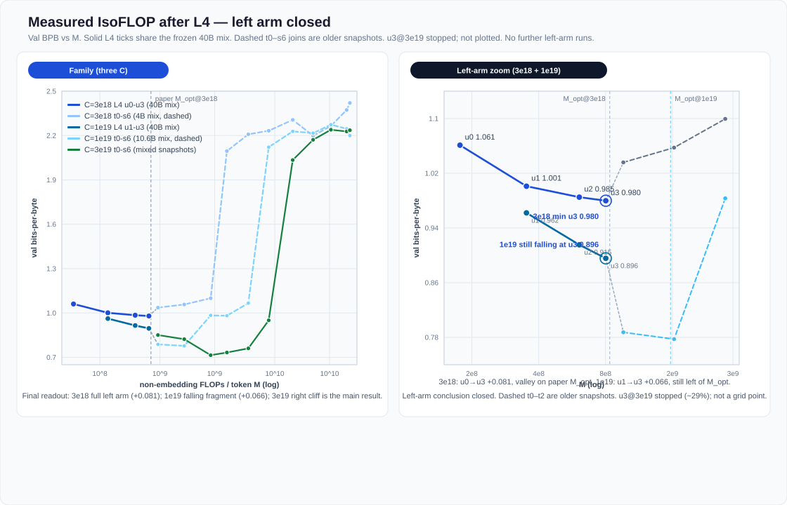
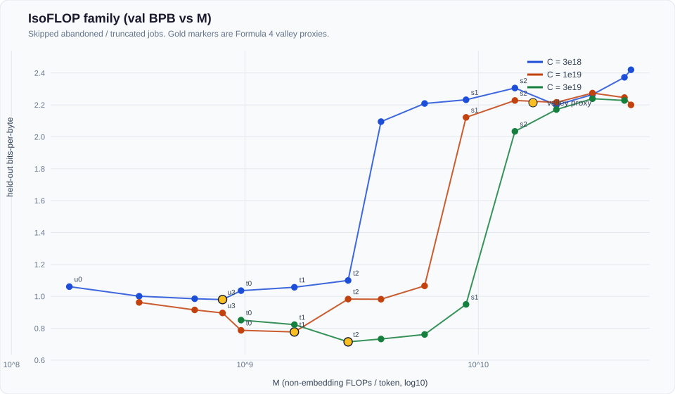
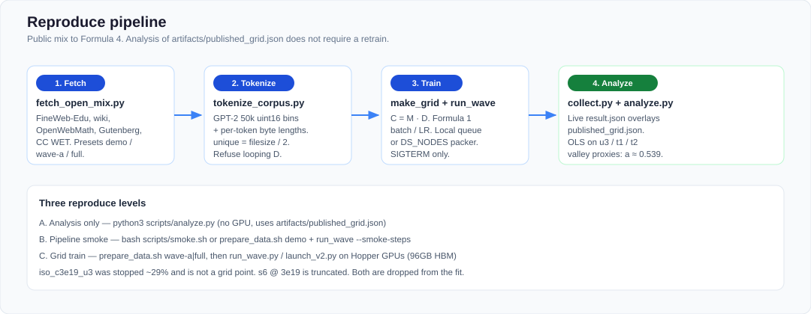

# DeepSeek-V1 IsoFLOP lab

From-scratch IsoFLOP experiment for DeepSeek-LLM V1 scaling ([arXiv:2401.02954](https://arxiv.org/abs/2401.02954) §3). Top width matches the product 7B (30L / d=4096 / 32 heads).

This directory is a **runnable lab**: train, collect, and analyze. It is not an atlas note page.

| Doc | Role |
|-----|------|
| [docs/EXPERIMENT_REPORT.md](docs/EXPERIMENT_REPORT.md) | Measured results (closed) |
| [docs/EXPERIMENT_DESIGN.md](docs/EXPERIMENT_DESIGN.md) | Pre-registered goals + pilot fail |
| [docs/WAVE_L_DESIGN.md](docs/WAVE_L_DESIGN.md) | Left-of-s1 width ladder |
| [docs/REPRODUCE.md](docs/REPRODUCE.md) | Analysis → smoke → full train |

**Headline:** IsoFLOP valley **M_opt ∝ C^a** with **a ≈ 0.539** here vs the paper's **0.5243** (illustrative 3-point fit, not the paper's 8-budget fit).



*Figure: frozen 40B mix closes the left arm at C=3e18 (+0.081 BPB); C=1e19 is still falling at u3; C=3e19 is dominated by the right-arm cliff.*



*Figure: rebuilt by `scripts/analyze.py` from `artifacts/published_grid.json` (no GPU).*

## Quickstart — analysis only (no GPU)

```bash
cd experiments/v1-isoflop
python3 scripts/collect.py
python3 scripts/analyze.py
```

Writes `artifacts/isoflop_fit.json` and refreshes `artifacts/isoflop_family.svg`. Expect **a ≈ 0.539**.

## Quickstart — one local train job

```bash
cd experiments/v1-isoflop
bash scripts/setup_venv.sh
bash scripts/smoke.sh
```

Public mix (small sample) then a sequential grid:

```bash
bash scripts/prepare_data.sh demo
python3 scripts/make_grid.py --wave a
python3 scripts/run_wave.py --grid configs/grid.json --nproc 1 --smoke-steps 8
python3 scripts/status.py
```

Full IsoFLOP points need Hopper GPUs (96GB HBM), Formula-1 batches, and unique tokens ≥ D. See [docs/REPRODUCE.md](docs/REPRODUCE.md).

## Layout

```text
src/           model, FLOPs (Formula 1/2), trainer, data, LR
scripts/       fetch, tokenize, grid, local run, collect, analyze, cluster packer
configs/       wave grids (a / l1 / l2 / l3 / l4)
artifacts/     published measurements + generated tables/plots
docs/          design, report, figures
```

Paths default to this directory (`DS_ROOT`). Override with env if needed:

```text
DS_ROOT DS_DATA DS_RESULTS DS_LOGS DS_VENV
DS_NODES / DS_RDZV_NODES   # required for multi-node launchers (no baked-in hosts)
```

## Sample preparation

IsoFLOP needs **unique** training tokens, not epochs over a tiny dump. At fixed compute `C`, each width spends `D = C / M` tokens. If `D` exceeds the unique train pool, the job would loop the same text — that is **not** a valid IsoFLOP point (the TinyStories pilot failed for this reason). The lab refuses those schedules.



*Figure: public mix → packed bins → train / analyze. Analysis of `artifacts/published_grid.json` does not need a refetch.*

### Pipeline (what `prepare_data.sh` does)

```text
1. Fetch   scripts/fetch_open_mix.py
           official dumps / hub APIs only → $DS_DATA/raw/mix/*.jsonl
           sources: FineWeb-Edu, Wikipedia EN/ZH, OpenWebMath,
                    Gutenberg, Common Crawl WET
           report mix skips The Stack and C4 (--code-docs 0 --c4-docs 0)

2. Tokenize  scripts/tokenize_corpus.py
           GPT-2 50k (tiktoken) → packed uint16 train.bin / val.bin
           + matching *.bytes.bin (UTF-8 byte length per token, for BPB)
           docs shorter than ~80 chars are dropped at fetch time

3. Gate    unique_train = sizeof(train.bin) / 2
           run_wave.py / make_grid only keep jobs with unique_train ≥ D
```

One command:

```bash
bash scripts/prepare_data.sh smoke     # random bins, no download
bash scripts/prepare_data.sh demo      # ~2M train / 200k val tokens
bash scripts/prepare_data.sh wave-a    # ~4B unique train (Wave A / L1)
bash scripts/prepare_data.sh full      # toward ~40B unique (L3 / L4 floor)
```

| Preset  | Fetch scale (order of mag.) | Train / val token targets | Used for |
|---------|-----------------------------|---------------------------|----------|
| `smoke` | none (RNG packed tokens)    | small local smoke         | CI / wiring |
| `demo`  | thousands of docs           | 2M / 0.2M                 | pipeline check |
| `wave-a`| ~3M FineWeb docs + wiki/math/Gutenberg/CC | 4B / 50M | Wave A + L1 |
| `full`  | larger FineWeb + same family | 40B / 50M              | L3 / L4 unique floor |

Published L4 left-arm points used a **frozen** mix of **39_995_303_545** unique train tokens. Rebuilding that mix is optional and slow; reading the report only needs `artifacts/published_grid.json`.

Corpus **grew across waves** (4.00B → 10.6B → 40B). Compare BPB within one snapshot; dashed joins in the measured figure mark a corpus change, not a matched IsoFLOP neighbor. Details: [docs/REPRODUCE.md](docs/REPRODUCE.md) §3 · [docs/WAVE_L_DESIGN.md](docs/WAVE_L_DESIGN.md).

## Training

Each job is named `iso_c{budget}_{width}` and spends `D = C / M` tokens (Formula 2 M, Formula 1 batch and LR). Local sequential queue:

```bash
python3 scripts/make_grid.py --wave l4
python3 scripts/run_job.py --job-id iso_c3e18_u3 --grid configs/grid_wave_l4.json --nproc 8 --foreground
python3 scripts/run_wave.py --grid configs/grid_wave_l4.json --nproc 8
```

`run_wave.py` skips finished `result.json` and refuses jobs whose D would loop the unique train set.

Multi-node packers (`launch_v2.py`, `launch_l3_20gpu.py`, `launch_l4_24gpu.py`) need explicit `DS_NODES` / `DS_RDZV_NODES`.

## Logs and analysis

| Script                     | Output                                                                    |
| -------------------------- | ------------------------------------------------------------------------- |
| `scripts/collect.py`       | `artifacts/collected_jobs.json` / `.csv` (live results overlay published) |
| `scripts/analyze.py`       | Formula 4 OLS on valley proxies u3@3e18, t1@1e19, t2@3e19                 |
| `scripts/status.py`        | local pid / result.json / last log line                                   |
| `scripts/stop_job.sh <id>` | SIGTERM only                                                              |

Hardware for the published runs: Hopper GPUs (96GB HBM). License: Apache-2.0.
