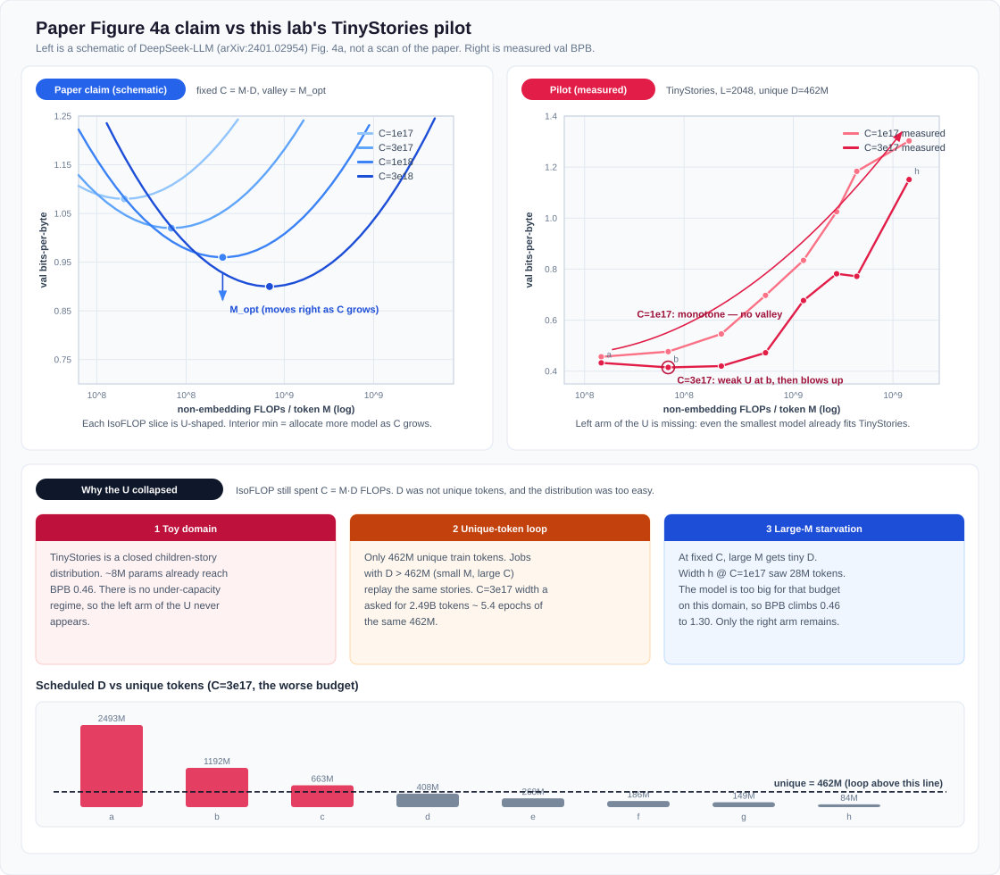
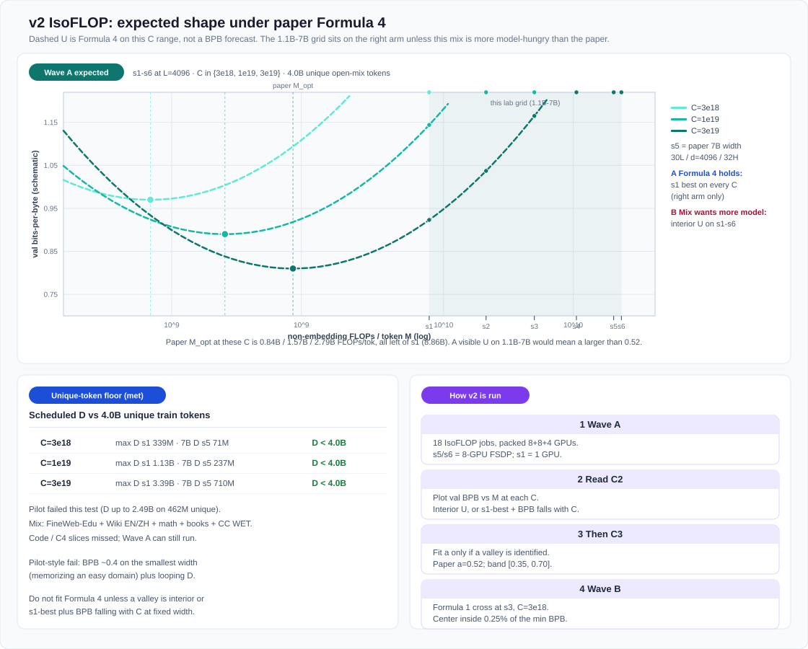

# DeepSeek-LLM V1 IsoFLOP lab

From-scratch check of *DeepSeek LLM* (arXiv:2401.02954) §3 on 20× Hopper (96GB HBM).

This lab does **not** retrain the product 7B/67B at 2T tokens, and does **not** start from Qwen or any other pretrained checkpoint. V1 fit its scaling laws on small dense runs, then used those laws to train the product models. Here the product **7B width** (30L / d=4096 / 32 heads / MHA) is the **top of the grid**; IsoFLOP budgets stay in the paper’s small-`C` range so 20 GPUs can finish.

Figures below are original schematics of the paper **claim** plus **measured** pilot points. They are not scans of the copyrighted paper figures.

---

## 1. What the paper claims (Figure 4a)

Fix compute `C = M · D`, where `M` is non-embedding FLOPs per token (Formula 2) and `D` is training tokens. Sweep model size at that `C`. Validation **bits-per-byte** vs `M` is **U-shaped**. The valley is `M_opt`: smaller `M` is under-capacity, larger `M` is under-trained.

As `C` grows, the valley moves **right** (`M_opt ∝ C^a`, `a ≈ 0.524`) and **down**. Data scales almost as fast (`D_opt ∝ C^b`, `b ≈ 0.476`). That is Formula 4.

Hyperparameters at each `C` come from Formula 1 (batch tokens and max LR). The metric is held-out BPB, not training loss.



Left panel: schematic of that claim (several `C`, each a U, valleys marked). Right panel and the bars under it are this lab’s pilot.

---

## 2. Pilot: how the U collapsed

Twenty independent 1-GPU jobs. TinyStories, `L=2048`, GPT-2 50k, unique train tokens **462M**. Widths `a`–`h` from ~8M to ~0.5B non-embedding params. Budgets `C ∈ {1e17, 3e17}` plus a Formula 1 cross.

### Measured BPB

| width | M | D @ 1e17 | BPB @ 1e17 | D @ 3e17 | BPB @ 3e17 |
|-------|--:|---------:|-----------:|---------:|-----------:|
| a 6L/384 | 1.20e8 | 831M | **0.457** | 2.49B | 0.433 |
| b 8L/512 | 2.52e8 | 397M | 0.477 | 1.19B | **0.415** |
| c 10L/640 | 4.52e8 | 221M | 0.546 | 663M | 0.420 |
| d 12L/768 | 7.36e8 | 136M | 0.697 | 408M | 0.472 |
| e 14L/896 | 1.12e9 | 89M | 0.834 | 268M | 0.677 |
| f 16L/1024 | 1.61e9 | 62M | 1.025 | 186M | 0.782 |
| g 20L/1024 | 2.01e9 | 50M | 1.183 | 149M | 0.772 |
| h 24L/1280 | 3.59e9 | 28M | **1.303** | 84M | 1.151 |

`C=1e17` is **monotone**: smallest model best. `C=3e17` has a weak dip at `b`, then the same blow-up. Formula 1 center (`f1_opt` BPB 0.759) is **worse** than `η/2` (0.610) — outside the paper’s 0.25% near-opt band.

### Why (not “IsoFLOP is false”)

The identity `C = M · D` was still spent in FLOPs. Two ingredients of Figure 4a were missing.

**The left arm never exists on TinyStories.** A U needs an under-capacity regime: a model too small to fit the distribution. Width `a` (~8M params) already reaches BPB **0.46**. That is memorizing a closed children’s-story domain, not modeling open web text. Growing `M` cannot buy a better fit of a distribution that is already saturated, so the curve has no descending left arm.

**`D` was not unique tokens.** 462M unique tokens. Any job with scheduled `D > 462M` loops. At `C=3e17`, width `a` asked for **2.49B** tokens ≈ **5.4 epochs** of the same 462M. Those points are not IsoFLOP on new data; they are extra epochs on a toy set. The bar chart in the figure marks every `C=3e17` job above the 462M dashed line as looping.

**The right arm is all that remains.** At fixed `C`, large `M` gets a tiny `D` (width `h` @ `1e17` saw **28M** tokens). The model is too big for that budget, BPB climbs 0.46 → 1.30. That looks like “bigger is worse,” which is the right arm of a U with the left arm cut off.

Together: **easy domain + looping unique tokens + starved large-M jobs.** Do not fit Formula 4 on these points. Keep the artifacts as a negative control (`results/pilot_tinystories/`).

---

## 3. Goals for v2

| # | Goal | Hit | Miss |
|---|------|-----|------|
| C1 | Scale unit is `M`, not `6N1`/`6N2` | Table of `6N1/M`, `6N2/M` at `L=4096` has the same **direction** as paper Table 3 (small models: `6N1` low, `6N2` high) | Ratios near 1 even at 1B, or the formula is implemented wrong |
| C2 | IsoFLOP curve is a real compute–data tradeoff, not TinyStories memorization | See readout below | Repeat of pilot: BPB ~0.4 on the smallest width, looping `D`, larger `M` only worse |
| C3 | `M_opt ∝ C^a` with `a ≈ 0.5` | Fit only if a valley is identified; `a ∈ [0.35, 0.70]` (paper 0.524). Do not claim a numerical match on a different corpus | Fitting `a` on endpoint minima |
| C4 | Formula 1 near-opt band (0.25% val) | After C2, 5-point `(B, η)` cross; Formula 1 inside the band or report the miss | Skip if C2 is a pilot-style fail |
| C5 | Higher-quality data → larger `a` | Optional second corpus, **only** after C2 is not a collapse | |

Not in scope: 7B/67B @ 2T, SFT/DPO, AlignBench / MT-Bench.

### C2 readout on a 1.1B–7B grid (important)

Paper Formula 4 at **this lab’s** budgets:

| C | paper `M_opt` | this grid |
|---|--------------:|-----------|
| 3e18 | 8.35e8 | s1 already **8.86e9** |
| 1e19 | 1.57e9 | all widths to the **right** of the valley |
| 3e19 | 2.79e9 | still left of s1 |

So if Formula 4 **transfers**, the 1.1B–7B points sit on the **right arm**. The expected plot is not a full U on s1–s6.



Two non-collapse outcomes:

- **A — Formula 4 holds on this mix.** Every `C` is monotone with **s1 best**, but unlike the pilot: web-scale BPB (not 0.46), **BPB falls as `C` grows at fixed width**, and no job loops unique tokens. The valley is inferred to lie **left of 1.1B**, which is what Formula 4 says at these `C`.
- **B — this mix is more model-hungry** (`a` larger than 0.52, paper Table 4 style). Then an **interior U appears on s1–s6**, valley moving right with `C`. That is a C2 hit *on this grid*, and a C5-adjacent finding.

Pilot-style fail (stop, do not fit Formula 4): smallest width at BPB ~0.4, `D` looping, larger `C` does not help fixed-width BPB.

7B is in the grid to match the **product width**, not because Formula 4 says 7B is `M_opt` at `3e19` (it does not; paper `M_opt` at `8.5e22` is the 7B @ 2T product point).

---

## 4. How v2 is run

### Locked (match paper unless noted)

| Item | Paper | This lab |
|------|-------|----------|
| Init | std **0.006** | same |
| Optim | AdamW β=(0.9, **0.95**), wd=0.1, clip=1.0 | same |
| LR | warmup 2000 → 100% → **31.6% @ 80% tokens** → **10% @ 90%** | same; if steps &lt; 40k, warmup = `min(2000, 5% steps)` (logged) |
| Arch | Pre-Norm RMSNorm, SwiGLU **8/3 d**, RoPE, MHA | same; no GQA |
| `l_seq` | **4096** | **4096** |
| Scale | `C = M · D`, `M = 72 n d² + 12 n d L` | same |
| Batch / LR | Formula 1 | same |
| Val | BPB, 100M held-out | BPB, **50M** held-out |
| Tokenizer | BBPE ~100k | GPT-2 50k (uint16). Comparison metric is still BPB |
| Data | internal EN/ZH mix | open mix, unique train tokens **≥ max scheduled D** |
| Parallel | paper cluster | Independent **8-GPU single-node** FSDP jobs; pack one per idle node (≤3 concurrent) |
| Activation memory | — | Gradient checkpointing **off** (`--no-checkpoint`): 96GB/GPU makes recompute pure overhead (~26% throughput on s3, gradient-identical) |

### Widths

Head dim 128. **s5 = V1 7B Table 2**.

| id | n_layer | d_model | n_heads | N1 | M (`L=4096`) | n_gpus |
|----|--------:|--------:|--------:|---:|-------------:|-------:|
| s1 | 22 | 2048 | 16 | 1.11B | 8.86e9 | 8 |
| s2 | 24 | 2560 | 20 | 1.89B | 1.43e10 | 8 |
| s3 | 26 | 3072 | 24 | 2.94B | 2.16e10 | 8 |
| s4 | 28 | 3584 | 28 | 4.32B | 3.08e10 | 8 |
| s5 | 30 | 4096 | 32 | 6.04B | 4.23e10 | 8 |
| s6 | 32 | 4096 | 32 | 6.44B | 4.51e10 | 8 |

Budgets **`C ∈ {3e18, 1e19, 3e19}`** (18 jobs). At 7B, `C=1e17` would be ~2M tokens and would starve by construction.

| C | D for s1 | D for s5 (7B) |
|--:|---------:|--------------:|
| 3e18 | 339M | 71M |
| 1e19 | 1.13B | 237M |
| 3e19 | 3.39B | 710M |

### Data (ready)

Unique-token floor is met: **4.00B train + 50M val** GPT-2 tokens, no looping even for s1 @ `3e19`.

| slice | docs | role |
|-------|-----:|------|
| FineWeb-Edu sample-10BT | 3.0M | web-edu bulk |
| Wikipedia EN / ZH | 250k / 120k | encyclopedia + Chinese |
| OpenWebMath | 80k | STEM |
| CC WET | 134k | raw web (official crawl) |
| Gutenberg | 375 books | long prose |
| The Stack / C4 / ZH FineWeb-Edu | 0 | hub timeout; skipped |

Pilot TinyStories bins live under `data/pilot_tinystories/` and are not overwritten.

### Waves

**Wave L — left-of-s1 (t0–t4).** See [`WAVE_L_DESIGN.md`](WAVE_L_DESIGN.md). L1 is t0–t4 @ `C=3e18` only (`configs/grid_wave_l.json`). Do not retrain s1–s6.

**Wave A — IsoFLOP (C1 x-axis, C2, then C3).** 18 jobs. Pack onto 20 GPUs (typical first pack: 8-GPU 7B + 8-GPU 7B + 4-GPU 3B). Re-run `scripts/launch_v2.py` when `result.json` appears.

**Wave B — Formula 1 (C4).** Only if C2 is not a pilot-style fail. Fix s3, `C=3e18`, cross `B, η ∈ {0.5, 1, 2} ×` Formula 1 (five trains if the center is reused).

### Stop / go

1. Log `unique_train_tokens` vs scheduled `D` on every job. If `D` exceeds unique tokens, that point is invalid for IsoFLOP.
2. Plot val BPB vs `M` at each `C`.
3. Classify C2 as A, B, or pilot-fail using §3.
4. Fit Formula 4 **only** for outcome B, or for outcome A after adding smaller widths (paper Table 3 scale) so the valley is on-grid.
5. Do not run Wave B on a pilot-style fail.

---

## 5. Ops

```bash
export DS_ROOT=/path/to/ds-v1-isoflop
export DS_NODES='node-a:8 node-b:8 node-c:4'
bash scripts/stop.sh              # SIGTERM only
python3 scripts/make_grid.py
python3 scripts/launch_v2.py      # re-run to drain the queue
python3 scripts/fit_isoflop.py --results-dir "$DS_ROOT/results"
```

Figures: `python3 docs/figures/render_design_svgs.py` (requires `xmllint` to check).
