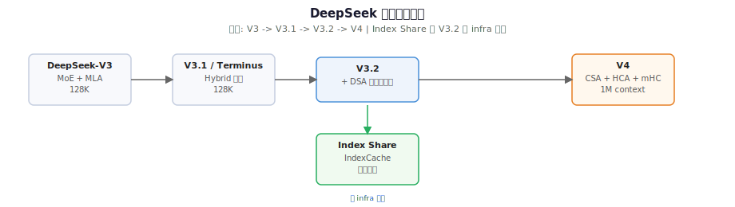

# 知识库导读

> **《ds-技术报告》读本** · [← 返回全书目录](../README.md) · [中文导读（文章索引）](./02-中文导读.md)

---

## 从这里读起

**[01 版本演进总览](../01-总览/01-版本演进总览.md)** — 全书主线。三线导读、各版本梗概、DSA/ESS/Engram 等跳转均在该章内展开。

修改内容请编辑 `deepseek-everything/docs/` 源稿，再执行 `python3 build_book.py`。

---

## 快速对照图

[直接打开 SVG](../01-总览/figures/deepseek-version-quick.svg)

---

卷册地图（需要时展开）

| 卷 | 主题 |
|----|------|
| [01 总览](../01-总览/01-版本演进总览.md) | 演进总览、三线导读、V1→V3 |
| [02 基座架构](../02-基座架构/01-V3基座.md) | V3 MLA / MoE / FP8 |
| [03 后训练与 R1](../03-后训练与R1/01-RLVR.md) | RLVR、R1 |
| [04 版本代际](../04-版本代际/00-V1-LLM.md) | V1 … V4 各代 |
| [05 DSA](../05-DSA稀疏注意力/01-系列导读.md) | 稀疏注意力、Index Share |
| [06 推理基础设施](../06-推理基础设施/01-ESS概念.md) | ESS、投机解码、V4 KV |
| [07 Engram](../07-Engram/01-Engram官方README.md) | 条件记忆 |
| [08 外部解读](../08-外部解读/01-Raschka要点速读.md) | 社区对照阅读 |

完整章节目录见 [全书 README](../README.md)。

---

## 章节导航

| ← 上一章 | 下一章 → |
|----------|----------|
| [全书目录](../README.md) | [DeepSeek 版本演进：V1 → V3 → V3.2 → V4，Index Share 与 KV-offload](../01-总览/01-版本演进总览.md) |

> **《ds-技术报告》读本** · [← 返回全书目录](../README.md) · [中文导读（文章索引）](./02-中文导读.md)
