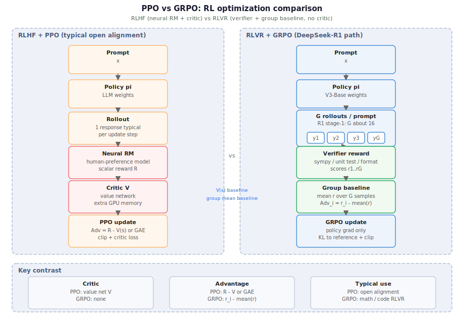

# deepseek-mechanism-atlas · 中文导读

> **丝滑阅读 × 深度拆解 × 前沿跟进** — 非官方 DeepSeek 技术笔记（V1→V4）。**与 DeepSeek 官方无隶属关系**。
>
> **Smooth, deep notes on frontier DeepSeek tech**. Unofficial; not affiliated with DeepSeek.

> [← English homepage](https://github.com/fooSynaptic/deepseek-mechanism-atlas)
>
> **[在线成书](https://fooSynaptic.github.io/deepseek-mechanism-atlas/)**

### 推荐阅读

本笔记是**双向引用 wiki**：文首有反向回链，文内有正向深入链接。要发挥这套导航的价值，请用下面两种方式之一——**不要用 GitHub 仓库内的 blob 预览**。

| 方式 | 何时用 | 导航怎么玩 |
|------|--------|------------|
| **IDE Preview**（VS Code / Cursor） | 已 clone 仓库、本地精读或改稿 | 点文首 `←` 回链与文内链接即可跳转；可开**预览分栏**或沿预览历史回溯——**正向 / 反向引用价值最大** |
| **[GitHub Pages（mdBook）](https://fooSynaptic.github.io/deepseek-mechanism-atlas/)** | 在线阅读、无需 clone | 公式、图示与 IDE 一致；用浏览器 **后退 / 前进** 沿阅读路径返回上一篇或再进下一篇，效果与 IDE 里点链接类似 |

**小结**：本地 **IDE Preview** 与 **Pages** 二选一即可；编辑与 PR 仍在本仓库 `docs/` 进行。

> **善意提醒**：正文里的 SVG 插图下方，通常都有 **「图示详情」** 链接——点进去可在新页查看可缩放的原图。不少机制就写在图里的箭头、分区与小字标注里，值得放慢节奏、仔细品读。

> **项目仍在完善中**：梗概补全、书中镜像、链接与图示校验仍在推进。阅读时请以各篇文首的 arXiv / 官方 PDF 为准；发现断链、口径不一致或表述错误，**欢迎提 issue**。

---

## 这个项目在做什么

我从 [DeepSeek V1 技术报告](../04-版本代际/00-V1-LLM.md) 一路跟到 [**V4**](../04-版本代际/03-V4.md)，并把**大部分**主要技术文章里的**机制与细节**拆开写清楚：架构怎么变、训练/推理在优化什么、[版本之间如何衔接](../01-总览/01-版本演进总览.md#2-版本时间线与关系)。

范围包括：

- **DeepSeek 主线**（见 [算法线](../01-总览/05-算法线导读.md) · [MoE 线](../01-总览/07-MoE线导读.md)）：[**MLA**](../02-基座架构/02-MLA低秩注意力.md)、[**DeepSeekMoE**](../02-基座架构/05-DeepSeekMoE.md)、[**aux-loss-free 路由**](../02-基座架构/03-aux-loss-free-MoE路由.md)、[**MTP**](../02-基座架构/01-V3基座.md#三mtpmulti-token-prediction)、[**RLVR**](../03-后训练与R1/01-RLVR.md) / [**R1**](../03-后训练与R1/02-R1.md)、[**DSA**](../05-DSA稀疏注意力/02-DSA梗概.md)、[**CSA / HCA**](../04-版本代际/05-CSA-HCA混合压缩注意力.md)、[**mHC**](../04-版本代际/04-mHC流形约束超连接.md)、[**Hash MoE**](../04-版本代际/06-Hash-MoE-FP4.md)、[**V4 异构 KV**](../06-推理基础设施/05-V4-KV-Layout.md) 等。
- **V4 及衍生的推理技术**（见 [基础设施线](../01-总览/06-基础设施线导读.md)）：如 [**DSpark**](../06-推理基础设施/04-DSpark投机解码.md) 投机解码（半自回归 draft + 置信度调度验证）、[**HiSparse**](../06-推理基础设施/06-V4-HiSparse.md)、[**磁盘 Prefix Cache**](../06-推理基础设施/07-V4-磁盘Prefix-Cache.md) 等。
- **叠在 DeepSeek checkpoint 上的衍生工作**——尤其 **AI Infrastructure** 向：
 - [**Index Share / IndexCache**](../05-DSA稀疏注意力/05-Index-Share梗概.md)（清华 + 智谱）：跨层复用 [DSA](../05-DSA稀疏注意力/02-DSA梗概.md) indexer 的 top-$k$ index，纯推理补丁；[逻辑详解](../05-DSA稀疏注意力/06-Index-Share逻辑.md)
 - [**ESS**](../06-推理基础设施/01-ESS概念.md)（百度百舸）：Latent-Cache CPU offload，与 DSA 算法正交；[论文梗概](../06-推理基础设施/02-ESS论文梗概.md)

---

## 演进

**[版本演进总览](../01-总览/01-版本演进总览.md)** — 全系列唯一主线入口：时间线 + 算法 / 基础设施 / MoE 三线；各版本与 infra 补丁的内链均从此文展开。

[图示详情](../01-总览/figures/deepseek-version-lineage.svg) · 与 [演进总览 §1](../01-总览/01-版本演进总览.md#1-总览) 对照阅读

[图示详情](../03-后训练与R1/figures/grpo-vs-ppo.svg) · [RLVR / GRPO](../03-后训练与R1/01-RLVR.md) · [R1](../03-后训练与R1/02-R1.md)

[图示详情](../06-推理基础设施/figures/mtp-fusion-scheme.svg) · [DSpark 投机解码](../06-推理基础设施/04-DSpark投机解码.md) · [MTP 融合 scheme](../06-推理基础设施/qa/mtp-fusion-scheme.md)

---

## 文章

| 主题 | 一句话 |
|------|--------|
| [**V1**](../04-版本代际/00-V1-LLM.md) | DeepSeek-LLM 完整中文译文 |
| [**V1 BBPE**](../04-版本代际/00-V1-BBPE词表与Tokenizer.md) | Byte-level BPE 词表与预分词 |
| [**V2**](../04-版本代际/00-V2-MoE与MLA.md) | 236B/21B；MLA + DeepSeekMoE 首次引入 |
| [**V3**](../02-基座架构/01-V3基座.md) | 671B MoE + MLA 开源旗舰基座 |
| [**V3 FP8**](../02-基座架构/06-V3-FP8动态量化.md) | 训练侧 FP8 块级动态量化 |
| [**R1**](../03-后训练与R1/02-R1.md) | V3-Base + RLVR；架构不变 |
| [**RLVR / GRPO**](../03-后训练与R1/01-RLVR.md) | 可验证奖励 + 组内相对优化 |
| [**V3.1**](../04-版本代际/01-V3.1-Terminus.md) | Hybrid 推理，128K |
| [**V3.2**](../04-版本代际/02-V3.2-DSA.md) | DSA 稀疏注意力 |
| [**DSA**](../05-DSA稀疏注意力/02-DSA梗概.md) | indexer + top-$k$ + Core MLA |
| [**Index Share**](../05-DSA稀疏注意力/05-Index-Share梗概.md) | IndexCache 纯 infra 补丁 |
| [**ESS**](../06-推理基础设施/01-ESS概念.md) · [论文梗概](../06-推理基础设施/02-ESS论文梗概.md) | Latent-Cache CPU offload |
| [**V4**](../04-版本代际/03-V4.md) | CSA + HCA + mHC；1M context |
| [**CSA / HCA**](../04-版本代际/05-CSA-HCA混合压缩注意力.md) | 4:1 稀疏 + 128:1 dense 混合压缩注意力 |
| [**mHC**](../04-版本代际/04-mHC流形约束超连接.md) | 双随机流形约束超连接 |
| [**Hash MoE + FP4**](../04-版本代际/06-Hash-MoE-FP4.md) | Hash 路由 + routed expert FP4 |
| [**V4 KV**](../06-推理基础设施/05-V4-KV-Layout.md) | Classical + State 双池 |
| [**V4 HiSparse**](../06-推理基础设施/06-V4-HiSparse.md) | inactive C4 CPU offload |
| [**V4 磁盘 Prefix**](../06-推理基础设施/07-V4-磁盘Prefix-Cache.md) | CSA/HCA 落盘 + SWA 三档策略 |
| [**DSpark**](../06-推理基础设施/04-DSpark投机解码.md) | V4 投机解码：半自回归 draft + 置信度验证 |
| [**MLA**](../02-基座架构/02-MLA低秩注意力.md) | latent 压缩 KV |
| [**DeepSeekMoE**](../02-基座架构/05-DeepSeekMoE.md) | 细粒度 routed + shared experts |
| [**MoE 路由**](../02-基座架构/03-aux-loss-free-MoE路由.md) | aux-loss-free 动态 bias 负载均衡 |
| [**$L_{\mathrm{Bal}}$**](../02-基座架构/04-序列均衡损失.md) | 序列内专家均衡损失 |
| [**Hyper-Connections**](../04-版本代际/04b-Hyper-Connections.md) | $n$ 路并行残差流；mHC 前置 |

---

---

## 许可

| 范围 | 许可 |
|------|------|
| 导读、图示、成书读本 | [CC BY 4.0](../../LICENSE) |
| `scripts/` | [MIT](../../LICENSE-MIT) |
| `docs/engram/` | [Apache 2.0](../07-Engram/LICENSE) |
| `docs/material/` 镜像 | 上游 / 原论文许可 |

DeepSeek 论文、权重与官方代码库另有其许可；引用时请以 **arXiv / 官方发布** 为准。
