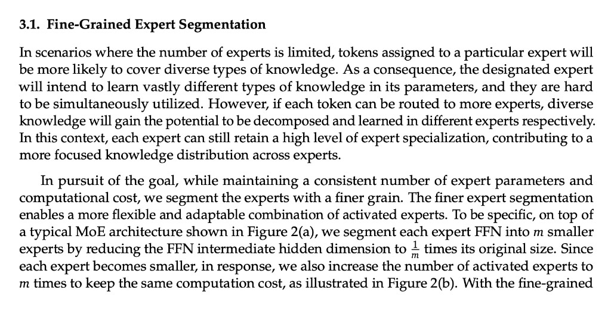
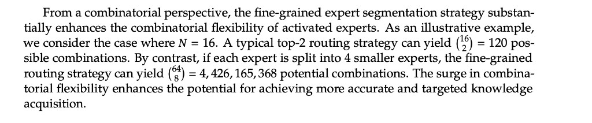

# Fine-grained Expert Segmentation：为何优于 GShard 式粗专家？

[← 返回 DeepSeekMoE §优化逻辑 (b)](../05-DeepSeekMoE.md#optimization-logic) · [答疑目录](README.md)

> 来源：DeepSeekMoE 论文（Dai et al., arXiv:[2401.06066](https://arxiv.org/abs/2401.06066)）§3.1 · V2 技术报告 [2405.04434](https://arxiv.org/abs/2405.04434) §2.2

---

## 1. 核心直觉：IsoFLOP 下换「组合空间」

Fine-grained 的操作：

1. 每个标准 expert FFN **切成 $m$ 个小 expert**；
2. 中间维缩为 **$1/m$**；
3. 每 token 激活数 **$K \to mK$**。

**总参 / 激活 FLOPs 不变**：

$$
K \times d_{\mathrm{ffn}}
\;\approx\;
mK \times \frac{d_{\mathrm{ffn}}}{m}
$$

因此优势 **不是**「多烧算力」，而是在 **同等计算预算** 下，把路由从「选 $K$ 个大块」换成「选 $mK$ 个小块」——**组合数学上，可选方案数爆炸式增长**（下文 §2）。

[直接打开 §3.1 原文截图](../figures/v2/moe-fine-grained-segmentation.png)

---

## 2. 组合数学视角

### 2.1 路由 = 从专家池里选子集

MoE 对 token $t$ 的路由，本质是：在 $N$ 个 routed expert 中选 **$K$ 个** 组成激活集 $\mathcal{S}_t$，再加权求和：

$$
\sum_{i \in \mathcal{S}_t} g_{i,t}\,\mathrm{FFN}_i(u_t),
\quad |\mathcal{S}_t| = K
$$

若 **不考虑 gate 权重、只计「选哪几个 expert」**，不同激活集的个数为：

$$
\boxed{\;\#\text{组合} = \binom{N}{K}\;}
$$

这就是 fine-grained 相对 GShard 的 **第一性优势**：**$N$ 变大、$K$ 同比放大时，$\binom{N}{K}$ 超指数增长**——模型在 **相同 FLOPs** 下能表达 vastly more 种「专家配方」。

### 2.2 论文数值例

DeepSeekMoE 原文给出对照（见下图）：

[直接打开组合数学原文截图](../figures/v2/moe-fine-grained-combinatorics.png)

| 设定 | 专家池 $N$ | 每 token 激活 $K$ | 组合数 $\binom{N}{K}$ |
|------|-----------|-------------------|------------------------|
| **标准（粗）MoE** | 16 | 2 | $\binom{16}{2} = \mathbf{120}$ |
| **Fine-grained**（每个 expert 切 4 份） | 64 | 8 | $\binom{64}{8} = \mathbf{4{,}426{,}165{,}368}$ |

**倍数**：$\dfrac{\binom{64}{8}}{\binom{16}{2}} \approx 3.7 \times 10^{7}$ —— 约 **3700 万倍** 的离散路由方案。

切分参数：$N' = mN = 4 \times 16 = 64$，$K' = mK = 4 \times 2 = 8$，与 §1 的 IsoFLOP 约定一致（$m=4$）。

### 2.3 通式：为何 $m$ 一放大，组合数就「炸」？

记粗粒度 $\binom{N}{K}$，细粒度 $\binom{mN}{mK}$。固定 $N,K$，增大 $m$：

$$
\frac{\binom{mN}{mK}}{\binom{N}{K}}
= \prod_{j=0}^{K-1} \frac{mN - j}{N - j}
\;\xrightarrow{m\to\infty}\; m^{K}
\quad\text{（首阶）}
$$

直觉：

- **粗 MoE**：$K=2$ 时只有 $\binom{N}{2} \sim O(N^2)$ 种「双专家配方」；
- **细 MoE**：$mK$ 个 slot 从 $mN$ 个 specialist 里挑，组合数随 $mN$ 与 $mK$ **同时**升高，增长远快于 $m^K$ 的多项式级。

论文结论：*This combinatorial flexibility allows for **more accurate and targeted knowledge acquisition**.*

### 2.4 组合多 → 训练为何更好？

| 组合视角 | 对训练的含义 |
|----------|--------------|
| 120 种配方 | Router 只能在 **少数粗粒度混合** 间选择；每种配方对应 **大 FFN 内部折中** |
| $4.4\times 10^9$ 种配方 | Router 可为不同 token **细调 specialist 子集**；每种配方 = **多个窄 FFN 的特化组合** |
| 同 FLOPs | 不是「算更多次」，而是 **同一次 forward 里，从更大离散菜单点菜** |
| 与 gate 权重联立 | Top-$mK$ 先定 **支持集**，$g_{i,t}$ 再定 **配比** → 连续 × 离散 的表达力都上去 |

**类比**：粗 MoE 像 **120 种固定套餐**；fine-grained 像 **40 亿种自选小份拼盘**——总卡路里（FLOPs）一样，但可针对每个 token **更精准地配知识**。

### 2.5 与 V2 产品配置的尺度感

论文玩具数是 $N=16 \to 64$；V2 部署进一步放大 routed 池：

| 版本 | routed 数 $N_r$ | 每 token 激活 $K_r$ | $\binom{N_r}{K_r}$（量级） |
|------|-----------------|---------------------|----------------------------|
| 论文例 | 64 | 8 | $\sim 4.4 \times 10^9$ |
| **DeepSeek-V2** | 160 | 6 | $\binom{160}{6} \approx 2.0 \times 10^{11}$ |
| **DeepSeek-V3** | 256 | 8 | $\binom{256}{8} \approx 5.6 \times 10^{14}$ |

V2/V3 在 **IsoFLOP 路由槽位** 下，组合空间比论文 $64/8$ 例再大 **$10^2$–$10^5$** 量级——这也是细粒度必须配 **centroid / device-limited / 均衡** 的原因：池子越大，「点菜菜单」越大，越需要稳定路由（见 §5）。

---

## 3. GShard 式粗 expert 的特化问题

组合空间小 **且** 单 expert 太大时，还会出现 **知识重叠**：

| 现象 | 后果 |
|------|------|
| 单个 expert 很大 | 路由到它的 token **类型杂** |
| 一个 FFN 同时拟合多种知识 | 参数在 **冲突梯度** 间拉扯 |
| $\binom{N}{K}$ 本身很小 | 即使 router 想细分，**离散菜单不够** |

Fine-grained **同时**解决两件事：

1. **组合数** $\binom{N}{K} \to \binom{mN}{mK}$（§2）；
2. **单 expert 宽度** $d_{\mathrm{ffn}} \to d_{\mathrm{ffn}}/m$，每个 specialist **更窄、更专**。

---

## 4. 与 shared expert、Figure 2 的衔接

| 机制 | 作用 |
|------|------|
| Fine-grained routed | 扩大 $\binom{mN}{mK}$，**特化组合** |
| [Shared isolation](../05-DeepSeekMoE.md#optimization-logic) | 通用知识 **不占用** routed 组合槽位 |
| [Centroid affinity](moe-centroid-vs-gate-weight.md) | 在巨大组合空间中 **按簇** 选 expert，避免随机乱配 |

Figure 2 (b) 对应：$m=2$ 时 $N \to 2N$，Top-$K$ $\to$ Top-$2K$，中间维减半；组合数 $\binom{N}{K} \to \binom{2N}{2K}$，同样 **远大于** 原 $\binom{N}{K}$。

---

## 5. 训练配套

$\binom{mN}{mK}$ 极大时，若 router collapse 到少数 expert，**组合优势浪费**。DeepSeek 配套：

| 机制 | 作用 |
|------|------|
| Centroid + Top-$K$ | 按簇选 specialist |
| V2 device-limited routing | 控 EP 通信 |
| V2 aux loss / V3 [aux-loss-free](../03-aux-loss-free-MoE路由.md) | 防负载塌缩 |

论文实证（2401.06066）：**DeepSeekMoE 2B** 可达 **GShard 2.9B** 水平，后者 expert 参数量与计算约 **1.5×**——说明 **组合 + 特化** 在同等预算下能换更好效果。

---

## 6. 一句话

**Fine-grained 在 IsoFLOP 下把 $\binom{N}{K}$ 换成 $\binom{mN}{mK}$**，让 router 对每个 token 能从 ** vastly larger 的 specialist 子集菜单** 里精确配知识；再配合更窄的单 expert 与 shared/路由设计，**同等算力下训练效果更好**。DeepSeek MoE 线（V2→V3→V4）均建立在这一组合数学优势之上。

---

## 参考

- [DeepSeekMoE 架构](../05-DeepSeekMoE.md)
- [centroid vs gate-weight](moe-centroid-vs-gate-weight.md)
- Dai et al. *DeepSeekMoE: Towards Ultimate Expert Specialization in Mixture-of-Experts Language Models.* arXiv:2401.06066
- DeepSeek-V2 arXiv:2405.04434 §2.2
