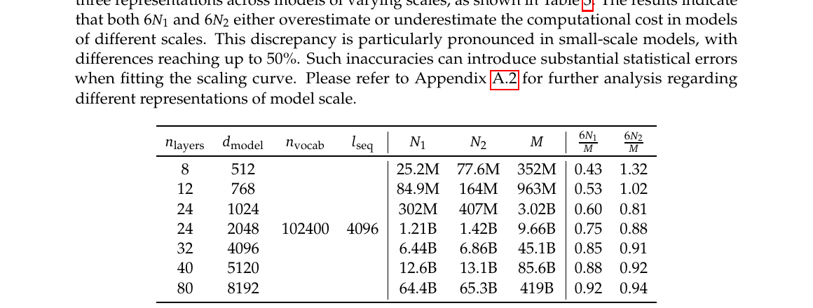

# 为何 DeepSeek 用 $C=M\cdot D$ 而非 $C=6ND$？

[← 返回演进总览 §3.1 V1](../../01-总览/01-版本演进总览.md#31-deepseek-llm-v1) · [← V1 §3 Scaling Laws](../00-V1-LLM.md#3-scaling-laws) · [答疑目录](../../01-总览/qa/README.md)

> 来源：DeepSeek-LLM arXiv:[2401.02954](https://arxiv.org/abs/2401.02954) §3.2 · Table 3 / Formula 2–4

---

## 1. 一句话

**不是**把 Chinchilla 的 $6$ 随便改掉，而是：**$6N$ 只是「每 token 算力」的粗近似**；DeepSeek 改用实测的 **$M$（non-embedding FLOPs/token）**，于是总算力按定义写成 **$C=M\cdot D$**——IsoFLOP 拟合（Figure 4a）才准。

---

## 2. 传统写法：$C \approx 6ND$

Kaplan / Chinchilla 系 scaling law 里，训练总算力常写成：

$$
C \approx 6ND
$$

| 符号 | 含义 |
|------|------|
| $N$ | 模型规模（参数量，有两种取法，见下） |
| $D$ | 训练 token 数 |
| **6** | 一次 forward + backward 相对 forward 的 FLOPs 倍数（$\approx 1+2=3$ 再乘 matmul 计数约定） |

**$N$ 的两种常见定义**（V1 论文 Table 3 脚注）：

| 符号 | 定义 | 文献 |
|------|------|------|
| $N_1$ | **non-embedding** 参数量 | Kaplan et al. |
| $N_2$ | **含 embedding / lm_head** 的全参 | Hoffmann et al.（Chinchilla） |

于是「每 token 算力」可粗写为 **$6N_1$** 或 **$6N_2$**，再乘 $D$ 得 $C$。

---

## 3. $6N$ 哪里不准？

V1 论文指出：**$6N_1$ 与 $6N_2$ 都不是真实的 per-token FLOPs**，误差在小模型上尤其大：

| 近似 | 问题 |
|------|------|
| **$6N_1$** | 只数 FFN/线性层 matmul，**不含** attention 的 $O(L^2)$ 项 → **低估**算力 |
| **$6N_2$** | 在 $6N_1$ 基础上 **加上** $6\,n_{\mathrm{vocab}}\,d$（vocab 投影）→ 对能力贡献小却 **高估**算力；仍 **不含** attention |

DeepSeek 给出三者闭式（Formula 2，$l_{\mathrm{seq}}$ = 序列长度）：

$$
\begin{aligned}
6N_1 &= 72 \cdot n_{\mathrm{layer}} \cdot d_{\mathrm{model}}^2 \\
6N_2 &= 72 \cdot n_{\mathrm{layer}} \cdot d_{\mathrm{model}}^2 + 6 \cdot n_{\mathrm{vocab}} \cdot d_{\mathrm{model}} \\
M    &= 72 \cdot n_{\mathrm{layer}} \cdot d_{\mathrm{model}}^2 + 12 \cdot n_{\mathrm{layer}} \cdot d_{\mathrm{model}} \cdot l_{\mathrm{seq}}
\end{aligned}
$$

**$M$** = **non-embedding FLOPs/token**：计 **attention**，**不计** vocab 投影——作为「模型有多重、每 token 算多狠」的度量。

---

## 4. Table 3：小模型上误差可达 50%

[直接打开 Table 3](../figures/v1/scaling-law/deepseek-table3-model-scale.png)

| $n_{\mathrm{layer}}$ | $d_{\mathrm{model}}$ | $6N_1/M$ | $6N_2/M$ |
|----------------------|----------------------|----------|----------|
| 12 | 768 | **0.43** | **1.32** |
| 24 | 1024 | 0.69 | 1.14 |
| 32 | 4096 | 0.97 | 1.01 |

- **$6N_1/M < 1$**（12 层仅 **0.43**）：缺 attention → **严重低估** $M$
- **$6N_2/M > 1$**（12 层 **1.32**）：多计 vocab → **高估** $M$
- 模型变大后趋近 1，但 **IsoFLOP 扫小模型**时若仍用 $6N$，会把「同一 $C$ 下的不同 $(M,D)$ 分配」搞错 → **U 形曲线（Figure 4a）拟合被污染**

因此 Formula 4 / IsoFLOP **统一用 $M$**，不用 $6N_1$/$6N_2$。

---

## 5. 改成 $C = M \cdot D$ 在算什么？

这是 **定义**，不是新物理定律：

$$
\boxed{C = M \cdot D}
$$

| 量 | 含义 |
|----|------|
| $M$ | 每个训练 token 的 **non-embedding forward FLOPs**（含 attention，不含 embedding 矩阵乘） |
| $D$ | 训练 token 总数 |
| $C$ | 总训练算力（FLOPs） |

**与 $6ND$ 的关系**：若你坚持用参数量 $N$，只能选 $N_1$ 或 $N_2$，再乘 **6** 去 **近似** $M$；DeepSeek 选择 **直接测 $M$**，避免 $N_1$/$N_2$ 双轨与 attention 缺失。

**训练时仍用 3× forward 做 backward**——变的只是 **用什么标度刻画「模型规模」**：从 **参数个数 $N$** 换成 **每 token 实际 FLOPs $M$**。

---

## 6. 和 Figure 4a / IsoFLOP 的关系

IsoFLOP 实验：固定总算力 $C$，扫约 10 种 $(M,D)$ 满足 $M\cdot D=C$，找 validation loss **谷底**。

- 横轴必须是 **真实的 $M$**（FLOPs/token），不能是 $6N_1$ 或 $6N_2$
- 若用 $6N$ 当横轴，小模型点会 **系统性偏移**，谷底位置错 → $M_{\mathrm{opt}}(C)$、$D_{\mathrm{opt}}(C)$（Formula 4）不可信

Figure 4a 的 U 形曲线因此建立在 **$C=M\cdot D$** 之上；演进总览 §3.1 所贴即此图。

---

## 7. 和数据质量结论的关系（别混为一谈）

论文在 **Formula 4 成立（即用 $M$）** 之后还发现：不同语料拟合的 $M_{\mathrm{opt}}\propto C^a$、$D_{\mathrm{opt}}\propto C^b$ 指数 **$a,b$ 不同**——**数据质量越高，$a$ 越大 → 更该扩模型而非堆数据**。

这是 **第二层结论**，依赖第一层「用 $M$ 而不是 $6N$ 把 $C$ 算准」。

---

## 8. 常见误解

| 误解 | 正解 |
|------|------|
| DeepSeek 否定了 Chinchilla | 仍做 IsoFLOP；改的是 **模型规模的度量**（$M$ vs $6N$） |
| $C=MD$ 意味着 7B/67B 必须同 $D$ | $C=M\cdot D$ 是乘法 **定义**；产品统一 2T 是 **工程选择**，见 [Scaling-Law 选择性应用](v1-scaling-law-c-vs-md.md) |
| 6 这个常数错了 | **6** 来自 fwd+bwd 计数；问题在于 **$N$ 不能代表 per-token FLOPs**（缺 attention / 多 vocab） |

---

## 9. 延伸阅读

| 文档 | 内容 |
|------|------|
| [V1 §3.2 最优 model/data Scaling](../00-V1-LLM.md#32-最优模型数据-scaling) | Formula 2–4 原文与 Figure 4 |
| [Scaling 答疑](v1-scaling-law-c-vs-md.md) | $M$ 推导、Formula 1/4 数值、4B 实战 |
| [Scaling-Law 选择性应用](v1-scaling-law-c-vs-md.md) | Figure 3/4/5 分工；2T 产品 vs IsoFLOP 谷底 |
| [产品训练与 Scaling Law](v1-scaling-law-c-vs-md.md) | 7B/67B 同训 2T 与 compute-optimal 的区别 |
