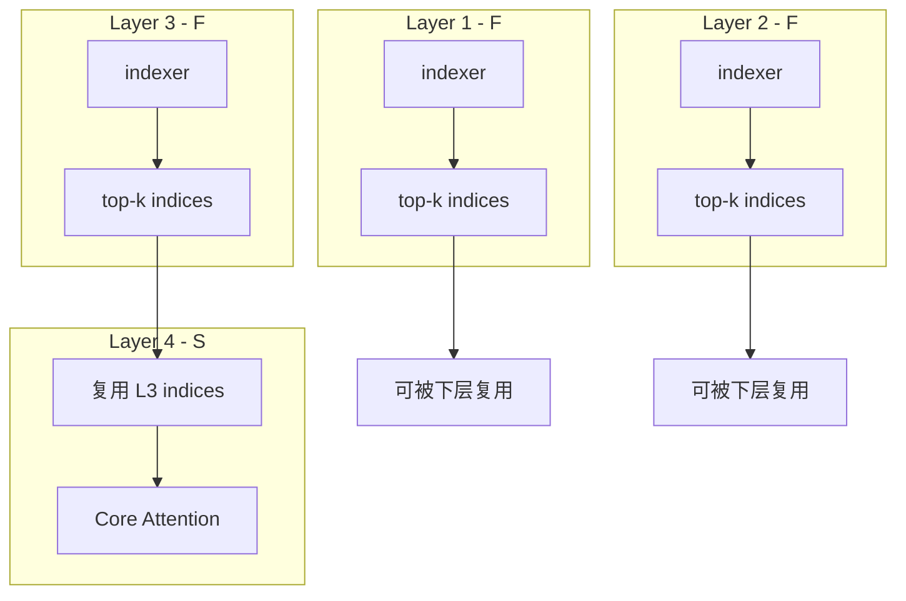

# Index Share逻辑详解

> [← 中文导读](../00-前言/02-中文导读.md) · [← 仓库首页（EN）](https://github.com/fooSynaptic/deepseek-tech-notes) · [← 系列目录](01-系列导读.md) · [← 基础设施线导读](../01-总览/06-基础设施线导读.md) · [DSA 梗概](02-DSA梗概.md) · [DSA 逻辑](03-DSA逻辑详解.md) · [Index Share 梗概](05-Index-Share梗概.md) · [演进总览 §3.6](../01-总览/01-版本演进总览.md#36-deepseek-v32--v32-exp)

---

## 1. 定位：不是新模型，是 DSA 上的纯 infra 补丁

社区昵称 **Index Share** / 「**V3.3**」；正式名 **IndexCache**（清华 + Z.ai，2026-03，[arXiv:2603.12201](https://arxiv.org/abs/2603.12201)）。

| 属性 | Index Share | 新模型（如 V4） |
|------|-------------|----------------|
| 权重 | **不变** | 全量重训 |
| 显存 | **零额外** | 新 layout / 新算子 |
| 改动面 | 推理调度（F/S 层 + index 缓存） | 架构级 |
| 前提 | **必须有 DSA**（lightning indexer + top-$k$） | 自带 CSA indexer 等 |

典型体现：**infra 归 infra，算法归算法**——算法仍是 [V3.2 的 DSA](03-DSA逻辑详解.md)，系统侧利用 **跨层冗余** 减少 indexer 计算。

### 1.1 技术归属

| 机构 | 做什么 | 不做什么 |
|------|--------|----------|
| **DeepSeek** | **DSA + Lightning Indexer** 模型结构（每层独立 top-$k$） | 不拥有 IndexCache / index-share 发明 |
| **清华 + 智谱（Z.ai）** | **IndexCache** 论文与开源（[THUDM/IndexCache](https://github.com/THUDM/IndexCache)）；F 层 **index-cache**、S 层 **index-share** | 不改动 DSA 权重 |
| **百度百舸** | **ESS**（Latent-Cache offload）原创；IndexCache **引擎集成与云部署** | 非 IndexCache 算法发明方 |

**一句话**：DeepSeek 提供 **被优化的 DSA 模型**；清华 + 智谱 提供 **跨层索引复用算法**；百舸把 IndexCache **工程化落地**，并与自研 **ESS** 等 infra **组合**服务线上 DeepSeek 推理。

**勿混淆**：

- DSA 的 **Indexer-Cache / Latent-Cache** = 异构 **[KV 存储](03-DSA逻辑详解.md#4-异构-kv-cacheindexer-cache-与-latent-cache)**；
- IndexCache 的 **index-cache** = **top-$k$ 下标**的跨层复用缓存；
- [ESS](../06-推理基础设施/01-ESS概念.md) 管 **Latent** 搬移，Index Share 管 **indexer 算子**次数，二者正交。

> **梗概**：[Index Share 梗概](05-Index-Share梗概.md#技术归属)

---

## 2. 前置：DSA 里 indexer 为何成为瓶颈

在 [DSA 逻辑](03-DSA逻辑详解.md) 中，每层独立执行：

1. Lightning Indexer：对全长 $L$ 打分（$O(L^2)$ 量级，常数小）；
2. Top-$k$ 选择；
3. 仅对 $k$ 个 latent 做 Core MLA Attention。

长上下文 **Prefill** 时，层数 $\times$ 全长 indexer 累加，indexer 可占显著时间；Decode 阶段每层每步也要跑 indexer。
**Index Share 不碰第 3 步主 attention**，只优化第 1–2 步的 **重复劳动**。

---

## 3. 核心观察：相邻层 top-$k$ index 高度相似

IndexCache 论文与工程实现的出发点：

- 不同 Transformer 层对「哪些历史 token 重要」的判断 **高度相关**；
- 若 layer $\ell$ 与 $\ell+1$ 的 top-$k$ **index 集合** 相近，则 $\ell+1$ **不必再跑一遍 indexer**，直接 **复用** $\ell$（或最近 Full 层）的 indices 即可进入 Core Attention。

这与 DSA 的 **异构 Cache** 分工一致：

- **Indexer-Cache** 仍常驻 GPU（F 层要算 indexer）；
- 省掉的是 **S 层上的 indexer 算子调用**，不是取消 Indexer-Cache 存储。

---

## 4. 机制：Full 层与 Shared 层

每层标记为两种角色之一：

| 类型 | 行为 |
|------|------|
| **Full (F)** | 正常运行 Lightning Indexer，计算 top-$k$，**写出 index 供后续 S 层复用** |
| **Shared (S)** | **跳过 indexer**；从缓存读取最近 F 层的 top-$k$ indices，直接进入 Core MLA Attention |



### 4.1 典型模式 `FFFS`

每 4 层中 **3 个 F + 1 个 S**，周期重复：

```text
Layer: 1 2 3 4 5 6 7 8 ...
Role: F F F S F F F S ...
```

- **去掉 75% 的 indexer 计算**（每 4 层只算 3 次 indexer，而非 4 次）；
- S 层复用的是 **紧前一个 F 层**的 indices。


[图示详情](figures/index-share-fffs.svg)

### 4.2 实现形态

- 推理框架（SGLang / vLLM patch）中多为 **分支**：若当前层为 S，则 `cached_indices = last_F_layer.indices`，否则跑 indexer 并更新缓存。
- **零额外 GPU 显存**：复用已有 index 张量，不复制整套 KV。

---

## 5. 部署模式：Training-free vs Training-aware

| 模式 | 做法 | 适用 |
|------|------|------|
| **Training-free** | 在校准集上 **贪心搜索** 哪些层保留 F、哪些设为 S，约束 LM loss 下降可忽略 | 快速上线、零训练 |
| **Training-aware** | **多层蒸馏**：让保留的 F 层 indexer 拟合其「覆盖」的 S 层的平均 attention 分布 | 更激进 S 比例、更长上下文 |

二者都不改 checkpoint 权重；差别在 **F/S 划分与可选蒸馏校准**。

---

## 6. 效果与适用边界

200K context 量级：

| 指标 | 加速 |
|------|------|
| Prefill（TTFT） | **1.82×** |
| Decode 吞吐 | **1.48×** |
| 精度 | 可忽略损失 |

**适用**：

- DSA 系模型：**DeepSeek-V3.2**、**GLM-5** 等带 lightning indexer 的栈；
- **不适用** 无 DSA 的稠密 MLA/V3.1 路径。

**正交叠加**：

| 补丁 | 优化对象 | 与 Index Share |
|------|----------|----------------|
| **[ESS](../06-推理基础设施/01-ESS概念.md)** | Latent-Cache CPU offload | **正交**，可同时开 |
| **V4 HiSparse** | V4 异构 KV + 磁盘 prefix | 不同代际，非 V3.2 补丁；[HiSparse](../06-推理基础设施/06-V4-HiSparse.md) · [磁盘 prefix](../06-推理基础设施/07-V4-磁盘Prefix-Cache.md) |
| **Engram** | n-gram 条件记忆查表 | **正交**，见 [Engram 导读](../07-Engram/02-Engram系列导读.md) |

---

## 7. 与 V4 的对比

| 维度 | Index Share | V4 |
|------|-------------|-----|
| 权重 | 不变 | 重训 |
| 上下文目标 | 优化现有 128K 系 | 原生 1M |
| Ablation | 干净（纯 infra） | 多变量（CSA/HCA、mHC、Muon…） |
| indexer 来源 | 复用 DSA 层间相似性 | CSA 自带压缩 indexer |

社区将 Index Share 戏称为「V3.3」，指的是 **收益大、改动小、无需重训**，而非官方版本号。

---

## 8. 逻辑闭环：从 DSA 双 Cache 到 Index Share

1. **DSA** 分裂 **Indexer-Cache**（GPU 常驻、每步参与打分）与 **Latent-Cache**（主 attention、可 [ESS](../06-推理基础设施/01-ESS概念.md) offload）。
2. Indexer 每层独立 → Prefill/Decode 上 indexer 成为可优化热点。
3. **Index Share** 利用 **层间 index 相似**，让 S 层跳过 indexer，只复用 F 层的 top-$k$ **选择结果**。
4. 主 attention 仍走 DSA 稀疏 Core MLA；精度由 F 层密度与 F/S 划分保证。

> **返回 DSA**：[DSA逻辑详解§4 异构 KV Cache](03-DSA逻辑详解.md#4-异构-kv-cacheindexer-cache-与-latent-cache)

---

## 9. 参考

- 论文：[arXiv:2603.12201](https://arxiv.org/abs/2603.12201)
- 代码：[THUDM/IndexCache](https://github.com/THUDM/IndexCache)
- 前置：[DSA 逻辑详解](03-DSA逻辑详解.md)
- 梗概：[Index Share 梗概](05-Index-Share梗概.md)
- 演进全景：[版本演进总览](../01-总览/01-版本演进总览.md)