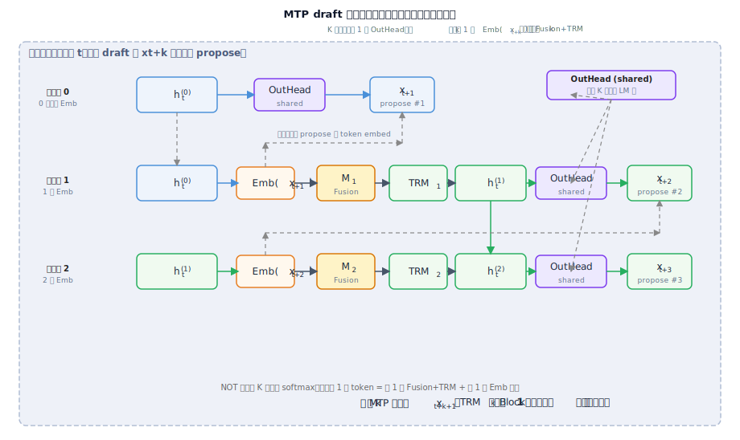

# MTP 中间 token 融合方案

[← V3 §三 MTP](../../02-基座架构/01-V3基座.md#三mtp-multi-token-predictionv3-新增顶层结构) · [← 投机解码专文 §2](../04-DSpark投机解码.md#2-deepseek-路线mtpv3--v4) · [融合 scheme SVG](../figures/mtp-fusion-scheme.svg) · [答疑目录](../../01-总览/qa/README.md)

> [← 中文导读](../../00-前言/02-中文导读.md) · [← 仓库首页（EN）](https://github.com/fooSynaptic/deepseek-tech-notes) · 旧图 [MTP 投机解码总览图](../figures/mtp-speculative.svg) 是「训练结构 + 投机对照」总览；**本文 + [MTP 融合 scheme 图](../figures/mtp-fusion-scheme.svg)** 只讲 **中间 token 怎么融进 MTP 链**。

---

## 1. 先建立时间线：在位置 $t$ 要预测谁？

已接受前缀 $x_{1:t}$，接下来要猜未来 token：

| 谁预测 | 预测目标 | 依赖什么 |
|--------|----------|----------|
| **主网 OutHead** | $x_{t+1}$ | 主 Transformer 在 $t$ 的 hidden $h_t^{(0)}$ |
| **MTP-1** | $x_{t+2}$ | $h_t^{(0)}$ **融合** $\mathrm{Emb}(x_{t+1})$ |
| **MTP-2** | $x_{t+3}$ | $h_t^{(1)}$ **融合** $\mathrm{Emb}(x_{t+2})$ |
| **MTP-$k$** | $x_{t+k+1}$ | $h_t^{(k-1)}$ **融合** $\mathrm{Emb}(x_{t+k})$ |

**要点**：主网负责 **下一个** token；MTP 模块负责 **更远的** $t{+}2, t{+}3, \ldots$，且 **每一位仍因果依赖前面的中间 token**。

### 1.1 你的理解：对在哪里、错在哪里？

| 说法 | 判定 | 说明 |
|------|------|------|
| draft 多个 token **不是一次性** | **对** | 必须 **串行** propose：先 $x_{t+1}$，再融 $\mathrm{Emb}(x_{t+1})$ 猜 $x_{t+2}$，再融 $\mathrm{Emb}(x_{t+2})$ 猜 $x_{t+3}$… |
| 「$K$ 个 LM 头、每个头深度不同」 | **半对半错** | V3 是 **1 个共享 OutHead**，被调用 $K$ 次；变长的是 **MTP 因果链**，不是 $K$ 套独立 output head |
| 「第 2 个比第 1 个深，因为要融上一个 emb」 | **对（指链深度）** | 猜 $x_{t+2}$：**链深度 1**（1 次 Fusion+TRM，1 个中间 Emb）；猜 $x_{t+3}$：**链深度 2**（再串 1 步，累计 2 个 Emb） |
| 「每个 MTP 模块自身更深」 | **错** | 每个 $\mathrm{TRM}_k$ 都是 **1 个**浅 Block；**不是** MTP-2 = 2 层 Transformer、MTP-3 = 3 层 |

一句话：**不是 K 路并行 LM 头；是 1 个共享 OutHead + K 步串行 Fusion/TRM，每步多注入 1 个中间 token 的 Emb。**



[图示详情](../figures/mtp-draft-chain-depth.svg)

---

## 2. 融合公式

对位置 $t$、MTP 深度 $k$：

$$
h_t^{\prime(k)} = M_k\bigl[\,\mathrm{RMSNorm}(h_t^{(k-1)})\ ;\ \mathrm{RMSNorm}(\mathrm{Emb}(x_{t+k}))\,\bigr]
$$

$$
h_t^{(k)} = \mathrm{TRM}_k(h_t^{\prime(k)}), \qquad
P(x_{t+k+1}\mid x_{1:t}) = \mathrm{softmax}\bigl(\mathrm{OutHead}(h_t^{(k)})\bigr)
$$

符号说明：

| 符号 | 含义 |
|------|------|
| $h_t^{(0)}$ | 主网在位置 $t$ 的 hidden（**不是**再跑一遍主网） |
| $x_{t+k}$ | 第 $k$ 个 **中间 token**（训练用真值，推理用已 propose 的 $\hat{x}$） |
| $M_k$ | 线性投影 $d \to d$（concat 后） |
| $\mathrm{TRM}_k$ | **1 层**浅 Transformer Block（不是 L 层主网） |
| $\mathrm{OutHead}$ | 与主网 **共享** 的输出头 |

**$\oplus$ / 融合** = `[RMSNorm(h); RMSNorm(Emb)]` 拼接后过 $M_k$，不是把 $x_{t+1:t+k}$ 一次性全塞进去。

---

## 3. 「一次前向」到底指什么？

容易混的两层：

### 3.1 训练

```
整段序列 x_{1:T}
 -> 主 Transformer 【1 次前向】-> 所有位置的 h_t^(0)
 -> 各 t 上批量跑 MTP-1, MTP-2, ...（浅块，不重跑主网 L 层）
 -> 中间 token 用 teacher forcing 真值 Emb(x_{t+k})
```

- **1 次前向** = 主网对 **整批序列** 只跑一遍 L 层 Transformer。
- MTP 是在 **已有 $h_t^{(0)}$** 上叠 **浅 MTP Block**，算力远小于「主网 × K 遍」。

### 3.2 推理

每个 decode **轮**：

```
1) 主网 【1 次】target forward -> verify 已 propose 的 K 个候选
2) MTP 链 【K 小步】串行：
 Emb(x_hat_{t+1}) + MTPBlock_1 -> 猜 x_hat_{t+2}
 Emb(x_hat_{t+2}) + MTPBlock_2 -> 猜 x_hat_{t+3}
 ...
```

- **不是** 一个 softmax 无依赖吐出 $t{+}1,\ldots,t{+}K$。
- **也不是** 为 MTP 把 671B 主网跑 $K$ 遍；主网每轮仍 **1 次 verify**。

---

## 4. 三个常见误解

| 误解 | 实际 |
|------|------|
| MTP 一次吐出 K 个独立 token | **因果链**：深度 $k$ 只融 **一个** $x_{t+k}$，更远位靠上一层 $h_t^{(k-1)}$ 传递 |
| MTP 推理 = 主网跑 K 遍 | 主网 **1 遍**；多出来的是 **K 个浅 MTP Block** |
| Emb 输入永远是真值 | **训练** teacher forcing；**推理 draft** 用 **上一步刚猜的** $\hat{x}$ embed |

---

## 5. 与 DSpark 对照

| | **MTP** | **DSpark** |
|--|---------|------------|
| 重活 | 主网 1 次（verify） | 并行 MoE 主干 1 次 |
| 轻链 | MTPBlock 串 $K$ 步（融 embed） | 顺序头 $g_\theta$ 串 $K$ 步 |
| 权重 | 同 checkpoint MTP 头 | 外挂 DeepSpec draft |

投机 **verify 循环相同**（§1）；差异在 **draft 从哪来、怎么猜 K 位**。

---

## 6. 训练目标

$$
\mathcal{L}_{\mathrm{total}} = \mathcal{L}_{\mathrm{main}} + \sum_{k=1}^{M} \lambda_k \mathcal{L}_{\mathrm{MTP}}^{(k)}
$$

MTP 首要目的是 **训练信号 densify / 表征 pre-plan**；推理时可 **丢弃** MTP 模块，也可 **复用做 draft**（V3 论文 *MTP in Inference*）。

---

## 7. 反向引用

| 文档 | 说明 |
|------|------|
| [MTP 融合 scheme 图](../figures/mtp-fusion-scheme.svg) | 融合 scheme 总览 |
| [MTP draft 链深度图](../figures/mtp-draft-chain-depth.svg) | §1.1 串行 draft 链深度计算图 |
| [酱紫君解读 §MTP](../../08-外部解读/03-酱紫君DSpark阅读笔记.md#mtp一次前向如何融合中间-token) |
| [投机解码专文 §2](../04-DSpark投机解码.md#2-deepseek-路线mtpv3--v4) |
| [V3 论文 Figure 3 原文](https://arxiv.org/pdf/2412.19437)（Eq.21–23） |
