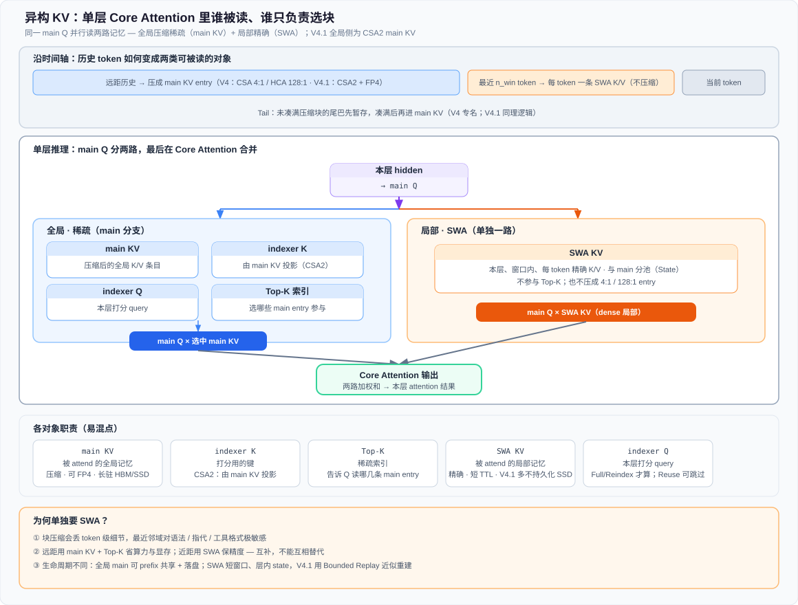

# V4 里的 SWA是什么？

[← 返回 CSA/HCA 一句话](../../04-版本代际/05-CSA-HCA混合压缩注意力.md#一句话) · [§4 异构 KV](../../04-版本代际/05-CSA-HCA混合压缩注意力.md#v4-mixed-attention) · [KV Layout §State](../05-V4-KV-Layout.md#state-cache) · [磁盘 Prefix §SWA 三档](../07-V4-磁盘Prefix-Cache.md#swa-三档策略论文-352) · [答疑目录](../../01-总览/qa/README.md)

---

## 一句话

**SWA** 保存最近约 $n_{\text{win}}$个 token 的 **精确、未压缩** K/V，给当前 query 提供 **局部因果邻域**；与 CSA/HCA **压缩 entry 分池**（State cache），eviction 与 **磁盘 prefix 策略** 均 **独立**——部署上 SWA 常常是 **per-token KV 体积大头**。

## 0. 四模块表里的 sliding window 指什么

[Raschka 表 8-1](../../08-外部解读/02-Raschka全文解析.md#表-8-1-transformer-模块演进) 与 [演进总览 §1.2](../../01-总览/01-版本演进总览.md#四模块演进) 的 **Attention 行业链** 中，`sliding window` 指 **Sliding Window Attention（SWA，滑动窗口注意力）**：

| 维度 | 说明 |
|------|------|
| **机制** | 每个 query 只 attend **最近 $W$ 个** token 的 K/V（固定局部窗口），复杂度随序列长度 **线性** 而非 $O(L^2)$ |
| **行业语境** | Mistral 等长上下文模型常用此路数，介于 **GQA**（减 KV 头）与 **MLA**（低秩 latent 压缩 KV）之间 |
| **DeepSeek 落点** | V1–V3 主线走 **MLA → DSA → CSA/HCA**；**V4** 把 SWA 作为 **五类 KV 之一** 与压缩 entry **分池**（[KV Layout §State](../05-V4-KV-Layout.md#state-cache)），保证最近邻域 **不丢 token 级精度** |

即：表里的 sliding window 是 **行业演进节点**；DeepSeek 在 **V4** 才将其 **显式工程化** 进异构 cache，而非 V2 引入 MLA 时的同代产物。

---

## 1. 在 V4 五类 KV 里的角色

| 维度 | **SWA** | **CSA / HCA** |
|------|---------|----------------|
| 表示 | **每 token 一条** 精确 K/V | **按块压缩** 后的 entry（4:1 或 128:1） |
| 覆盖范围 | 最近 **窗口内** 局部 | 远距 **稀疏**（CSA）或 **全局摘要**（HCA） |
| 存放池 | **State cache**（per-request 块） | **Classical KV cache**（对齐 $\mathrm{lcm}(4,128)$） |
| 是否可落盘共享 | 体积大、策略复杂（见 §3） | CSA/HCA **压缩块易落盘** |

CSA/HCA 把历史 **压短**；SWA 保证 **紧邻上下文** 不丢精度——二者 **互补**，不是替代关系。

*Figure: **main KV** 与 **SWA KV** 都会被 **main Q** attend；**indexer K / Top-K** 只服务全局稀疏分支。V4.1 全局侧为 CSA2 的 main KV + FP4；SWA 仍单独分池。*

[图示详情](../../04-版本代际/figures/kv-types-core-attention.svg)

图里左侧全局分支其实有两套 K/Q，职责不同：下面先讲清 **indexer vs main KV**；右侧 **SWA** 为何还要单独一路，见 §2。

### 1.1 indexer 与 main KV：粗召回 vs 精确注意力（CSA2）

**一句话**：**indexer K / indexer Q** 是专门做「快速粗筛召回」的轻量检索头；**main KV**（配合 **main Q**）是后面做「精确注意力」的主路径。两套 K/Q 服务两件不同的事——检索打分与最终注意力的目标、维度、压缩策略都分开设计，各自一套专用参数。

流水线是两阶段：**粗召回（Indexer）→ 细计算（main attention）**。

#### Indexer：轻量检索，只出 Top-K

| 对象 | 是什么 | 做什么 |
|------|--------|--------|
| **indexer K** | 由 **main KV** 投影得到的 **低维检索 key**（CSA2） | 与 indexer Q 算相似度，从海量 `main entry` 里挑候选 |
| **indexer Q** | 当前 token 的 **低维检索 query** | Full / Reindex 时本层计算；Reuse 可跳过 |
| **Top-K** | 粗筛结果（索引表） | 告诉后面的 main 路径读哪几条 entry |

这一阶段的目标是 **快、成本低** 地筛出一小批相关历史条目；真正的 attention 加权求和在下一步完成。

#### main KV：高精度压缩 KV，做最终注意力

**main KV** 是承载真实信息的高维（相对 indexer）压缩 KV，用于最终的 `main Q × 选中 main KV`（再与 **SWA KV** 一路合并进 Core Attention），生成输出表征。它的维度与特征空间按 **最终表示质量** 设计；**indexer** 则把 main KV 再投到 **更适合相似度匹配** 的 index 特征空间。

#### 分开的额外收益：CSA2 层间复用

V4.1 CSA2 相对初代 CSA 的重要一点：把 **indexer K** 做成可跨层共享的对象，于是有三种静态模式：

| Mode | 做什么 |
|------|--------|
| **Full** | 新建 main KV + indexer K；本层 indexer Q 打分 → 新 Top-K |
| **Reindex** | **复用**上游 indexer K（与 main KV）；本层只用新的 indexer Q 再打分 |
| **Reuse** | 直接继承上游 Top-K；indexer Q / K 都不算，跳过检索 |

indexer K 与 main KV 是可解耦的张量时，才能单独共享 indexer K、单独做 Reindex / Reuse；否则每一层都要重复投影、重复全长打分。

#### 类比

| CSA2 | 搜索引擎 |
|------|----------|
| **indexer K/Q** | 向量索引 / 倒排：**低维粗筛**，只求快，召回候选文档 |
| **main KV + main Q** | 拿到候选后的 **精读**：高维原文信息，用来真正提取内容、生成回答 |

搜索引擎用索引做粗筛、用原文做精读；CSA2 用 indexer 做粗筛、用 main KV 做精确注意力——同一套路。

---

## 2. 为何还要单独一路 SWA（相对压缩 entry）

块压缩（4:1 / 128:1，以及 V4.1 的 CSA2 main KV）会 **损失 token 级精度**。最近几十个 token 对语法、指代、工具调用格式等 **极敏感**；SWA 用 **滑动窗口** 保留这部分 **dense 局部**，与 CSA / CSA2 的 top-$k$ 主路径、HCA dense 摘要 **[并行参与](../../04-版本代际/05-CSA-HCA混合压缩注意力.md#v4-mixed-attention)** 同一层 attention 融合。

合起来看图里的三块：

1. **indexer**：粗筛远距历史（§1.1）
2. **main KV**：对选中条目做精确全局注意力
3. **SWA KV**：近邻精确局部，补压缩路径在窗口内丢掉的精度

---

## 3. 推理 infra：体积与 prefix 策略

| 现象 | 说明 |
|------|------|
| **体积** | Together 早期：全量 SWA 时 per-token KV 可 **高于** 仅 MLA 路径；瓶颈常在 **SWA state** 而非 CSA/HCA 本体（[HiSparse 专文](../06-V4-HiSparse.md)） |
| **Eviction** | 与 C4 inactive offload **正交**；可只保留 **高复用** SWA 检查点 |
| **磁盘 Prefix** | 论文 §3.5.2：**Full / Periodic Checkpointing / Zero** 三档——在 **存储带宽 vs 命中重算** 间取舍（[专文](../07-V4-磁盘Prefix-Cache.md#swa-三档策略论文-352)） |

---

## 4. 与 V3.2 DSA 的对比

| | **V3.2** | **V4 SWA** |
|--|----------|------------|
| 局部性 | 主要靠 **顺序滑动 + indexer top-$k$** | **显式 SWA state** + CSA/HCA 压缩 |
| Cache 类型 | Indexer-Cache + Latent-Cache | 五类异构对象之一 |

---

## 5. 相关阅读

| 文档 | 内容 |
|------|------|
| [V4 KV Layout](../05-V4-KV-Layout.md) | Classical vs State 双池；SWA 进 State |
| [V4 磁盘 Prefix Cache](../07-V4-磁盘Prefix-Cache.md) | SWA 三档落盘策略 |
| [V4 HiSparse](../06-V4-HiSparse.md) | SWA 与 C4 offload 的容量权衡 |
