# DeepSeek Engram 系列导读

> [← 中文导读](../00-前言/02-中文导读.md) · [← Engram 官方 README](01-Engram官方README.md) · [← 演进总览 §7 Engram](../01-总览/01-版本演进总览.md#7-与本仓库其他专题的关系) · [《ds-技术报告》](../01-总览/01-版本演进总览.md#7-与本仓库其他专题的关系)  
> 更新：2026-06-24  
> PDF 目录：[src/](../09-附录/material/papers/engram/src)

---

## 系列在解决什么问题？

Transformer + MoE 用**条件计算**扩容量，但缺少原生的**知识查表**原语——模型被迫用多层 FFN/Attention **模拟**静态模式检索（固定搭配、事实、局部 n-gram 依赖），浪费算力与有效深度。

**Engram** 提出 **条件记忆（Conditional Memory）**：

| 稀疏轴 | 机制 | 激活依据 |
|--------|------|----------|
| **条件计算**（MoE） | 动态路由专家 | 当前 hidden state |
| **条件记忆**（Engram） | O(1) n-gram embedding 查表 | **输入 token 序列**（确定性） |

> **论文标题**（arXiv:2601.07372）：*Conditional Memory via Scalable Lookup: A New Axis of Sparsity for Large Language Models*
>
> **Abstract**（[Engram 官方 README](01-Engram官方README.md)）：
>
> While Mixture-of-Experts (MoE) scales capacity via conditional computation, Transformers lack a native primitive for knowledge lookup. To address this, we explore conditional memory as a complementary sparsity axis, instantiated via Engram, a module that modernizes classic N-gram embeddings for O(1) lookup.

第二根轴的关键性质：**寻址在推理前可知** → 可 prefetch、可 offload 到 Host DRAM / CXL，GPU 只算动态推理。

---

## 系列演进关系

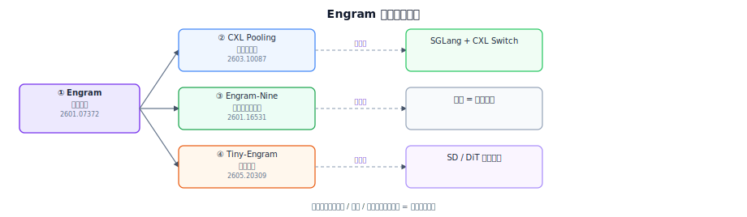

[直接打开 SVG](../09-附录/material/papers/engram/diagrams/engram-00-series-lineage.svg)

---

## ① Engram 奠基（arXiv:2601.07372）

**标题**：*Conditional Memory via Scalable Lookup: A New Axis of Sparsity for Large Language Models*  
**作者**：DeepSeek-AI + 北大等 · **代码开源** · 梁文锋合著

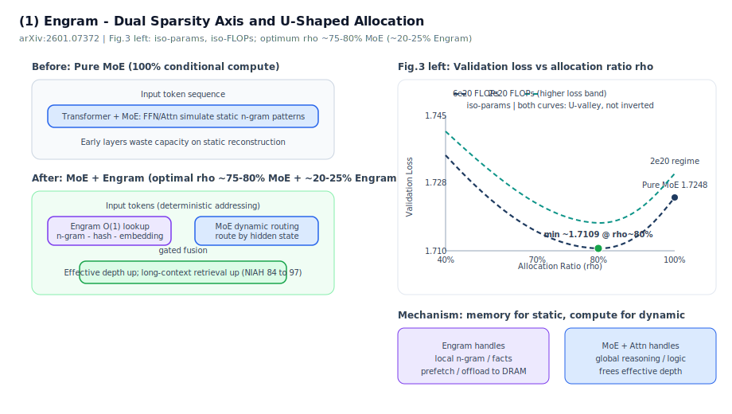

> **架构详图**：[Engram 工作原理](#engram-架构总览figure-1)（Figure 1 + 逐步推导）

### 核心设计

1. **N-gram 查表现代化**：tokenizer 压缩 + **多头哈希** + 上下文门控 + 多分支注入 Transformer
2. **O(1) lookup**：局部 context → hash → 从大表取 embedding → 与 backbone hidden 融合
3. **稀疏分配问题（Sparsity Allocation）**：MoE 算力 vs Engram 记忆容量如何切？

### Engram 架构总览（Figure 1）

下图与论文 **Figure 1** 同构（[量子位](https://www.qbitai.com/) 整理版；论文原图见 PDF 第 3 页）。左侧是 Engram 在 backbone 中的位置，右侧是模块内部数据流。

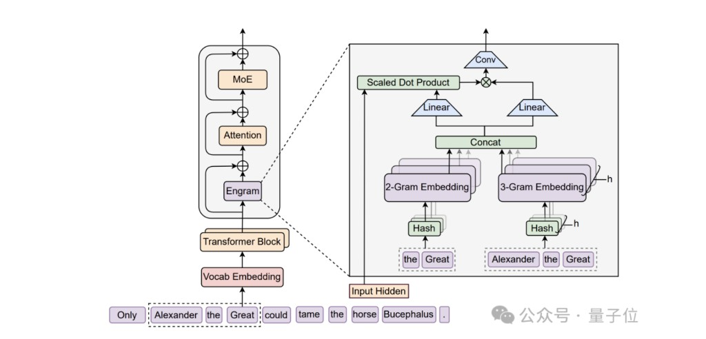

**在整网中的位置**（对应图左侧竖列）：

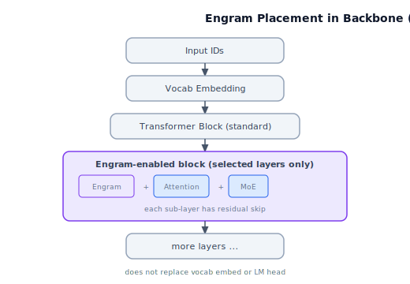

[直接打开 SVG](../09-附录/material/papers/engram/diagrams/engram-01b-backbone-placement.svg)

Engram **不替换** 标准 embedding / un-embedding，也 **不是每层都有**；只在系统延迟允许的少数层插入，与 Attention、MoE 串行，各自带残差。

---

### Engram 工作原理（逐步）

给定序列 $X=(x_1,\ldots,x_T)$，在第 $\ell$ 层 hidden $h_t^{(\ell)}$ 处，Engram 对每个位置 $t$ 做 **检索（Retrieval）** 与 **融合（Fusion）** 两阶段。

| Step | 名称 | 记忆过滤 |
|:----:|------|----------|
| 1 | Tokenizer 压缩 | **不过滤** — 只规范化 token ID |
| 2 | 构造 n-gram | **不过滤** — 只组后缀 |
| 3 | 多头哈希寻址 | **不过滤** — 算索引、查表 |
| 4 | 拼接 $e_t$ | **不过滤** — 产出**静态记忆**（上下文无关） |
| 5 | $W_K$ / $W_V$ 投影 | **备过滤** — 记忆变 $k_t,v_t$，尚未用 $h_t$ |
| 6 | 上下文门控 | **★ 过滤记忆** — $\alpha_t$ 门控，$\tilde{v}_t=\alpha_t v_t$（[为何记忆依赖？](../09-附录/material/papers/engram/qa/step6-context-gating-rationale.md)） |
| 7 | 短卷积 | **已过滤** — 只在 $\tilde{v}_t$ 上运算 |
| 8 | 残差写回 | **已过滤** — $Y$ 注入 backbone，之后接 Attn/MoE |

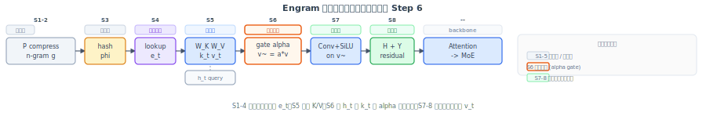

[直接打开逐步前向 SVG](../09-附录/material/papers/engram/diagrams/engram-01c-forward-dataflow.svg)

#### 阶段 A：确定性检索（O(1) 查表）

**Step 1 — Tokenizer 压缩（Vocabulary Projection）** · `记忆过滤：不过滤`

- 子词 tokenizer 常把语义相同的词切成不同 ID（如 `Apple` vs `␣apple`）。
- 预计算映射 $P: V \to V'$：NFKC 规范化、小写化等，把 raw ID 压成 **canonical ID** $x^{\prime}_t = P(x_t)$。
- 论文在 128k 词表上有效词表约 **缩小 23%**，提高 n-gram 槽位利用率。

**Step 2 — 构造后缀 n-gram** · `记忆过滤：不过滤`

- 对每个位置 $t$、每个阶数 $n$（如 2-gram、3-gram），取压缩后的后缀：

$$
g_{t,n} = (x^{\prime}_{t-n+1}, \ldots, x^{\prime}_t)
$$

- 例（图中句子）：`Alexander the Great` → 2-gram `the Great`、3-gram `Alexander the Great`。

**Step 3 — 多头哈希寻址** · `记忆过滤：不过滤`

- 全空间 n-gram 无法显式建表，用 **$K$ 个独立 hash 头**（每阶 $n$ 各 $K$ 头）映射到素数大小的表 $E_{n,k}$：

$$
z_{t,n,k} = \varphi_{n,k}(g_{t,n}), \quad e_{t,n,k} = E_{n,k}[z_{t,n,k}]
$$

- $\varphi_{n,k}$ 为确定性 **乘性-XOR hash**；多头降低碰撞。
- **关键**：索引只依赖 **输入 token 序列**，推理前即可算出 → 可 prefetch / offload。

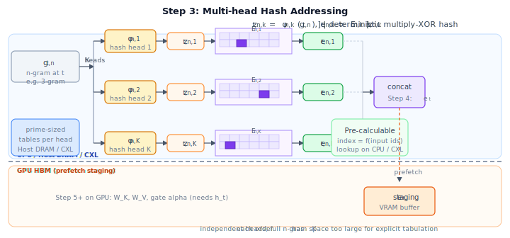

[直接打开 SVG](../09-附录/material/papers/engram/diagrams/engram-01d-multi-head-hash.svg)

**Step 4 — 拼接记忆向量** · `记忆过滤：不过滤 → 静态记忆 e_t`

$$
e_t = \mathop{\Big\Vert}\limits_{n=2}^{N} \mathop{\Big\Vert}\limits_{k=1}^{K} e_{t,n,k} \in \mathbb{R}^{d_{\mathrm{mem}}}
$$

- $e_t$ 是 **上下文无关** 的静态先验：「这个 n-gram 在历史上常伴随什么表示」。

#### 阶段 B：上下文门控与融合

静态查表有碰撞、多义性；必须用当前 hidden 做 **动态过滤**（对应图右侧 Scaled Dot Product / Linear / Conv）。

**Step 5 — Key / Value 投影** · `记忆过滤：备过滤（尚未用 h_t）`

$$
k_t = W_K e_t, \quad v_t = W_V e_t
$$

- 检索向量 $e_t$ 提供 Key、Value；当前 hidden $h_t$（已看过前文 Attention）作 Query 来源。

**Step 6 — 上下文门控（Context-aware Gating）** · `记忆过滤：★ 在此过滤`

$$
\alpha_t = \sigma\left(\frac{\mathrm{RMSNorm}(h_t)^{\top} \mathrm{RMSNorm}(k_t)}{\sqrt{d}}\right), \quad \tilde{v}_t = \alpha_t \cdot v_t
$$

- $\alpha_t \in (0,1)$：$e_t$ 与当前语境 **一致** 则门开大，**矛盾**（碰撞/歧义）则趋近 0，抑制噪声。
- 本质：用 Attention 式对齐，但 **记忆来自查表而非算出来**。

> **答疑**：[门控依据与记忆依赖过滤](../09-附录/material/papers/engram/qa/step6-context-gating-rationale.md)

**Step 7 — 短卷积扩感受野** · `记忆过滤：已过滤（仅 ṽ_t）`

$$
Y = \mathrm{SiLU}\left(\mathrm{Conv1D}(\mathrm{RMSNorm}(\tilde{V}))\right) + \tilde{V}
$$

- **Depthwise 因果 Conv1D**：kernel $w=4$，dilation = 最大 n-gram 阶数 $N$；再 SiLU。
- 在门控后的 $\tilde{V}$ 序列上扩局部感受野、增加非线性。
- **感受野常数**（demo 默认 $w=4,N=3$）：门控流沿序列从 **1** 扩到 **$1+(w-1)N=10$**，不是扩到 4。详见 [感受野常数](../09-附录/material/papers/engram/qa/step7-short-conv-receptive-field.md)；**训练/推理差异**见 [RF 1→10 影响](../09-附录/material/papers/engram/qa/step7-rf10-train-infer-impact.md)。

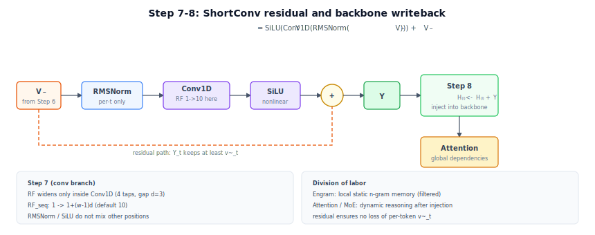

[直接打开 SVG](../09-附录/material/papers/engram/diagrams/engram-01e-residual-step78.svg)

**Step 8 — 残差写回 backbone** · `记忆过滤：已过滤 → 注入 H`

$$
H^{(\ell)} \leftarrow H^{(\ell)} + Y
$$

- 然后接标准 **Attention**（处理全局依赖）→ **MoE**（条件计算）。
- 分工：Engram 接管 **局部静态搭配**；Attention/MoE 专注 **动态推理**。

#### 多分支 backbone 上的变体（论文 §2.4，DeepSeek 默认 M=4）

若 backbone 是 **多分支 Hyper-Connection**（$M=4$ 路并行残差流）：

| 组件 | 是否共享 |
|------|----------|
| 稀疏 embedding 表 $E_{n,k}$ | **共享** |
| Value 投影 $W_V$ | **共享** |
| Key 投影 $W_K^{(m)}$ | **每分支独立** $m=1,\ldots,M$ |

- 每分支用自己的 gate：

$$
\alpha_t^{(m)} = \sigma\left(\frac{\mathrm{RMSNorm}(h_t^{(m)})^{\top} \mathrm{RMSNorm}(W_K^{(m)} e_t)}{\sqrt{d}}\right)
$$

- 输出：$u_t^{(m)} = \alpha_t^{(m)} \cdot (W_V e_t)$
- 工程上可把 $W_V$ 与 $M$ 个 $W_K^{(m)}$ **融合成一次 FP8 稠密 GEMM**，提高 GPU 利用率。

#### 一步前向的数据流小结（对应架构图箭头）

见上文 **Step 1–8 总表** 与 [逐步前向 SVG](../09-附录/material/papers/engram/diagrams/engram-01c-forward-dataflow.svg)（每步顶部标注记忆过滤状态）。

#### 与 MoE 的本质区别（为何是「第二稀疏轴」）

导读所称「第二稀疏轴」即论文摘要中的 *complementary sparsity axis*（第一轴为 MoE 的 *conditional computation*）；原文见上文 [系列在解决什么问题？](#系列在解决什么问题) 引用块。

| | Engram（条件记忆） | MoE（条件计算） |
|--|-------------------|----------------|
| 激活依据 | **输入 token / n-gram**（确定性） | **当前 hidden**（数据依赖） |
| 操作 | O(1) 查表 + 轻量门控/卷积 | 路由 + 专家 FFN 矩阵乘 |
| 擅长 | 固定搭配、实体、局部事实 | 组合推理、复杂逻辑 |
| 系统 | 可 offload、异步 prefetch | 专家权重通常在 HBM |

### 机制解释（训练后现象）

- Engram 接管**早期层**的静态模式重建 → backbone **等效加深**，复杂推理更好
- 局部依赖交给 lookup → Attention 腾给**全局上下文**

### U 形缩放律（关键结论）

在**等参、等 FLOPs** 下扫描分配比 **ρ**（inactive 参数预算中 MoE 专家占比；ρ=1 为纯 MoE），纵轴为 **Validation Loss**（论文 Figure 3 左）：

- 纯 MoE（ρ=1）**不是最优**（10B 档 loss 1.7248）
- 经验最优 **ρ ≈ 75–80% MoE**（Engram 约 20–25%；该档 loss 约 1.7109）
- ρ 过低（Engram 过多）：记忆挤占、推理容量不足
- ρ=1（纯 MoE）：浅层仍在「重建」静态模式，挤占有效深度

### 实验亮点（Engram-27B vs 同规模 MoE）

| 类型 | 代表提升 |
|------|----------|
| 知识 | MMLU +3.4，CMMLU +4.0 |
| 推理 | BBH +5.0，ARC-Challenge +3.7 |
| 代码/数学 | HumanEval +3.0，MATH +2.4 |
| 长上下文 | Multi-Query NIAH **84.2 → 97.0** |

### 系统特性

- 100B 参数 embedding 表 offload 到 **Host DRAM**，吞吐损失 **<3%**
- 前几层 GPU 计算时，异步 PCIe prefetch Engram embedding

---

## ② CXL 内存池化（arXiv:2603.10087）

**标题**：*Pooling Engram Conditional Memory in Large Language Models using CXL*  
**作者**：北大、阿里云计算、人大、港大等

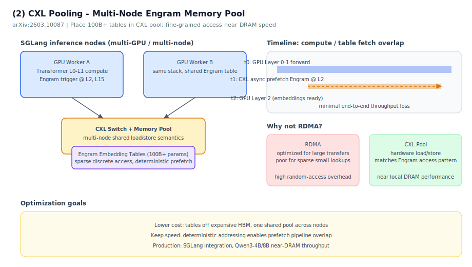

### 动机

Engram 表可达百亿参数级，若每机本地 DRAM 各存一份成本极高；传统 **RDMA 内存池**（Mooncake 等）面向 KV cache 的 **大块 MB–GB 传输**，对 Engram 每次仅 **~5 KB/ token/层、16 段离散小 embedding** 的访问模式不友好（64B 小包 RDMA 吞吐可跌至峰值带宽 25% 以下）。

### 体系结构：三级存储分层

论文原型 + 工程解读可抽象为三层（对应 Figure 4 拓扑）：

| 层级 | 物理介质 | 典型容量 | 存放内容 | 访问特征 |
|------|----------|----------|----------|----------|
| **L1（计算层）** | GPU **HBM** | 数十 GB | Transformer/MoE **权重**、当前 batch hidden、Engram **gate/conv 小参数**、prefetch **staging buffer** | 算力主战场；带宽最高 |
| **L2（节点本地）** | Host **Local DRAM** | TiB 级/节点 | 可选 **热 embedding 缓存**（Zipf 高频 n-gram）、CPU bounce buffer、CXL 映射的 **虚拟地址窗口** | 延迟 ≈ 本地 DRAM；可作 CXL 读路径中转 |
| **L3（机架共享）** | **CXL Memory Pool** | 论文原型 **256 GB/卡**，交换机方案可达 **4 TB / 8 机** | **完整 Engram embedding 大表**（只读、多机共享一份） | 容量最大、单 bit 成本最低；经 CXL Switch **细粒度 load/store** |

> **答疑**：[HBM / DRAM / CXL.mem 区别与 L1–L3 分工](../09-附录/material/papers/engram/qa/cxl-l1-l2-l3-memory-tiers.md)

**硬件拓扑（论文 §4.1）**：每服务器 CPU/GPU → PCIe 5.0 ×16 **CXL Adapter** → **XConn XC50256** CXL Switch → 多块 CXL.mem；交换机总带宽 **512 GB/s**，最多 **8 机共享 4 TB** 池。Engram 表以 **DAX 设备** `mmap` 进用户态，多机只读、**无需跨节点 cache coherence**。

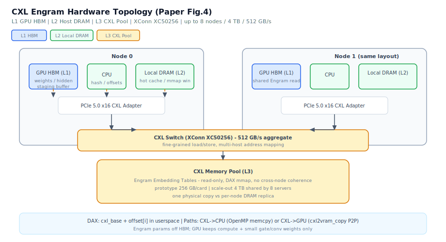

[直接打开 SVG](../09-附录/material/papers/engram/diagrams/engram-02b-cxl-hardware-topology.svg)

---

### 缓存访问逻辑（一次 Decode 的完整路径）

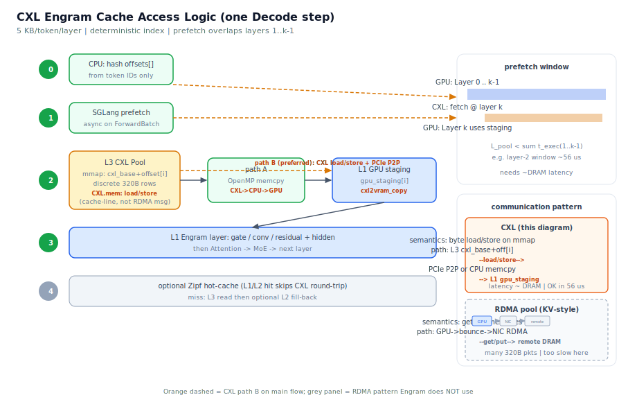

[直接打开 SVG](../09-附录/material/papers/engram/diagrams/engram-02c-cxl-cache-access.svg)

> **答疑**：[prefetch window 与 CPU/GPU 分工](../09-附录/material/papers/engram/qa/cxl-prefetch-window-cpu-gpu.md) · [CXL vs RDMA pattern](../09-附录/material/papers/engram/qa/cxl-vs-rdma-communication-pattern.md)

Engram 访问有三大性质（论文 §3.1），决定上述分层如何工作：

1. **只读、极小激活**：每 token 每层只取 **5 KB**（N=2,3 × 8 hash heads × 320B），相对百亿参数表几乎为零。
2. **稀疏离散**：hash 索引分散在巨大表中，成千上万次 **数百字节级** 随机读。
3. **延迟可隐藏**：索引仅依赖 **输入 token**，decode 步开始即可发起读，与 Engram 之前各层 **GPU 计算重叠**。

#### Step 0 — 索引预计算（CPU，decode 步入口）

- `ForwardBatch` 到达（SGLang）→ 由 **input token IDs** 计算各层 Engram 的 hash 索引 `offsets[]`
- **不依赖 hidden**，与 GPU 前向可并行启动

#### Step 1 — 异步 Prefetch 触发（SGLang store backend）

- 解析 prefill / decode batch 的 token IDs → 异步启动 Engram embedding 拉取（目标：本步 Layer $k$ 所需行）
- 数据终点：**GPU VRAM staging buffer**（或先落 CPU 再拷 GPU）

**时间窗约束**（论文 §3.2）：Engram 插在 layer $k$（如 $k=2,15$），必须在 layer $1..k-1$ 的计算时间内完成取数：

$$
L_{\mathrm{pool}}(N_{\mathrm{token}}, S_{\mathrm{layer}}) < \sum_{i=1}^{k-1} t_{\mathrm{exec}}(i)
$$

以 Qwen3-32B 为例：$t_{\mathrm{step}}\approx 3.6\,\mathrm{ms}$ / 64 层 → 每层约 **56 μs**；**Layer 2 的 prefetch 窗口仅 ~56 μs**，这是选 CXL 而非 RDMA 的核心原因。

> **答疑**：[为何选 CXL 而非 RDMA](../09-附录/material/papers/engram/qa/cxl-why-cxl-not-rdma.md)（时间窗不等式 + 56 μs + 访问形态）

#### Step 2 — L3 → L2/L1 数据通路（二选一）

**通路 A：CXL → CPU（OpenMP 并行 `memcpy`）**

- CXL DAX 已 `mmap` 到用户态 `cxl_base`
- 64 线程按 `offsets[i]` 并行 `memcpy` 到 `cpu_dst`（Listing 1）
- 延迟：**≈ 本地 DRAM**（论文 Figure 5/6）

**通路 B：CXL → GPU（推荐，绕过 CPU 搬运）**

- `cudaHostRegister` 注册 CXL 区域为 **CUDA pinned host memory**
- 单 kernel `cxl2vram_copy`：每个 block 处理一段离散 embedding，GPU DMA **经 PCIe P2P 直读 CXL**（Listing 2）
- 避免数千次 `cudaMemcpy` 启动开销；宽 grid 并发打满 PCIe
- 延迟略高于 CXL→CPU，但仍 **可满足 prefetch 窗口**

（通路示意见上图 Step 2：L3 `cxl_base + offset[i]` 经 PCIe P2P 至 L1 `gpu_staging[i]`，CPU 并行计算 offsets。）

#### Step 3 — L1 计算融合（GPU，Engram 层）

- staging 中的 $e_t$ 已在 HBM → $W_K, W_V$ 投影 → 门控 $\alpha_t$ → Conv → $Y$ → $H \leftarrow H + Y$ → Attention → MoE

#### Step 4 — 热数据短路（可选，Zipf 优化）

① 中 n-gram 服从 **Zipf 分布**：少数模式占绝大多数命中。工程上可在 **L2 Local DRAM / L1 HBM** 维护高频 embedding 缓存——**命中则跳过 CXL 往返**；未命中则从 L3 读取并可选回填 L2（见上图 Step 4）。

CXL 论文原型将 **整表放 L3 单卡 256 GB**；更大规模用 **4 TB 池 + 热缓存** 是自然的扩展路径。

---

### 与 RDMA 池的访问逻辑对比

| 环节 | RDMA Pool（Figure 2a） | CXL Pool（Figure 2b） |
|------|------------------------|------------------------|
| 语义 | `get/put` **消息式** | **load/store**，cache-line 粒度 |
| 数据路径 | GPU → host bounce → **NIC RDMA** → 远端 DRAM | GPU/CPU **直连** CXL 地址空间 |
| Engram 5KB×离散 | 小包效率差，延迟 **数量级高于 DRAM** | 延迟 **接近本地 DRAM**（Figure 3） |
| 多机共享 | 支持 | CXL Switch **硬件地址映射**，8 机并发读同一表 |

> **答疑**：[CXL vs RDMA 通信 pattern（02c 图标注）](../09-附录/material/papers/engram/qa/cxl-vs-rdma-communication-pattern.md)

---

### SGLang 集成：Init → Prefetch → Compute

论文 §4.3 三处改动：

1. **Initialization**：全局 `tp_rank=0, pp_rank=0` 的 ModelRunner 将 Engram 权重 **加载进 CXL 共享池**（其余 rank 复用映射地址）。
2. **Prefetching**：每个 `ForwardBatch` 到达 → 解析 token IDs → **异步** CXL→GPU 传输，与非 Engram 层 overlap。
3. **Computation**：各 rank 按 DP/TP/PP 分工，到 Engram 层时从 pool（或 staging）取 embedding，与本地 hidden 计算；Engram 带宽占用小，**每 rank 可直接读池**。

---

### 带宽与延迟预算（论文 Case Study）

| 符号 | 含义 | Qwen3-32B 例 |
|------|------|----------------|
| $T$ | 系统吞吐 (tok/s) | ≈ 70,000 |
| $S_{\mathrm{layer}}$ | 每 token 每层 Engram 载荷 | 5 KB |
| $N_{\mathrm{eng}}$ | 含 Engram 的层数 | 2（layer 2, 15） |

**带宽**：$B_{\mathrm{pool}} > T \times S_{\mathrm{layer}} \times N_{\mathrm{eng}} \approx 0.7\,\mathrm{GB/s}$ — PCIe Gen5 / 百 G 网卡均够，**瓶颈不在带宽**。

**延迟**：Layer 2 的 prefetch 窗 ≈ **56 μs** —— 必须选 **CXL 近 DRAM 延迟**，RDMA 不满足。

---

### 实验结论

| 指标 | 结果 |
|------|------|
| CXL 读延迟 | CXL→CPU ≈ DRAM；CXL→GPU 略高但可接受（Figure 5/6） |
| 端到端吞吐 | Qwen3-4B：DRAM 5683.7 vs **CXL 5614.4** tok/s（≈ **1.2%** 损失）；8B 类似 |
| 多机扩展 | DP=2, 2 节点吞吐几乎不变（Table 3） |
| 成本 | 大表 + 多节点时 **共享 CXL 池** 优于每机配满 DRAM（Table 4/5） |

### 与①的关系

① 在单机 Host DRAM 上证明 **offload + prefetch <3% 损失**；② 把同一套 **确定性索引 → 异步预取 → 计算重叠** 逻辑推到 **多机 CXL 共享池**，并量化 **RDMA 不适合、CXL 适合** 的访问路径差异。

---

## ③ 无冲突热层实验 Engram-Nine（arXiv:2601.16531）

**标题**：*A Collision-Free Hot-Tier Extension for Engram-Style Conditional Memory: A Controlled Study of Training Dynamics*

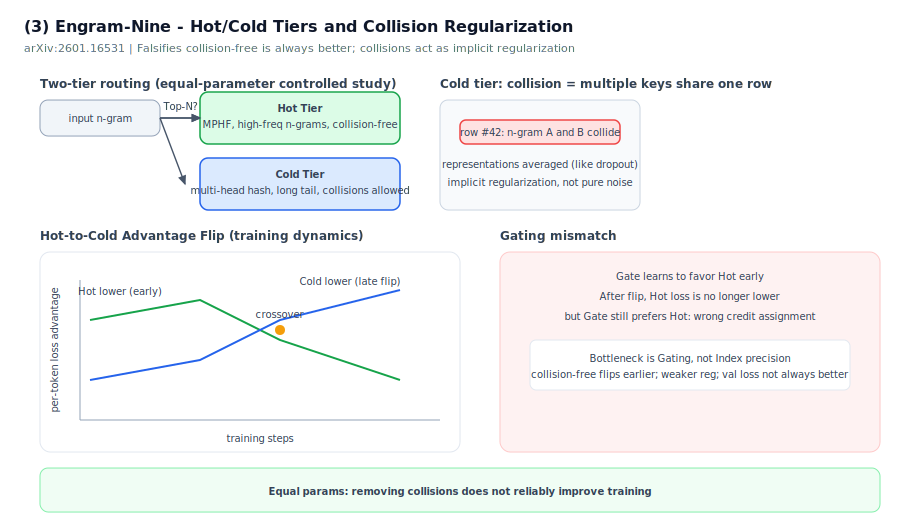

[直接打开 SVG](../09-附录/material/papers/engram/diagrams/engram-03-hot-cold-tier.svg)

### 要验证的直觉

Engram 用**多头哈希**会有碰撞：不同 n-gram 共享 embedding 行。直觉上「高频键碰撞」可能是瓶颈 → 用 **MPHF（最小完美哈希）** 给 Top-N 高频 n-gram 建**无碰撞热层**，长尾仍走原冷层哈希。

**论文 Figure 1** — 双层检索：MPHF + fingerprint 命中走 Hot（单表 $K\times d$），未命中走 Cold（$K$ 头哈希拼接）。

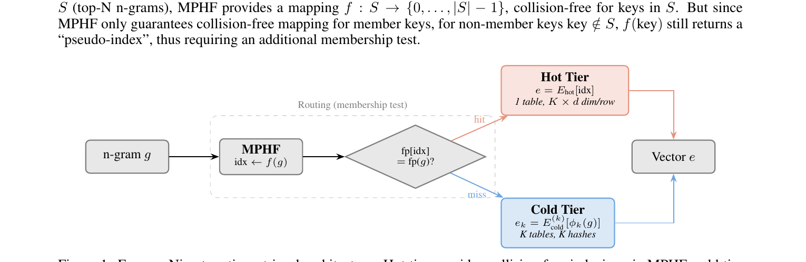

[论文原图 PDF](../09-附录/material/papers/engram/src/hot-tier-2601.16531.pdf) · [裁剪图源目录](../09-附录/material/papers/engram/assets/figures/nine-2601.16531)

### 核心发现（反直觉）

在**严格等参**对照下：

#### 1. 去碰撞并不稳定降低 val loss — 证伪「碰撞是主要瓶颈」

**论文 Table 3**：`Nine-100/400K`（无碰撞热层）val loss **4.4799**，与 `Hash-500K` **4.4809** 几乎相同；高碰撞 `Hash-300K` **4.4825** 亦相当。差异小于测量标准差（0.008–0.012）。

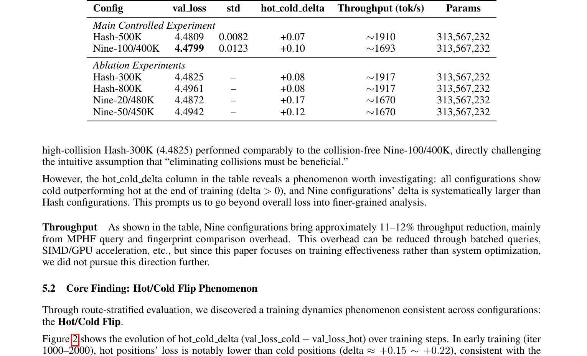

#### 2. Hot-to-Cold Advantage Flip：训练早期 hot（高频）位置 loss 更低；后期 cold 位置反超

定义 $\texttt{hot\_cold\_delta} = \texttt{val\_loss\_cold} - \texttt{val\_loss\_hot}$：正值 = hot 更优，负值 = cold 更优。**所有配置**都经历从 hot 占优到 cold 占优的 crossover。

**论文 Figure 2** — 训练全程 flip 曲线；**Table 4** — 各配置 flip 时刻与幅度。

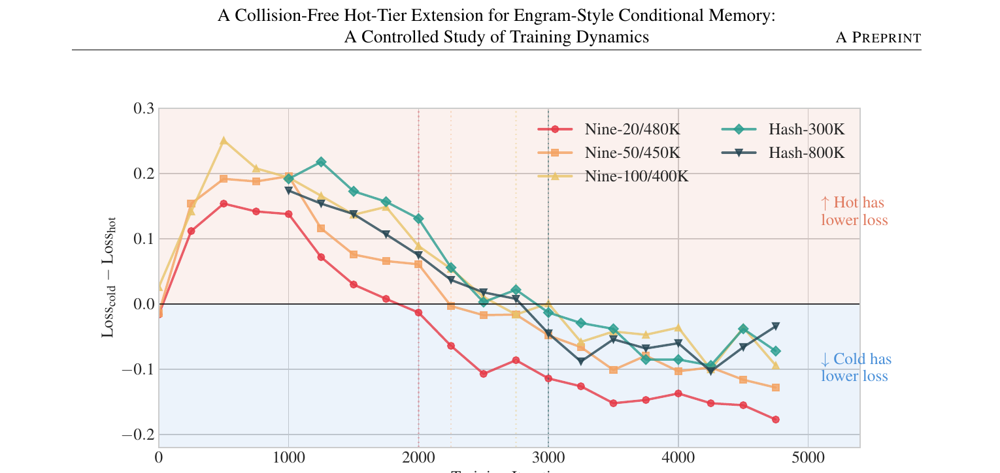

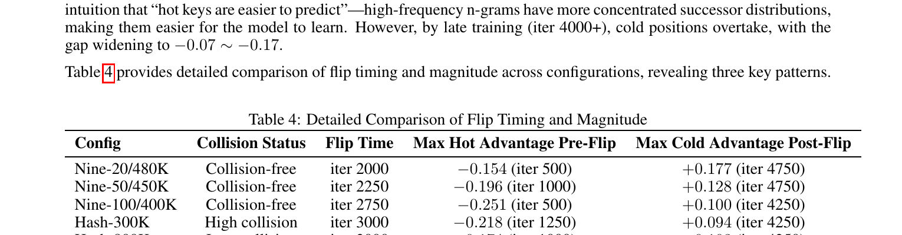

#### 3. 无碰撞配置更早 flip → 碰撞像隐式正则（类似 dropout / 表示平均）

Nine（无碰撞）在 iter **2000–2750** flip；Hash（有碰撞）多在 iter **3000** 才 flip。更小 $N_{\mathrm{hot}}$ 的 Nine 配置 flip **更早**（Table 5），与「稀疏样本学得慢」的直觉相反 → 碰撞延迟 flip、像正则。

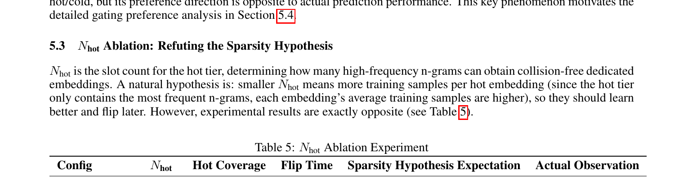

#### 4. 门控错配：gate 早期学会偏 hot，flip 后仍给 hot 更高权重，但 hot 已不再更优

**Figure 3**：$\alpha_{\mathrm{hot}} > \alpha_{\mathrm{cold}}$ 从早期固化；**Divergence** 后 cold loss 已更低，但 $\Delta\alpha$ 仍为正。

**Figure 4 / Table 6**：高 $\alpha$ bucket 对应 **更高 loss**（0.8–1.0 桶 avg loss **5.28** vs 0.2–0.4 桶 **3.90**），且 hot 占比 **76%** — 与门控设计意图相反。

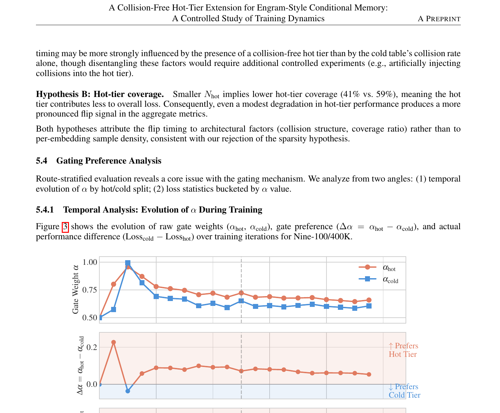

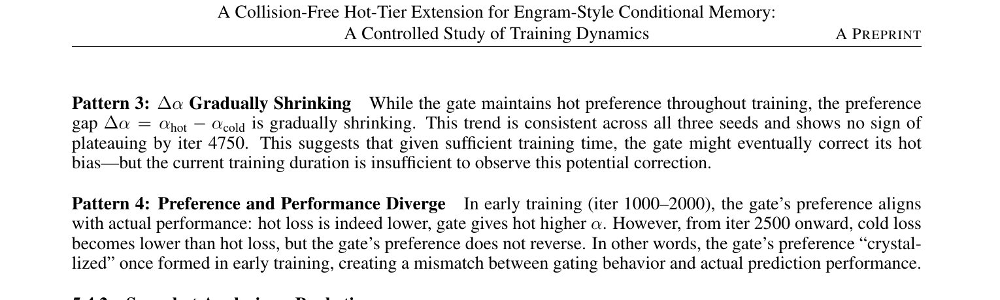

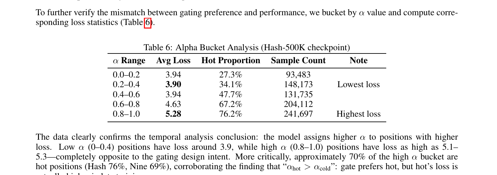

**补充 — Figure 5**：深层（Layer 6）$\Delta\alpha$ 可出现反转，Nine 配置更明显。

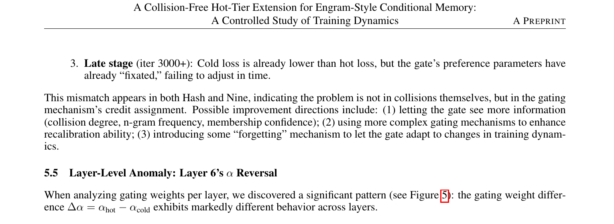

### 启示

- 改进查表精度 ≠ 必然更好训练
- 瓶颈可能在 **gating 的 credit assignment**，而非 index 准确度
- 工程上不要盲目消灭哈希碰撞

### 与①的关系

① 把多头哈希当工程手段；③ 用控制实验说明**碰撞可能是特性而非 bug**。

---

## ④ 视觉 Tiny-Engram（arXiv:2605.20309）

**标题**：*Tiny-Engram: Trigger-Indexed Concept Tables for Generative Vision*  
**机构**：**AutoArk-AI**（开源跟进，非 DeepSeek 官方）

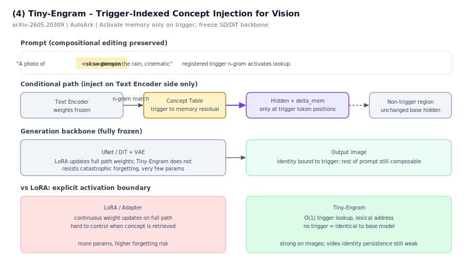

### 动机

视觉个性化常用 LoRA / adapter 全路径改权重，难以控制「**何时、是否**」检索某个概念。

### 方案

- **Trigger-indexed concept table**：注册稀有 **n-gram 触发词** → 查小表 memory residual
- 仅在 prompt 匹配触发区域注入，**冻结** SD / DiT backbone
- 调制 **text encoder hidden**，不改 UNet/DiT 权重

### 结果

- 图像生成：绑定身份 + 保持 prompt 组合性，参数极少
- 视频：能改主体，跨 prompt **身份持续性仍弱**（需视觉侧记忆注入）
- 开源声称：视觉场景下 **参数效率与抗灾难性遗忘** 优于 LoRA

### 与①的关系

把 Engram 的「**显式地址 + O(1) 查表 + 条件激活**」从 LLM 搬到 **生成式视觉**；证明条件记忆不限于语言 backbone。

---

## 四篇对照总表

| 维度 | ① Engram | ② CXL | ③ Engram-Nine | ④ Tiny-Engram |
|------|----------|-------|---------------|---------------|
| **层级** | 模型架构 | 推理系统 | 训练动力学 | 跨模态应用 |
| **核心问题** | 记忆 vs 计算怎么分 | 表放哪、怎么连 | 哈希碰撞要不要消 | 视觉概念怎么注入 |
| **关键结论** | U 形律 ~25% 记忆 | CXL ≈ DRAM 性能 | 碰撞有正则作用 | 触发词查表可个性化 |
| **官方性** | DeepSeek | 系统论文 | 跟进研究 | AutoArk 开源 |

---

## 概念速查

| 术语 | 含义 |
|------|------|
| **Conditional Memory** | 按输入稀疏查表，非全参数前向 |
| **Sparsity Allocation** | MoE FLOPs 与 Engram 表大小的最优配比 |
| **Multi-head hashing** | 多 hash 头降碰撞，拼接 embedding |
| **MPHF 热层** | 高频 n-gram 完美哈希、无碰撞 |
| **CXL pool** | 跨机共享内存池，细粒度访问 |
| **Trigger-indexed** | 仅当 prompt 出现注册 n-gram 才激活记忆 |

---

## 若做跟进创新

| 方向 | 可切入点 |
|------|----------|
| **与推理框架结合** | Engram prefetch 与 CUDA Graph / 分层 KV 的调度共存 |
| **与 LoRA 对比** | 语言侧 Tiny-Engram 式「触发词记忆」vs LoRA（④ 已在视觉做） |
| **分配律** | 不同任务（代码 vs 知识）是否需不同 MoE/Engram 比 |
| **门控** | ③ 指出 gating credit assignment；可改 gate 结构或训练目标 |
| **多模态** | ④ 视频身份持久 → 视觉 token 侧 Engram 而非仅 text encoder |

---

## 参考文献

1. Cheng et al. Engram. arXiv:2601.07372. https://github.com/deepseek-ai/Engram  
2. Pooling Engram using CXL. arXiv:2603.10087  
3. Collision-Free Hot-Tier Extension. arXiv:2601.16531  
4. Cai et al. Tiny-Engram. arXiv:2605.20309. https://github.com/AutoArk/TinyEngram  

---

## 相关文档

- [版本演进总览 §7 Engram](../../../../../docs/reports/deepseek-version-lineage-20260625.md#7-与本仓库其他专题的关系) · [《ds-技术报告》](../01-总览/01-版本演进总览.md#7-与本仓库其他专题的关系)
- [Engram 官方 README](01-Engram官方README.md)

---

## 章节导航

| ← 上一章 | 下一章 → |
|----------|----------|
| [01-Engram官方README](01-Engram官方README.md) | [Raschka 解读梗概：DeepSeek V3 → V3.2](../08-外部解读/01-Raschka要点速读.md) |

> [← 中文导读](../00-前言/02-中文导读.md) · [← Engram 官方 README](01-Engram官方README.md) · [← 演进总览 §7 Engram](../01-总览/01-版本演进总览.md#7-与本仓库其他专题的关系) · [《ds-技术报告》](../01-总览/01-版本演进总览.md#7-与本仓库其他专题的关系)  
> 更新：2026-06-24  
> PDF 目录：[src/](../09-附录/material/papers/engram/src)
