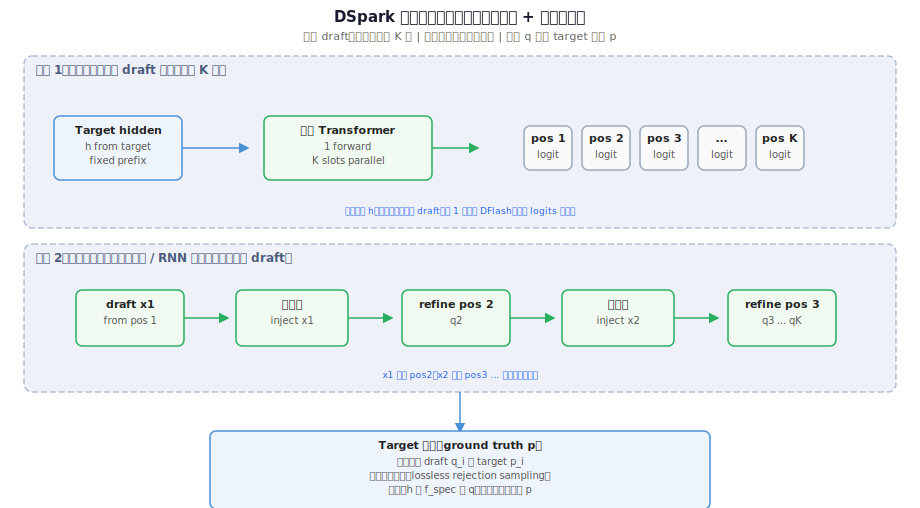
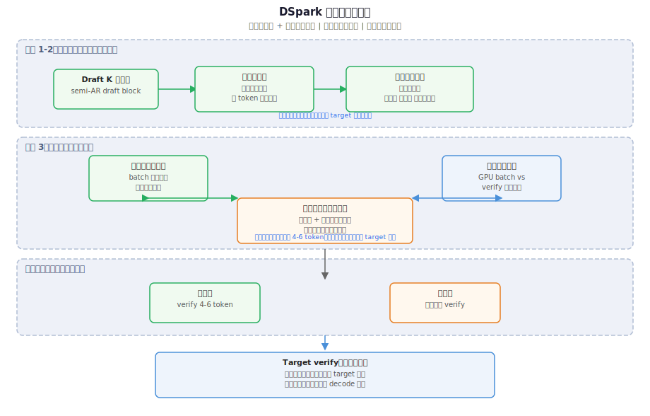
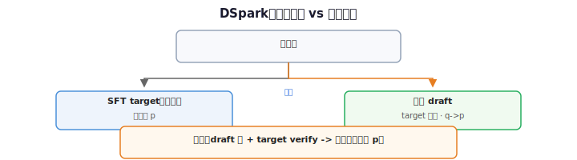

# 如何评价 DeepSeek 发布 DSpark？哪些亮点值得关注？

> [← 返回 V3 §三 MTP](../02-基座架构/01-V3基座.md#三mtp-multi-token-predictionv3-新增顶层结构) · [投机解码专文](../06-推理基础设施/04-DSpark投机解码.md) · [报告目录](../01-总览/03-技术报告索引.md)

**作者**：[酱紫君](https://www.zhihu.com/people/GalAster)（GalAster）
**原文**：[知乎回答](https://www.zhihu.com/question/2054255700407055156/answer/2054537823915619954)
**对照**：[DeepSpec](https://github.com/deepseek-ai/DeepSpec) · [DSpark 论文 PDF](https://github.com/deepseek-ai/DeepSpec/blob/main/DSpark_paper.pdf) · [投机解码专文](../06-推理基础设施/04-DSpark投机解码.md)

---

这个说的是草稿模型，和 ds4f 最近更新 Flash 草稿模式不是一回事。

和之前 1000T/s 的 Mimo UltraSpeed 一起讲一下吧，都是基于 DFlash 的优化。

DSpark 成本低，加速普适性高，可以套用到任何模型；而 UltraSpeed 一对一成本极高，但是效果更好。

---

## Speculative Decoding

大模型训练完成的推理部分有很多的工程优化，其中加速比最大的就是投机解码，说白了就是用时间换空间，用 Compute-Bound 的并行验证去替代 Memory-Bound 的串行读取。

> **Compute / Memory 两层读法 · DFlash vs Eagle**：[答疑：draft 侧 DFlash≈并行 Compute-Bound、Eagle≈串行 Memory-Bound](../06-推理基础设施/qa/spec-decode-compute-vs-memory-bound.md) — 开篇整句指 **target 并行 verify**；draft 范式上 **DFlash / Eagle** 分别对应两侧。

投机解码需要两个模型，一个是分布为 $P(x)$ 的大模型为 $M_p$，另一个是轻量级分布为 $Q(x)$ 草稿模型为 $M_q$。

接下来会将一次推理分解为草稿阶段（Drafting）和验证阶段（Verification）。

令草稿模型 $M_q$ 串行自回归生成 $K$ 个候选 token $\hat{x}_{t+1}, \hat{x}_{t+2}, \dots, \hat{x}_{t+K}$。

然后大模型 $M_p$ **一次前向**并行校验这 $K$ 个位置，按 rejection sampling 从左到右接受与 $P$ 一致的 prefix；未通过处截断并自 $M_p$ 重采样。输出分布与不用投机时 **完全一致**（lossless）。

在外置方案中，草稿模型和主模型是两套完全独立的表征空间，经常出现鸡同鸭讲导致的拒绝。这也是为什么 MiMo UltraSpeed 可以打出 1000+ 单 token 射速，而其他架构在缺卡的情况下很难做到。

[加速比粗式](../06-推理基础设施/04-DSpark投机解码.md#4-草稿范式总览eagle3--dflash--mtp--dspark)：

$$
S_{\uparrow} = \frac{\bigl(\mathbb{E}[N_{\mathrm{acc}}] + 1\bigr)\,\tau_p}{K\,\tau_q + \tau_p}
$$

要把 $S_{\uparrow}$ 做大，需同时抬高 $\mathbb{E}[N_{\mathrm{acc}}]$（draft 猜得准）并压低 $K\tau_q$（draft 别太慢）。**DSpark** 正是在这两项目标之间的半自回归折中。

---

## DSpark 半自回归草稿：并行主干 vs 顺序头

DSpark 用改进版 DFlash 作 **并行主干**（约 2–3 层轻量 MoE），一次前向出 $K$ 个位置特征；再用极轻 **顺序头** $g_\theta$ 逐位注入块内因果。

$$
E = \{e_{t+1}, \ldots, e_{t+K}\} = \mathrm{DFlashBackbone}(h_t^p)
$$

$$
\tilde{e}_{t+i} = g_\theta\bigl(e_{t+i},\, \mathrm{Embed}(\hat{x}_{t+i-1})\bigr), \quad
\hat{q}_i = \mathrm{softmax}(W_{\mathrm{lm}}\tilde{e}_{t+i})
$$

### 为何「2–3 层 MoE 很大」，而「串行 $K$ 次」却很 trivial？

比的不是 **并行 vs 串行**，而是 **每步有多重**：

| | **第一步：并行主干** | **第二步：顺序头 $\times K$** |
|---|---|---|
| **算什么** | 2–3 层 MoE，**一次**前向出 $K$ 位 $E$ | 每步：embed 上一位 + 极小 $g_\theta$ + lm 投影 → 采 1 token |
| **参数量级** | 小 Transformer/MoE 整块权重 | 论文口径 **$<0.1\%$** 主模型 |
| **访存** | 从 **HBM** 拉 MoE 专家，$K$ 位并行 matmul | 主张在 **寄存器 / on-chip**，几乎不碰大块权重 |
| **在 $\tau_q$ 里** | draft 侧 **主体算量** | **加性小尾巴** |

**Eagle3 式串行**：第 $i$ 步 = 再跑 **一整段** draft Transformer → $K$ 次「小模型完整前向」，$\tau_q \propto K$。

**DSpark 式串行**：第 $i$ 步只在 **已算好的** $e_{t+i}$ 上用 $g_\theta$ 注入 $\hat{x}_{t+i-1}$ → $K$ 次 **寄存器级微算**，不是 $K$ 次 MoE 前向。

> **一句话**：重的只并行 **一次**（买整块语义 + 第 1 位高接受率）；串行只串 **轻头**（补 DFlash 缺的块内因果）。若第二步也每层跑 MoE，就退化成 Eagle，配不上「半自回归」。

[图示详情](../06-推理基础设施/figures/dspark-semi-ar-draft.svg)

---

## 置信度调度与验证截断

DSpark 为 batch 内每个请求选验证长度 $L_j$（$1 \le L_j \le K$），在 SLA 下最大化期望接受收益：

$$
\max_{L_1,\ldots,L_B} \sum_{j=1}^{B}\sum_{i=1}^{L_j} \tilde{c}_{t+i}^{(j)}
\quad \text{s.t.}\quad
\mathrm{Latency}\bigl(\mathrm{BatchConfig}(L_1,\ldots,L_B)\bigr) \le \mathrm{SLA}
$$

$\tilde{c}_{t+i}^{(j)}$ 为第 $j$ 条请求、草稿第 $i$ 位的 **存活置信度**（校准后 $\approx$ 经验接受率）。

### 截断 / 减少验证长度：对效率与「准确率」的影响

| 维度 | 影响 |
|------|------|
| **输出准确率 / 分布** | **不变**。target 仍按 rejection sampling 校验；lossless，不会多接受主模型本不认可的 token。 |
| **单请求加速比** | $L_j$ 缩短 → 本轮少验后缀 → 单用户 **加速红利下降**；$L_j \to 1$ 时 **体感接近 MTP-1**（仍走 draft+verify，不是关投机）。 |
| **系统吞吐 / 效率** | 高负载或低置信时缩短 $L_j$，少把 target batch 浪费在 **大概率被拒的尾巴** 上 → **全局吞吐** $\uparrow$，SLA 下更多算力给高 $\tilde{c}$ 前缀。 |
| **draft 侧算力** | **几乎不减**。并行主干往往仍生成完整 $K$ 块草稿；截断只省 **[verify 侧](../06-推理基础设施/04-DSpark投机解码.md#11-局限与边界)**。 |

| 模式 | draft | target verify | 含义 |
|------|-------|---------------|------|
| 纯原生 decode | 无 | 每步 1 token | 不走 spec-decode |
| 弱投机（MTP-1） | 有（常 1 位） | 每轮 verify 1 位 | $L_j=1$，仍算投机 |
| DSpark 截断 | 可仍生成 $K$ 位草稿 | 只 verify 前缀 $L_j$ 位 | 沿 $L$ **连续变浅**，非关投机 |

**负载自适应**：低并发可验 4–6 位；高并发 **平滑缩短** $L_j$。

[图示详情](../06-推理基础设施/figures/dspark-confidence-scheduler.svg)

---

## MTP：一次前向如何融合中间 token

V3/V4 **MTP** 在位置 $t$ 上：**主网**预测 $x_{t+1}$；**MTP 链**再预测 $x_{t+2}, x_{t+3}, \ldots$。每一位都通过 **「上一层 hidden + 一个中间 token 的 embed」** 融合，不是无依赖并行吐出 K 个 token。

> **读图**：[MTP 融合 scheme 专文](../06-推理基础设施/qa/mtp-fusion-scheme.md) · [融合 SVG](../06-推理基础设施/figures/mtp-fusion-scheme.svg) · [串行链深度计算图](../06-推理基础设施/figures/mtp-draft-chain-depth.svg)

### 融合公式

对 MTP 深度 $k$（$k=1$ 时 $h_t^{(0)}$ 来自主网）：

$$
h_t^{\prime(k)} = M_k\bigl[\,\mathrm{RMSNorm}(h_t^{(k-1)})\ ;\ \mathrm{RMSNorm}(\mathrm{Emb}(x_{t+k}))\,\bigr], \quad
h_t^{(k)} = \mathrm{TRM}_k(h_t^{\prime(k)}), \quad
P(x_{t+k+1}) = \mathrm{softmax}\bigl(\mathrm{OutHead}(h_t^{(k)})\bigr)
$$

- **融的是单个** $x_{t+k}$，不是一次性 $\mathrm{Emb}(x_{t+1:t+k})$ 全塞进去。
- $\mathrm{TRM}_k$ = **1 层**浅 Block；**不是**重跑主网 L 层。

训练目标：

$$
\mathcal{L}_{\mathrm{total}} = \mathcal{L}_{\mathrm{main}} + \sum_{k=1}^{M} \lambda_k \mathcal{L}_{\mathrm{MTP}}^{(k)}
$$

### 「一次前向」指什么？

| 阶段 | 主 Transformer | MTPBlock | 中间 token 从哪来 |
|------|----------------|----------|-------------------|
| **训练** | **1 次**前向 → 全体 $h_t^{(0)}$ | 各 $t$ 上批量跑浅 MTP；**不重跑主网** | **teacher forcing 真值** $x_{t+1}, x_{t+2}, \ldots$ |
| **推理（MTP 当 draft）** | 每 decode 轮 **1 次** verify | MTP **链式** $K$ 小步：融 $\mathrm{Emb}(\hat{x}_{t+k})$ + MTPBlock | **上一步刚 propose 的** $\hat{x}$ |

**三个不是**：

1. **不是** 一个 softmax 无依赖同时吐出 $t{+}1,\ldots,t{+}K$（因果链仍在）。
2. **不是** 为 MTP 把 671B 主网跑 $K$ 遍（多的是 K 个 **浅** MTP Block）。
3. **不是** 推理时中间 token 永远用真值（draft 时用 **已猜 embed**）。

与 DSpark 对照：MTP = 主网 1 次 verify + **MTPBlock 串 $K$ 步（融 embed）**；DSpark = 并行 MoE 主干 1 次 + **更轻的** $g_\theta$ 串 $K$ 步。

 MTPBlock_k -> 预测 x_{t+k+1}" width="920"/>

[图示详情](../06-推理基础设施/figures/mtp-fusion-scheme.svg) · [投机对照总览（旧图）](../06-推理基础设施/figures/mtp-speculative.svg)

[图示详情](../06-推理基础设施/figures/mtp-draft-chain-depth.svg) · [专文 §1.1 理解对照](../06-推理基础设施/qa/mtp-fusion-scheme.md#11-你的理解对在哪里错在哪里)

---

## DeepSpec draft 训练 vs 主模型 fine-tune

> **范畴**：**DSpark 线上推理**不改 V4 基座权重。**「训练」**指 DeepSpec 里 **外挂 draft** 的蒸馏/SFT；**「在线引擎」**指 draft 接入后的调度与 kernel。**二者都不是** V3/V4 **主模型预训练或 fine-tune**。

### 动谁的权重？

| 说法 | 动谁 | 改变什么 |
|------|------|----------|
| **主模型 SFT / RL** | Target $M_p$ | 输出分布 $p$，**能力边界** |
| **DeepSpec 训外挂 draft** | 只动 $M_q$ / DSpark | 提议分布 $q \to p$，**冻结 target** |
| **V3 MTP 联合训练** | 骨干 + MTP 头 | 既改 $p$ 也改原生 draft（同 checkpoint） |

### 用新样本「下游特化」算 fine-tune 吗？

- **只训 draft、target 冻结**：应叫 **draft 域适配 / 蒸馏**，不是主模型 fine-tune。lossless 校验保证最终输出仍服从 **固定** $p$——**不会让主模型变聪明**，只可能让 $q_i \approx p_i$ 在新场景上更准 → $\mathbb{E}[N_{\mathrm{acc}}]$ $\uparrow$ → **更快**。
- **要改答案质量 / 领域能力**：必须 **SFT 或 RL 动 target**（或预训练期 MTP 联合更新）。可与「为 frozen target 训 domain draft」**并行两条线**，但 **不能互相替代**。

[图示详情](figures/dspark-draft-target-parallel.svg)

**一句话**：外挂 draft 用新数据训 = **给 draft 做微调**；**不更新主模型**；在 lossless 前提下 **只提速、不升智**。加速来自 **推理投机栈**，不来自 draft 训练本身。

---

## 与专文对照

| 主题 | 专文章节 |
|------|----------|
| Compute / Memory；DFlash vs Eagle | [答疑 §1–§7](../06-推理基础设施/qa/spec-decode-compute-vs-memory-bound.md) |
| 投机循环、lossless | [§1](../06-推理基础设施/04-DSpark投机解码.md#1-投机解码循环) |
| MTP vs 外挂 draft | [§2](../06-推理基础设施/04-DSpark投机解码.md#2-deepseek-路线mtpv3--v4) |
| MTP 中间 token 融合 | [MTP 融合 scheme](../06-推理基础设施/qa/mtp-fusion-scheme.md) · [SVG](../06-推理基础设施/figures/mtp-fusion-scheme.svg) |
| Eagle / DFlash / DSpark 范式 | [§4](../06-推理基础设施/04-DSpark投机解码.md#4-草稿范式总览eagle3--dflash--mtp--dspark) |
| 机制细节 | [§5–§6](../06-推理基础设施/04-DSpark投机解码.md#5-dspark-概述) |
| 线上 MTP-1 基线 | [§8、§10](../06-推理基础设施/04-DSpark投机解码.md#8-v4-生产部署) |