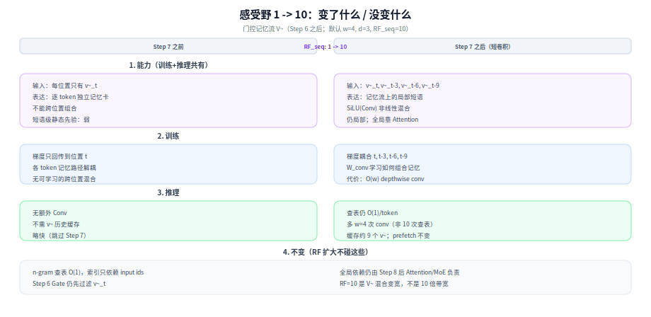
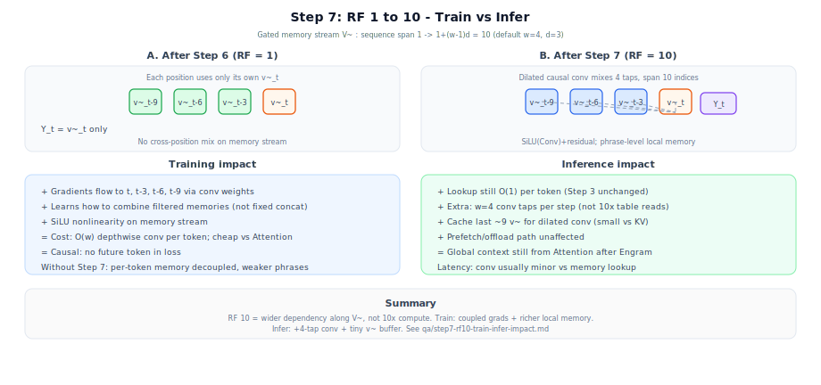

> [← 返回 Engram 系列导读](../../../../../07-Engram/02-Engram系列导读.md) · [答疑目录](README.md) · [← 中文导读](../../../../../00-前言/02-中文导读.md) · [← 仓库首页（EN）](https://github.com/fooSynaptic/deepseek-tech-notes)

# Step 7 感受野 1→10：训练与推理差异

[← 感受野常数](step7-short-conv-receptive-field.md) · [Step 7 正文](../../../../../07-Engram/02-Engram系列导读.md#step-7-短卷积扩感受野)

---

## 先澄清：「10 倍」指什么

不是算力放大 10×，而是门控记忆流 $\tilde{V}$ **沿序列的有效依赖跨度** 从 **1 个位置** 扩到 **10 个 token 索引范围**（默认 $w=4,d=3$）。

$$
\mathrm{RF}_{\mathrm{seq}}:\ 1 \;\rightarrow\; 1+(w-1)d = 10
$$

## 影响总览

[图示详情](../diagrams/engram-01h-rf-change-impact.svg)

---

## 1. 能力上差什么

| | RF = 1（仅 Step 6） | RF = 10（Step 7 后） |
|--|---------------------|----------------------|
| 每位置输入 | 仅 $\tilde{v}_t$ | $\tilde{v}_t,\tilde{v}_{t-3},\tilde{v}_{t-6},\tilde{v}_{t-9}$ |
| 表达 | 每 token **独立** 的过滤记忆 | **跨位置组合** 已过滤记忆 + SiLU 非线性 |
| 与 n-gram 关系 | 查表已见 2–3 token **input** | 在 **记忆向量序列** 上再对齐 n-gram 间隔 $d$ 做融合 |
| 仍不做的事 | — | **不替代 Attention**（全局仍靠 Attn/MoE） |

**直觉**：Step 1–4 给每个位置一张「局部词典卡片」；Step 6 决定信不信；Step 7 把 **间隔为 3 的多张卡片** 合成一句更长的「记忆短语」，再写入 backbone。

---

## 2. 训练带来的差异

### 2.1 梯度与耦合

- **RF=1**：loss 对 $\tilde{v}_t$ 的梯度只回传到位置 $t$ 的 gate / 查表 / 投影。
- **RF=10**：$Y_t$ 的梯度经 depthwise Conv **同时回传** 到 $t,t{-}3,t{-}6,t{-}9$ 四条记忆路径。
- 卷积权重 $W_{\mathrm{conv}}$ **可学习**：模型学习「哪些间隔 3 的记忆组合有用」，而非硬编码拼接。

### 2.2 优化与表达

| 效应 | 说明 |
|------|------|
| **更强局部组合** | 超出单次 n-gram 槽位的 **短语级** 静态先验（仍局部） |
| **非线性** | SiLU(Conv(·)) 在残差旁路；纯线性叠加 $w=4$ 的表达能力有限 |
| **因果安全** | 因果卷积不看未来 token，训练/推理一致 |
| **序列前端** | $t<9$ 时有效 tap 变少（边界），与因果 LM 常见行为一致 |

### 2.3 训练成本

- 相对 Engram 查表 + gate：**增量很小**。
- Depthwise Conv1d：每 token 仅 **$w=4$ 次** tap 乘加（按 channel 分组），与 $d_{\mathrm{model}}$ 线性，远低于同层 Attention。
- 反向：多 4 个历史位置的 gate/投影梯度，仍 $O(w)$ 常数。

---

## 3. 推理带来的差异

### 3.1 延迟与算力

| 项 | RF=1 | RF=10（有 Step 7） |
|----|------|---------------------|
| 每 decode step 查表 | $O(1)$ / token | **不变** $O(1)$ |
| Gate | 1 次 / token | **不变** |
| 额外 Conv | 无 | **$w=4$ tap** depthwise，$O(w\cdot d_{\mathrm{hc}})$，常数级 |
| 相对 Attention | Engram 仍偏 memory-bound 查表 | Conv 通常 **< 5%** Engram 块（实现依赖） |

**要点**：跨度 10 不等于每步读 10 次表；只是卷积多读 **3 个历史** $\tilde{v}$（间隔 3），计算量由 **$w$** 决定，不由 10 决定。

### 3.2 状态与缓存

- **Decode** 需保留最近 $\tilde{v}$（至少 **$t{-}9$**）供 dilated conv 取用，或等价地保留 Conv 环形缓冲。
- 额外显存：$\approx 9 \times d_{\mathrm{mem}} \times \mathrm{sizeof}(\mathrm{fp})$ **每序列每 Engram 层**，相对 KV cache 通常可忽略。
- **Prefill**：全长并行，与训练前向同构；仍无未来泄漏。

### 3.3 与 prefetch / offload 的关系

- n-gram 索引仍 **只依赖 input ids**（Step 3 前可算）→ prefetch 路径 **不受 Step 7 影响**。
- Step 7 只在 GPU 上融合 **已算出的** $\tilde{V}$，不增加 CXL/表访问次数。

---

## 4. 若去掉 Step 7

| | 训练 | 推理 |
|--|------|------|
| 速度 | 略快（少一次 conv） | 略快 |
| 质量 | 每 token 记忆 **解耦**，难学短语级组合 | 输出更「逐 token 查表感」 |
| 与论文分工 | 削弱 Engram「局部静态搭配」路径 | Attention 负担可能上升 |

论文保留 Step 7 的原因：**极便宜地** 在记忆支路补上 **跨位置局部非线性**，把全局留给 Attention。

---

## 5. 一图速览

[图示详情](../diagrams/engram-01f-rf10-train-infer.svg)
---

## 参考

- [Step 7 短卷积：感受野扩充常数](step7-short-conv-receptive-field.md) — 公式与 tap 下标
- [Engram demo 脚本](../../../../../07-Engram/engram_demo_v1.py) — `ShortConv`, `value + short_conv(value)`
