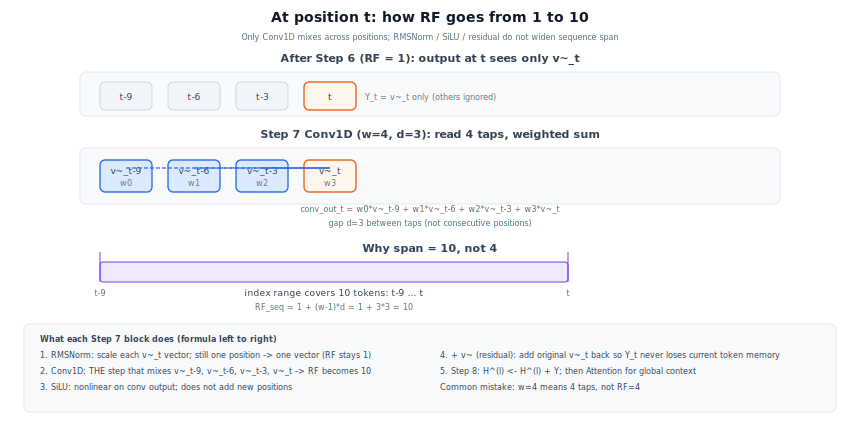

# Step 7 短卷积：感受野扩充常数

[← 返回 Step 7](../../../../../07-Engram/02-Engram系列导读.md#step-7-短卷积扩感受野) · [Step 6 门控专文](step6-context-gating-rationale.md) · [答疑目录](README.md)

---

## 问题

Step 7 标题写「扩感受野」——是从 **1 扩到 4** 吗？$w=4$ 的 kernel 是否等于跨度 4？

---

## 结论

| 维度 | Step 6 之后 | Step 7 之后（默认 demo） |
|------|-------------|--------------------------|
| **门控记忆流 $\tilde{V}$ 沿序列** | 每位置独立，跨度 **1** | 因果 dilated conv 混合，跨度 **$1+(w-1)d$** |
| 默认 $w=4$，$d=\text{max\_ngram\_size}=3$ | — | **$1+3\times 3=10$** |

**$w=4$ 是卷积核 tap 个数，不是感受野跨度。**


[图示详情](../diagrams/engram-01h-rf-change-impact.svg)

---

## 1. 两种「看过多远」不要混

### A. 输入侧 n-gram 跨度

每个位置 $t$ 查表时，$e_t$ 已编码 **后缀 2/3-gram**，即最多 **3 个 input token** 的静态搭配。

这是 **查表键的长度**，不是门控记忆在序列维上的混合。

### B. 门控记忆流沿序列的混合

Step 5–6 对每个 $t$ **独立**算 $\tilde{v}_t$；在 $\tilde{V}$ 这条流上，位置 $t$ 在 Step 6 结束时 **只依赖** $\tilde{v}_t$，与 $\tilde{v}_{t-1}$ 等无关 → **序列感受野 = 1**。

Step 7 的因果 Conv1D 才在 **$\tilde{v}$ 序列** 上做局部融合。

---

## 2. 公式与代码参数

论文 / overview：**Depthwise 因果 Conv1D**，kernel $w$，dilation = 最大 n-gram 阶数 $N$。

官方 demo（[Engram demo 脚本](../../../../../07-Engram/engram_demo_v1.py)）：

```python
kernel_size = engram_cfg.kernel_size # 默认 4
dilation = engram_cfg.max_ngram_size # 默认 3
```

因果 dilated 一维卷积，位置 $t$ 的输出依赖的 tap 下标（向后看）：

$$
t,\; t-d,\; t-2d,\; \ldots,\; t-(w-1)d
$$

**有效序列感受野（跨度）**：

$$
\boxed{\mathrm{RF}_{\mathrm{seq}} = 1 + (w-1)\,d}
$$

默认：$\mathrm{RF}_{\mathrm{seq}} = 1 + 3\times 3 = 10$。

即 $Y_t$ 会用到 $\tilde{v}_t,\,\tilde{v}_{t-3},\,\tilde{v}_{t-6},\,\tilde{v}_{t-9}$——**间隔为 $d$ 的 4 个点**，覆盖 **10** 个 token 索引范围，而非连续 4 个位置。

### 2.1 逐项看懂：谁在扩感受野？

公式 $Y=\mathrm{SiLU}(\mathrm{Conv1D}(\mathrm{RMSNorm}(\tilde{V})))+\tilde{V}$ 从左到右：

| 顺序 | 操作 | 对位置 $t$ 做了什么 | 序列感受野 |
|------|------|---------------------|------------|
| ① | **RMSNorm** | 只归一化 **当前** $\tilde{v}_t$ 这个向量 | **仍为 1**（不读邻居） |
| ② | **Conv1D** | 用 **4 个可学习权重** 把 $\tilde{v}_{t-9},\tilde{v}_{t-6},\tilde{v}_{t-3},\tilde{v}_t$ **加权求和** | **1 -> 10**（只有这一步扩） |
| ③ | **SiLU** | 对卷积结果做非线性 | 不新增位置 |
| ④ | **$+\tilde{V}$** | 把原始 $\tilde{v}_t$ 加回去（残差） | 不新增位置 |

**「第一项」RMSNorm 不扩感受野**；真正让 $t$ 看见 $t{-}3,t{-}6,t{-}9$ 的是 **第二项 Conv1D**。

**为何跨度是 10 而不是 4？**

- $w=4$ = 卷积 **读 4 个点**（4 个 tap）
- $d=3$ = 相邻 tap 间隔 **3 个 token**
- 最左 tap 在 $t{-}9$，最右在 $t$ → 索引覆盖 $t{-}9,\ldots,t$ 共 **10** 个位置

$$
\underbrace{t-9}_{\text{tap 0}}\;\cdots\; \underbrace{t-6}_{\text{tap 1}}\;\cdots\; \underbrace{t-3}_{\text{tap 2}}\;\cdots\; \underbrace{t}_{\text{tap 3}}
\quad\Rightarrow\quad \mathrm{RF}_{\mathrm{seq}} = t - (t-9) + 1 = 10
$$



[图示详情](../diagrams/engram-01g-rf-one-position.svg)
---

## 3. 为何 dilation = max n-gram 阶数

直觉对齐：n-gram 查表已在 **长度 $N$** 的 input 窗口上编码局部模式；短卷积用 **相同间隔 $N$** 在门控后的记忆流上再混合，使序列方向的采样节奏与 n-gram 阶数一致。

---

## 4. 残差与 Step 8

$$
Y = \mathrm{SiLU}(\mathrm{Conv1D}(\mathrm{RMSNorm}(\tilde{V}))) + \tilde{V}
$$

残差保证 $Y_t$ 至少保留 $\tilde{v}_t$；卷积分支提供跨位置的局部非线性。Step 8 将 $Y$ 残差写入 backbone，之后 **Attention** 再负责全局依赖。


[图示详情](../diagrams/engram-01e-residual-step78.svg)
---

## 5. 速查表

| 符号 | demo 默认 | 含义 |
|------|-----------|------|
| $w$ | 4 | Conv1d `kernel_size` |
| $d$ | 3 | `dilation` = `max_ngram_size` |
| $\mathrm{RF}_{\mathrm{seq}}$ | 10 | $1+(w-1)d$ |
| Step 6 序列 RF | 1 | 每 $t$ 仅 $\tilde{v}_t$ |
| n-gram input 跨度 | 2–3 | 查表键长，≠ 上式 RF |

→ **训练/推理差异**：[Step 7 感受野 1→10：训练与推理差异](step7-rf10-train-infer-impact.md)


[图示详情](../diagrams/engram-01f-rf10-train-infer.svg)
---

## 参考

- [DeepSeek Engram 系列导读§Step 7](../../../../../07-Engram/02-Engram系列导读.md#step-7-短卷积扩感受野)
- [Engram demo 脚本](../../../../../07-Engram/engram_demo_v1.py) — `ShortConv`, `EngramConfig.kernel_size`, `max_ngram_size`
