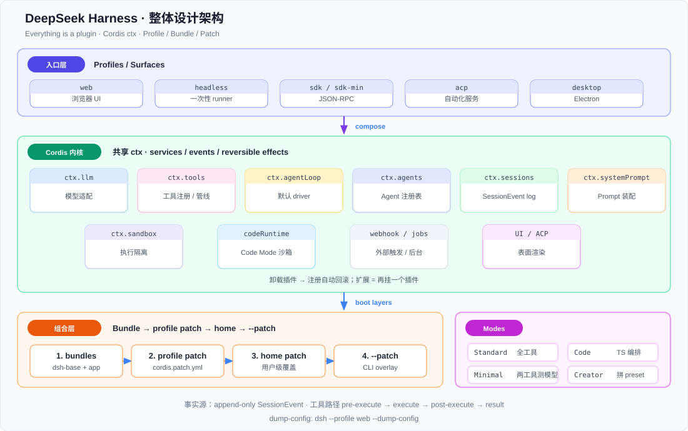
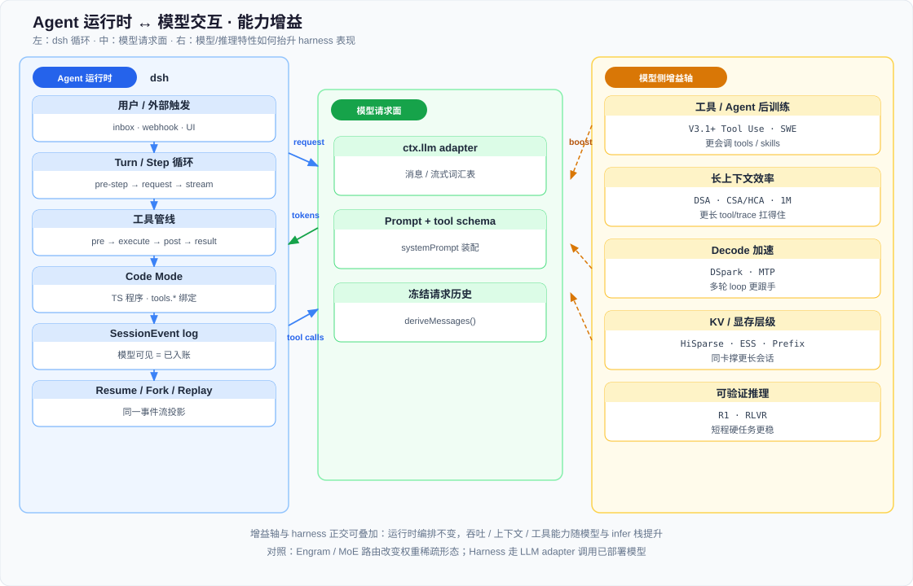

# DeepSeek Harness

> [← 中文导读](../00-前言/02-中文导读.md) · [← 仓库首页（EN）](https://github.com/fooSynaptic/deepseek-mechanism-atlas) · [← 版本目录](../01-总览/02-版本梗概索引.md) · [← 演进总览](../01-总览/01-版本演进总览.md) · [← 基础设施线](../01-总览/06-基础设施线导读.md) · [← V3.1 Agent](../04-版本代际/01-V3.1-Terminus.md) · [← V4 长上下文 Agent](../04-版本代际/03-V4.md) · [← DSpark](../06-推理基础设施/04-DSpark投机解码.md) · [← GRPO 长程局限](../03-后训练与R1/04-GRPO长程局限.md)

> **官方入口**：[产品页 · Everything is a plugin](https://deepseek.com/harness/en/) · [架构参考](https://deepseek-harness.github.io/deepseek-harness/en/reference/) · [源码 deepseek-ai/deepseek-harness](https://github.com/deepseek-ai/deepseek-harness) · 开发预览（APIs 仍会演进）

## 核心结论摘要

- **定位**：开源 **coding / agent harness**（又称 `dsh`），是面向真实环境的 **agent 运行时**：理解上下文、调工具、持续干活。
- **官方口号**：**Everything is a plugin**——模型适配、工具、skills、session、sandbox、存储、agent loop、调度、UI 全是 Cordis 插件（TypeScript 插件元框架），可配置替换，无需改 dsh 源码。
- **创新**：（1）无特权内核的插件组合；（2）**append-only session log** 作为模型可见上下文的唯一事实源；（3）**Code Mode**：模型写一段 TS 程序，经 typed SDK 一次性编排多轮工具调用，走同一套受控 tool pipeline。
- **与本仓库关系**：第四条叙事主线 **Agent 运行时（Harness）**；**受益于** DSpark / CSA·HiSparse 等 infer 加速；与 Engram / Index Share 等正交可叠加。

---

## 1. 定位：什么是 Harness

官方表述：模型是 agent 的「灵魂」；**harness** 负责让 agent **理解环境、使用工具、在真实场景里持续工作**。

| 维度 | DeepSeek Harness | 本仓库既有主线 |
|------|------------------|----------------|
| 产出物 | TypeScript/Node 运行时 + 插件生态（`npx @deepseek-ai/dsh web`） | 模型机制（MLA / MoE / DSA / DSpark…） |
| 优化对象 | agent 循环、工具策略、可组合运行时 | 权重 / 注意力 / 路由 / KV / 投机解码 |
| 读者 | harness / 插件开发者 | 读技术报告、复现架构 claim |

本篇把 atlas 从「模型与推理栈怎么变」扩展到 **装上工具与会话后 agent 怎么跑**，以及 **哪些模型 / infer 特性抬升 harness 表现**（后者见 §5）。

*Figure: dsh = Profiles / Surfaces → Cordis 共享 ctx（llm / tools / agentLoop / sessions…）→ Bundle→Patch 分层启动；旁路 Standard / Code / Minimal / Creator。*

[图示详情](figures/dsh-architecture.svg)

---

## 2. dsh 信息来源

| 层级        | URL / 路径                                                                                                                                                                                                       | 内容                                                |
| --------- | -------------------------------------------------------------------------------------------------------------------------------------------------------------------------------------------------------------- | ------------------------------------------------- |
| 产品叙事      | [deepseek.com/harness/en](https://deepseek.com/harness/en/)                                                                                                                                                    | Everything is a plugin；四种 mode；可追溯轨迹              |
| 架构总览      | [reference/](https://deepseek-harness.github.io/deepseek-harness/en/reference/)                                                                                                                                | Cordis、profile/bundle、turn flow、session log、seams |
| Cordis 入门 | [develop/basic](https://deepseek-harness.github.io/deepseek-harness/en/develop/basic/) · [cordis tutorial](https://deepseek-harness.github.io/deepseek-harness/en/develop/cordis-tutorial/07-into-the-harness) | 第一个插件、`inject`、自动清理                               |
| 工具契约      | [adding-a-tool](https://deepseek-harness.github.io/deepseek-harness/en/reference/cookbook/adding-a-tool) · [tool-catalog](https://deepseek-harness.github.io/deepseek-harness/en/reference/tool-catalog)       | `defineTool`、policy 扩展点、Code Mode 免费可达            |
| Code Mode | [code-runtime](https://deepseek-harness.github.io/deepseek-harness/en/reference/subsystems/code-runtime)                                                                                                       | `ctx.codeRuntime`、bindings、失败分类                   |
| 源码        | [github.com/deepseek-ai/deepseek-harness](https://github.com/deepseek-ai/deepseek-harness)                                                                                                                     | packages / profiles；建议用 agent 探索代码树               |

---

## 3. 关键特性

### 3.1 Cordis 插件内核

结构总览见 **§1** 整体设计架构图。

- **Cordis**：插件向共享 `ctx` 贡献 **services、typed events、可逆 effects**。
- 模型适配器、tool registry、session log、**agent loop 本身** 都是插件；扩展方式是「再挂一个插件」，卸载时注册自动回滚。
- 典型服务：`ctx.sessions` / `ctx.systemPrompt` / `ctx.tools` / `ctx.agents` / `ctx.agentLoop` / `ctx.llm` / `ctx.webhookRuntime`。

### 3.2 Profile · Bundle · Patch 分层启动

运行中的 `dsh` = **按序叠加的插件树**：

1. profile 列出的 **bundles**（如 `dsh-base` + `dsh-web-app`）
2. profile 的 `cordis.patch.yml`
3. 用户 home 级 patch
4. CLI `--patch` overlay

| Profile               | 用途                                     |
| --------------------- | -------------------------------------- |
| `web`                 | 浏览器 UI（`dsh web`）                      |
| `headless`            | 无服务、一次性 runner                         |
| `sdk` / `sdk-minimal` | JSON-RPC / 最小 SDK 树                    |
| `acp`                 | 自动化 ACP server                         |
| Desktop               | Electron 独占 profile；与 CLI 共享数据、不共享可执行包 |

`dsh --profile web --dump-config` 可打印整棵可替换配置行。

### 3.3 多运行时 Mode

| Mode         | 能力形态                                                                |
| ------------ | ------------------------------------------------------------------- |
| **Standard** | 完整 coding agent：编辑、shell、搜索、skills、规划、goals、subagents、workflows     |
| **Code**     | Standard 能力 + **Code Mode SDK**：模型用一段 TypeScript 编排多步工具             |
| **Minimal**  | 仅 persistent bash + `str_replace_editor`——给模型能力做 **最小环境 benchmark** |
| **Creator**  | Standard + 运行时自检、内存里试 Cordis 插件、拼新 preset                           |

### 3.4 Append-only Session Log（可追溯）

- 模型见到的一切写入 **append-only** `SessionEvent` **日志**：system prompt、推理、tool call/result、subagent 调度、每次 context 注入。
- **Model-visible means logged**：进入模型请求的内容必须能从 log 重建；运行时有不变量校验。
- Trajectory 视图按来源检视；**resume / fork / search / replay** 都作用在同一事件流上。
- `deriveMessages()` 从 log **投影**出模型历史；失败 attempt 可保留为 log-only，不污染 history。

### 3.5 Turn / Step 与工具管线

- **Step** = 一次模型请求 + 其触发的工具调用；**Turn** = 零或多 step。
- 工具路径：`tools/pre-execute` → `tools/execute` → `tools/post-execute` → `tool/result`（策略 allow/deny/ask、deadline、metrics、结果改写均挂在这些瀑布事件上）。
- 扩展优先挂 **documented seam / event**；loop 源码保持不动。

### 3.6 Capability Seams

一个 seam = **Service Definition + Provider + Consumer**（常为面向模型的 tool）。

- 例：把 filesystem / subprocess provider 指到远程 sandbox → Bash、PTY、LSP **一起搬家**，无需为每个工具 fork 实现。
- 实验性 **Agent Teams**：`ctx.agentTeams` 上的 roster / task board / mailbox，叠在可续跑 subagent 之上。

### 3.7 多语言 / 多表面入口

- CLI + Web + Headless + TS/Python SDK + ACP + Desktop。
- Python SDK 默认拉起同版本 `dsh --profile sdk`；外部插件经 `dsh plugin` 安装进同一套 profile/patch 组合。

---

## 4. 核心创新点

下列几条是官方公开文档反复强调、且与常见「硬编码 loop + 工具白名单」脚手架拉开差距的地方。

### 4.1 Everything is a plugin（可替换的产品骨架）

**loop、UI、session、sandbox 可无缝切换**。组合手段是通过 profile/bundle/patch多种方式进行调整。对 harness 开发者的友好之处：扩展点稳定控制在 `ctx.`* 与事件图上，简洁清晰。

### 4.2 Session log 即上下文真理源

把「模型看到了什么」从隐式内存结构提升为 **可持久、可迁移、可审计的事件记录**。这直接支撑（官方claim）：

- 调试（Trajectory by source）
- 续跑 / 分叉
- 多 UI 表面共用同一会话语义
- 强制「想让模型看见 → 先定义 SessionEvent」

### 4.3 Code Mode：用程序编排多步工具调用

- 模型生成 **一段 TS 程序**（top-level `await`），经 `ctx.codeRuntime` 在隔离沙箱（底层是 V8 isolate /worker 沙箱）上执行。
- 可见工具自动暴露为 `await tools.<name>(args)`；调用 **重新进入** 同一套 guarded pipeline（策略、并发上限、嵌套 `tool/code-dispatch` 记账）。
- `output.schema` 是给程序用的 **canonical JSON API**；`output.render` 才是给人/模型看的呈现——工具作者一次定义，Native 与 Code Mode 双路径受益。
- `run_code` 在 `mode: code` 下是注册表对外的保留传输；其它能力进生成的 SDK section。

多步控制流、分支、局部变量留在程序里，减少逐步 tool call 往返；执行仍受 sandbox / policy / 输出 cap / 失败分类约束，带来的核心优势是：

1. 极大减少LLM往返，省token、提速：普通agent tool_call——一步一往返；dsh code_mode——模型直接写一段TS脚本，只需要一次模型生成，内部跑完多步逻辑。
2. 天然支持复杂控制流+并发。
3. 安全和权限策略复用：得益于同一套guarded pipeline：不会因为变成代码调用就逃逸权限管控，安全模型统一，不用维护两套安全逻辑。
4. 工具一次定义，双路径复用（`output.schema` / `output.render`）。
  1. `output.schema`：结构化 JSON 数据，**给程序 / 代码沙箱读**
  2. `output.render`：自然语言渲染文本，**给人 / 大模型看** 同一个工具，既能在标准 Native Toolcall 模式跑，也能直接在 Code Mode 脚本调用，不用为 Code Mode 单独再开发一套工具，降低插件开发成本。
5. 沙箱隔离，风险可控。

### 4.4 策略与执行解耦的 tool 扩展点

官方明确：不要把部署策略写死在 tool 里。建议的拓展方式：

| 方式                   | 用途                         |
| -------------------- | -------------------------- |
| `tools/pre-execute`  | allow / deny / ask         |
| `ctx.tools.guard()`  | 单调最终拒绝                     |
| `tools/execute`      | deadline / retry / metrics |
| `tools/post-execute` | 改呈现、挡结果、附加上下文              |
| `tools/result`       | 观察不可变终局                    |

### 4.5 Minimal / Creator 作为一等公民

- **Minimal**：两工具环境专门服务「测模型本身」——和 Standard 全功能 agent 对照。
- **Creator**：把「拼 preset / 试插件」做成一等 mode。

---

## 5. DSH是模型应用无法忽视的一个环节

本仓库原先用三条线组织 DeepSeek 开源主线（见 [演进总览 §1](../01-总览/01-版本演进总览.md#1-总览)）：

1. **算法线** — MLA → DSA → CSA/HCA + mHC
2. **基础设施线** — MLA KV → 异构 cache → Index Share → ESS → V4 HiSparse / DSpark
3. **MoE 线** — DeepSeekMoE → aux-loss-free → Hash MoE + FP4

DeepSeek Harness 是现有三线之外的 **第四条叙事主线**：

> **Agent 运行时线（Harness）**：如何把「会推理 / 会用工具的模型」装进可组合、可审计、可替换的真实工作环境。

*Figure: 左侧 dsh 循环写入 SessionEvent；中间经 `ctx.llm` 发冻结请求；右侧模型侧能力（Tool Use、DSA/CSA、DSpark、HiSparse/ESS 等）抬升多轮 agent 吞吐与可跑上下文。*

[图示详情](figures/dsh-agent-model-boost.svg)

### 5.1 依赖与消费关系（模型侧）

| 仓库节点                                                 | 与 Harness 的关系                                                                                     |
| ---------------------------------------------------- | ------------------------------------------------------------------------------------------------- |
| [V3.1](../04-版本代际/01-V3.1-Terminus.md) Hybrid / Agent · Tool Use          | 后训练把 BrowseComp / SWE 等 **agent 能力**做强；Harness 是这类能力的 **产品侧载体，也是出口。**                             |
| [V3.2](../04-版本代际/02-V3.2-DSA.md) / [DSA](../05-DSA稀疏注意力/02-DSA梗概.md) | 长上下文 + 工具轨迹更便宜；Harness session 会吃更长的 tool/trace                                                   |
| [V4](../04-版本代际/03-V4.md) Agentic Coding（100K–1M）                | V4 面向长程 agent 工作流；官方Harness 提供 **多步 tool / subagent / workflow** 的运行时，CSA/HCA 提供 **扛得住的 context** |
| [R1](../03-后训练与R1/02-R1.md) / [RLVR](../03-后训练与R1/01-RLVR.md)                    | 短程可验证推理；Harness 场景更接近 **长程 coding agent**                                                         |
| [GRPO 长程局限](../03-后训练与R1/04-GRPO长程局限.md)                       | GRPO 舒适区是短程；长程 agent 要另谈吞吐与奖励——Harness 解决的是 **怎么跑与怎么观**；RL 算法见 R1 / RLVR                          |

### 5.2 受益关系（推理 / infra 侧）

交互与增益轴见上图。Harness 保持 KV 布局与投机算法原状；agent 延迟与可跑上下文长度直接吃 infer 红利：

| 仓库节点                                                                     | 对 agent 会话的意义                            |
| ------------------------------------------------------------------------ | ---------------------------------------- |
| [DSpark](../06-推理基础设施/04-DSpark投机解码.md)                               | 降 **decode** 延迟 → 多轮 tool loop 更快        |
| [V4 HiSparse](../06-推理基础设施/06-V4-HiSparse.md) · [磁盘 Prefix](../06-推理基础设施/07-V4-磁盘Prefix-Cache.md) | 超长 agent trace / 代码库前缀更扛得住               |
| [Index Share](../05-DSA稀疏注意力/05-Index-Share梗概.md) · [ESS](../06-推理基础设施/01-ESS概念.md)   | 服务侧省 indexer 算力 / Latent 显存 → 同卡可撑更长会话   |
| [MTP](../02-基座架构/01-V3基座.md#三mtpmulti-token-prediction)                                | 训练侧多 token；推理可接投机——与 Harness 的 tool 编排正交 |

### 5.3 正交、可叠加受益

| 主题                                          | 为何正交                                      |
| ------------------------------------------- | ----------------------------------------- |
| [Engram](../07-Engram/01-Engram官方README.md)               | 模型内部 **条件记忆 / 查表稀疏轴**；Harness 是进程外工具与会话框架 |
| [DeepSeekMoE](../02-基座架构/05-DeepSeekMoE.md) / Hash MoE | 权重稀疏；Harness 走 LLM adapter 调用已部署模型 |
| FlashMLA / DeepGEMM                         | Kernel；Harness 同样经 adapter 调用已部署模型 |

## 6. 出处与免责

- 梗概依据 DeepSeek 公开 developer preview 文档与 docs 站点整理，**非官方**；APIs / 插件契约仍可能变化。
- 公式级机制（MLA、DSA、MoE…）仍以各篇文首 arXiv / 官方 PDF 为准。
- 示意图由本仓库手绘，口径对齐官方 Architecture / Code Runtime 文档。